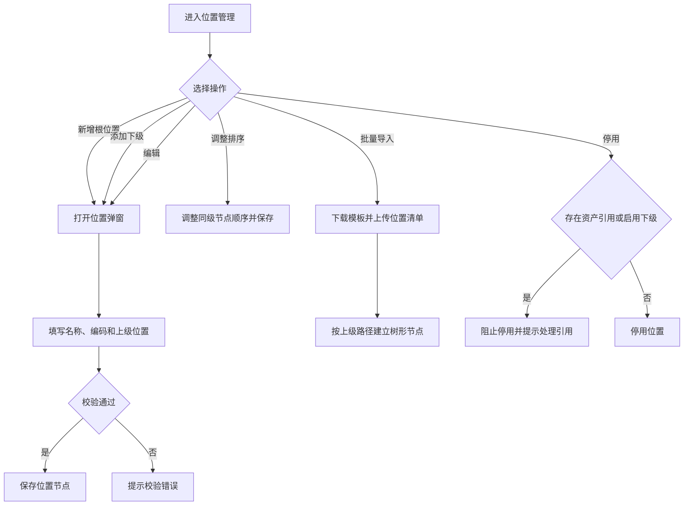

# 位置管理 PRD

## 版本记录

| 版本 | 日期 | 说明 | 影响范围 |
| --- | --- | --- | --- |
| v0.1 | 2026-08-03 | 初稿 | 全文 |
| v0.2 | 2026-08-11 | 同步原型迭代：位置管理承接仓库与位置信息维护 | 全文 |
| v0.4 | 2026-08-13 | 删除审计人员角色并补充普通用户不进入位置管理 | 使用角色、权限规则、验收标准 |

## 规划来源

- 产品规划文档：`001_产品规划/03-功能模块-06-系统设置模块.md`
- 对应模块：系统设置模块
- 关联页面：位置管理
- 端类型：web
- 关联实体：资产位置
- 关联权限：`07-权限逻辑约定.md` 中系统设置—位置管理（查看、新建、编辑、导入、启停、导出）
- 相关通用规则：`06-通用业务规则.md` 中位置单一入口、唯一数据源、批量导入契约（F-14）
- 本轮业务变更来源：用户本轮输入

## 背景与目标

单位管理员通过“系统设置 > 位置管理”维护单位全部资产位置。位置不再区分位置类型，也不再建立仓库实体；所有位置均以统一节点模型组成树形结构，根节点可直接建立，任一节点都可以继续新增下级节点，层级深度不设业务上限。资产的当前存放位置、入库位置和派发后位置均引用本页面的具体位置节点。

## 使用角色与诉求

| 角色 | 使用场景 | 关键诉求 | 页面主要动作 |
| --- | --- | --- | --- |
| 单位管理员 | 维护位置主数据 | 建立任意层级的位置树、调整节点顺序、编辑、启停、批量导入 | 新建、添加下级、编辑、排序、启停、导入、导出 |
| 部门管理员 | 使用部门位置引用 | 不维护位置主数据；仅在部门业务中选择启用位置 | 不开放位置管理 |
| 普通用户 | 个人资产位置查看 | 不进入 Web 位置管理；移动端只查看本人资产当前位置 | 不开放 Web |

## 功能范围

### 本期包含

- 位置树形表格展示，支持任意层级展开和收起
- 新增根位置、新增任意节点的下级位置
- 编辑位置名称、编码、归属部门和管理员等节点信息
- 调整同级节点排序
- 位置启用、停用、批量导入和受控导出
- 向资产入库、资产派发、资产清单、资产库存、使用变更、编码管理和查询导出提供位置选择与查询数据

### 本期不包含

- 位置类型、仓库类型、总仓/分仓等分类概念
- 独立仓库主数据、仓库管理员或仓库专属字段
- 审批流程
- 位置容量、库存上限和容量预警

### 边界说明

“系统设置 > 位置管理”是位置的唯一维护入口，其他模块只引用位置，不新增、编辑或删除位置主数据。资产只能保存一个当前具体位置；位置树中的父节点仅用于组织和路径展示，不自动代表资产同时位于所有祖先节点。停用位置不可被新的入库、派发、使用变更或其他需要选择位置的业务引用，但历史记录仍保留原位置名称和路径快照。

## 页面与入口

| 页面 | 端类型 | 路由/页面路径建议 | 入口 | 页面关系 | 说明 |
| --- | --- | --- | --- | --- | --- |
| 位置管理 | web | /asset-management/location-management | 系统设置 > 位置管理 | 下游为入库、派发、资产清单、库存、使用变更、编码管理和查询导出 | 位置树形表格单页 |

## 页面信息架构

| 页面 | 区域 | 信息层级 | 主体内容 | 关键操作区 |
| --- | --- | --- | --- | --- |
| 位置管理 | 顶部 | 主 | 页面标题“位置管理”、无限层级树形结构说明 | 新增位置、批量导入、调整排序、导出 |
| 位置管理 | 树形表格区 | 主 | 位置名称、位置编码、上级位置、完整路径、归属部门、管理员、状态 | 展开/收起、编辑、添加下级、启停 |
| 位置管理 | 新增/编辑弹窗 | 主 | 位置名称、位置编码、上级位置、归属部门、管理员 | 保存、取消 |
| 位置管理 | 导入弹窗 | 辅助 | 模板下载、文件选择、校验结果和失败明细 | 导入、取消 |

## 业务流程

## 功能需求

| 编号 | 功能点 | 规则说明 | 适用页面 | 优先级 |
| --- | --- | --- | --- | --- |
| FR-1 | 无限层级树展示 | 以树形结构展示全部位置节点；任一节点均可展开、收起和添加下级，不按固定楼栋、楼层或其他层级限制；支持查看上级位置和完整路径 | 位置管理 | P0 |
| FR-2 | 新增根位置 | 顶部“新增位置”打开弹窗，上级位置可不选；名称必填，编码可选；保存后生成根节点 | 位置管理 | P0 |
| FR-3 | 新增下级位置 | 任一位置节点提供“添加下级”；弹窗自动带出当前节点为上级位置；层级深度不设业务上限 | 位置管理 | P0 |
| FR-4 | 编辑位置 | 可编辑位置名称、位置编码、归属部门、管理员和上级位置；调整上级位置前校验不能移动到自身或自身后代节点；保存后刷新完整路径 | 位置管理 | P0 |
| FR-5 | 调整排序 | 支持调整同级节点顺序；不改变节点编码、名称和上下级关系 | 位置管理 | P1 |
| FR-6 | 位置启停 | 启用或停用位置；停用前校验当前节点无资产引用且无启用下级；停用节点及其下级不可作为新的业务选择项 | 位置管理 | P0 |
| FR-7 | 批量导入 | 按模板导入位置名称、位置编码、上级位置路径等信息；支持同批次建立多层树；逐行返回校验结果 | 位置管理 | P1 |
| FR-8 | 受控导出 | 按当前查询和展开范围导出位置名称、编码、上级位置、完整路径、状态等信息 | 位置管理 | P1 |

## 字段与展示

| 页面区域 | 字段 | 字段含义 | 类型/示例 | 展示规则 | 数据来源 |
| --- | --- | --- | --- | --- | --- |
| 树形表格 | 位置名称 | 节点名称 | 文本 | 展示当前节点名称 | 位置管理 |
| 树形表格 | 位置编码 | 节点编码 | 文本/空 | 为空时展示“—” | 位置管理 |
| 树形表格 | 上级位置 | 父节点 | 文本 | 根节点展示“无上级” | 位置管理 |
| 树形表格 | 完整路径 | 从根到当前节点的路径 | 文本 | 支持完整路径检索和引用 | 系统生成 |
| 树形表格 | 状态 | 节点可用状态 | 标签 | 启用/停用 | 位置管理 |

## 状态与操作

| 节点状态 | 可见操作 | 禁用/隐藏规则 | 操作后状态变化 | 结果反馈 |
| --- | --- | --- | --- | --- |
| 启用 | 编辑、添加下级、排序、停用、查看、导出 | 无 | 停用后变为停用 | 成功提示并刷新树 |
| 停用 | 查看、导出、启用 | 不可添加下级、不可被业务选择 | 启用后恢复可引用 | 成功提示并刷新树 |

## 交互规则

| 交互类型 | 适用页面/区域 | 规则 |
| --- | --- | --- |
| 树形展开/收起 | 树形表格 | 支持逐节点展开/收起；刷新后保留当前展开状态，首次进入默认展开根节点及其已加载下级 |
| 选择上级 | 新增/编辑弹窗 | 使用树形选择器，可搜索完整路径；根位置选择“无上级”；编辑时禁止选择自身及自身后代 |
| 保存/取消 | 新增/编辑弹窗 | 保存前执行名称、编码、循环引用和上级状态校验；取消不保存输入内容 |
| 排序 | 树形表格 | 仅允许同级排序；保存后同步更新同级顺序，子树随节点整体移动 |
| 批量导入 | 导入弹窗 | 先下载模板；导入前校验必填项、路径存在性、编码唯一性和循环关系；失败行展示原因 |

## 权限规则

| 权限对象 | 规则 | 无权限表现 | 数据可见范围 |
| --- | --- | --- | --- |
| 页面 | 仅单位管理员可见；部门管理员和普通用户不可见 | 无权限提示或导航隐藏 | 本单位 |
| 新增、编辑、排序、启停、导入 | 仅单位管理员 | 无权限隐藏 | — |
| 导出 | 仅单位管理员可见 | 无权限隐藏 | 本单位 |
| 位置数据 | 其他业务页面只读引用 | 无法从业务页面维护 | 当前授权范围内的位置 |

## 数据与校验规则

| 字段/数据项 | 默认值 | 必填 | 格式/范围校验 | 计算口径 | 刷新/同步规则 |
| --- | --- | --- | --- | --- | --- |
| 位置名称 | — | 是 | 同一上级位置下不可重复；文本长度按系统通用限制 | — | 变更后刷新当前节点及所有后代完整路径 |
| 位置编码 | — | 否 | 填写时单位内唯一；允许为空 | — | 编辑可修改，历史业务保留编码快照 |
| 上级位置 | 无上级 | 否 | 只能选择启用节点；编辑不可选择自身及后代 | — | 变更后重新计算完整路径 |
| 完整路径 | — | 系统生成 | 由根节点到当前节点按树顺序拼接 | — | 上级或名称变化时同步更新 |
| 归属部门 | — | 否 | 引用基础信息中的有效部门 | — | 从基础信息同步 |
| 管理员 | — | 否 | 引用基础信息中的有效人员 | — | 从基础信息同步 |
| 节点状态 | 启用 | 是 | 启用/停用 | — | 停用时执行资产和下级引用校验 |

## 异常与空状态

| 场景 | 触发条件 | 页面表现 | 用户可执行操作 | 恢复/兜底规则 |
| --- | --- | --- | --- | --- |
| 无数据 | 无位置数据 | 空态提示“暂无位置数据” | 新增根位置 | — |
| 名称重复 | 同一上级下存在同名节点 | 定位到名称字段并提示 | 修改名称或上级 | 阻止保存 |
| 编码重复 | 填写的编码已存在 | 定位到编码字段并提示 | 修改编码或清空 | 阻止保存 |
| 上级不可用 | 选择了停用节点 | 提示上级位置不可用 | 选择其他启用节点 | 阻止保存 |
| 循环引用 | 上级选择自身或自身后代 | 提示不能形成循环 | 重新选择上级 | 阻止保存 |
| 停用有引用 | 节点有资产引用或启用下级 | 阻止停用并提示引用数量或下级数量 | 先转移资产或停用下级 | 保留启用状态 |
| 导入失败 | 模板、路径、名称或编码校验失败 | 展示逐行失败原因 | 修正后重新导入 | 失败行不写入；成功行按导入规则生效 |

## 验收标准

### 页面验收

- 位置管理页面可通过“系统设置 > 位置管理”进入，页面只展示统一位置节点，不展示位置类型、仓库类型、总仓/分仓等字段。
- 树形表格支持任意节点展开、收起和添加下级，不限制楼栋、楼层或固定层数。
- 列表展示位置名称、位置编码、上级位置、完整路径、归属部门、管理员、状态。

### 功能验收

- 可新增无上级的根位置，也可从任意节点新增下级位置。
- 上级位置可通过树形选择器选择；移动节点不能形成自身或后代循环，保存后完整路径正确刷新。
- 位置编码可为空，填写时单位内唯一；同一上级下位置名称不可重复。
- 任一节点可编辑、排序、启停；停用有资产引用或启用下级的节点时必须阻止并提示。
- 批量导入支持用上级路径建立多层位置树，并返回逐行校验结果。
- 入库、资产派发、使用变更、资产清单、库存、编码管理和查询导出均只能引用本页启用位置。
- 平台不提供独立仓库主数据，位置管理中不存在位置类型概念。

### 状态验收

- 启用节点可添加下级并可被业务选择；停用节点不可被新的业务选择，但历史记录仍可查看。
- 位置名称或上级变更后，当前节点及后代的完整路径同步更新。

## 原型/工程关联

- PRD 类型：项目 PRD
- PRD 文件：`002_PRD/barracks-admin/位置管理.md`
- 原型项目：`003_prototype/barracks-admin/`
- 页面文件：`src/views/settings/LocationManagement.vue`
- 文档映射：`src/doc/manifest.json` 已登记 `/asset-management/location-management`
- 说明：本轮仅修改 PRD，原型页面及其静态展示暂不调整。
