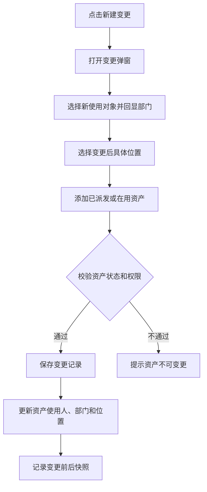

# 使用变更 PRD

## 版本记录

| 版本 | 日期 | 说明 | 影响范围 |
| --- | --- | --- | --- |
| v0.1 | 2026-08-03 | 初稿 | 全文 |
| v0.2 | 2026-08-11 | 同步原型迭代：主单+资产明细两段式，候选资产仅限在用 | 页面信息架构、功能需求、数据与校验、验收标准 |
| v0.3 | 2026-08-13 | 补充已派发资产的使用变更；新增变更后具体位置，使用变更可同时更新使用人、使用部门和位置 | 全文 |

## 规划来源

- 产品规划文档：`001_产品规划/03-功能模块-03-日常管理模块.md`
- 对应模块：日常管理模块
- 关联页面：使用变更
- 端类型：web
- 关联实体：使用变更记录、资产、资产位置、使用对象
- 关联权限：`07-权限逻辑约定.md` 中日常管理—使用变更（查看、新建、作废、导出）
- 相关通用规则：`06-通用业务规则.md` 中借用与使用变更互斥、原子业务动作、位置单一入口
- 本轮业务变更来源：用户本轮输入

## 背景与目标

单位管理员通过使用变更页面登记资产使用对象、责任人和当前位置的持续生效变化。使用变更既支持已有派发事实、当前状态为在用的资产后续调整，也支持在用资产的内部重新分配。变更时可指定新的使用人、使用部门和具体位置；保存即生效并更新资产当前值。借用中、维保中和已报废资产不得执行使用变更。

## 使用角色与诉求

| 角色 | 使用场景 | 关键诉求 | 页面主要动作 |
| --- | --- | --- | --- |
| 单位管理员 | 调整已派发或在用资产 | 记录新使用人、部门、具体位置和变更历史 | 新建、作废、查看、导出 |
| 部门管理员 | 部门内二次分发 | 仅在授权部门范围内调整使用人、部门和具体位置，保存即生效 | 新建、作废、查看 |
| 普通用户 | 个人资产点验 | 不进入 Web；在移动端查看本人资产并自主点验 | 不开放 Web |

## 功能范围

### 本期包含

- 变更记录列表、筛选、详情和导出
- 使用变更弹窗：创建人、变更日期、新使用对象、新使用部门、变更后位置、备注和资产明细
- 组织树抽屉选人并自动回显新使用部门
- 位置树选择变更后具体位置
- 候选资产支持当前状态为在用且已有派发事实或其他在用来源的资产
- 作废更正并恢复变更前使用人、部门和位置

### 本期不包含

- 已生效记录直接编辑
- 借用中、维保中或已报废资产的使用变更
- 审批流程

### 边界说明

使用变更表达持续生效变化；资产派发表达从在库到派发的业务事实。已派发资产可通过使用变更进行后续使用人、部门或位置调整。位置主数据仍由“系统设置 > 位置管理”维护，使用变更只引用启用的具体位置，不维护仓库或位置类型。

## 页面与入口

| 页面 | 端类型 | 路由/页面路径建议 | 入口 | 页面关系 | 说明 |
| --- | --- | --- | --- | --- | --- |
| 使用变更 | web | /asset-management/usage-change | 日常管理 > 使用变更 | 上游为资产派发/资产清单，下游为资产当前值 | 变更登记弹窗页 |

## 页面信息架构

| 页面 | 区域 | 信息层级 | 主体内容 | 关键操作区 |
| --- | --- | --- | --- | --- |
| 使用变更 | 顶部 | 主 | 页面标题“使用变更” | 新建变更、导出 |
| 使用变更 | 筛选区 | 主 | 关键字、状态 | 查询、重置 |
| 使用变更 | 表格区 | 主 | 变更单号、日期、资产编号、资产名称、原使用对象、新使用对象、变更前位置、变更后位置、状态 | 作废、查看详情 |
| 使用变更 | 变更弹窗 | 主 | 主单（创建人、变更日期、新使用对象、新使用部门、变更后位置、备注）+ 资产明细 | 组织树选人、位置选择、添加资产、保存 |
| 使用变更 | 详情抽屉 | 辅助 | 变更前后使用人、部门、位置及资产明细 | — |

## 业务流程

## 功能需求

| 编号 | 功能点 | 规则说明 | 适用页面 | 优先级 |
| --- | --- | --- | --- | --- |
| FR-1 | 列表展示 | 展示变更单号、日期、资产编号、资产名称、原使用对象、新使用对象、变更前位置、变更后位置和状态；支持关键字和状态筛选 | 使用变更 | P0 |
| FR-2 | 新建变更 | 主单+资产明细两段式弹窗；候选资产为当前状态为在用的资产；保存即生效 | 使用变更 | P0 |
| FR-3 | 组织树选人 | 新使用对象通过组织树选择；选定后自动回显新使用部门，部门字段不可编辑 | 使用变更 | P0 |
| FR-4 | 位置变更 | 通过位置树选择变更后具体位置；位置为必填，必须为启用节点 | 使用变更 | P0 |
| FR-5 | 已派发资产处理 | 已有派发事实且当前状态为在用的资产可通过使用变更重新指定使用人、使用部门和位置 | 使用变更 | P0 |
| FR-6 | 业务办理详情 | 只读展示变更单主单、资产明细和变更前后快照 | 使用变更 | P1 |
| FR-7 | 作废更正 | 作废变更记录后恢复资产变更前使用人、部门、位置和适用状态 | 使用变更 | P0 |
| FR-8 | 受控导出 | 按当前筛选条件导出使用变更记录 | 使用变更 | P1 |

## 字段与展示

| 页面区域 | 字段 | 字段含义 | 类型/示例 | 展示规则 | 数据来源 |
| --- | --- | --- | --- | --- | --- |
| 变更弹窗 | 创建人 | 业务登记人 | 文本只读 | 当前登录人，不可编辑 | 登录态 |
| 变更弹窗 | 变更日期 | 生效日期 | 日期 | 默认当天，必填 | 用户输入 |
| 变更弹窗 | 新使用对象 | 变更后的使用人 | 组织树选择 | 必填 | 基础信息 |
| 变更弹窗 | 新使用部门 | 新使用对象所属部门 | 文本只读 | 选人后自动回显，必填 | 基础信息 |
| 变更弹窗 | 变更后位置 | 变更后的具体位置 | 树形选择 | 必填；仅启用位置；不含仓库字段 | 位置管理 |
| 变更弹窗 | 备注 | 变更说明 | 多行文本 | 非必填 | 用户输入 |
| 资产明细 | 资产编号 | 变更资产唯一标识 | 文本 | 候选为当前状态为在用的资产 | 资产当前值 |
| 资产明细 | 资产名称 | 资产名称 | 文本 | 只读展示 | 资产当前值 |
| 资产明细 | 原使用对象 | 变更前使用人 | 文本 | 只读快照 | 资产当前值 |
| 资产明细 | 原使用部门 | 变更前部门 | 文本 | 只读快照 | 资产当前值 |
| 资产明细 | 变更前位置 | 变更前具体位置 | 文本 | 只读快照 | 资产当前值 |
| 资产明细 | 变更后位置 | 变更后具体位置 | 文本 | 保存后写入资产当前值 | 用户输入 |
| 资产明细 | 原资产状态 | 变更前业务状态 | 标签 | 在用 | 资产当前值 |

## 状态与操作

| 变更记录状态 | 可见操作 | 禁用/隐藏规则 | 操作后状态变化 | 结果反馈 |
| --- | --- | --- | --- | --- |
| 已生效 | 作废、查看、导出 | 无 | 作废后变为已作废并恢复变更前快照 | 成功提示 |
| 已作废 | 查看、导出 | 无 | 无 | — |

资产候选状态规则：当前状态为在用的资产可进入使用变更，其中包括已有派发事实的资产；借用中、维保中和已报废资产不可进入使用变更。

## 交互规则

| 交互类型 | 适用页面/区域 | 规则 |
| --- | --- | --- |
| 选择人员 | 变更弹窗 | 组织树展示序号、所属部门、姓名；选择后回填新使用部门；清空人员时同步清空部门 |
| 选择位置 | 变更弹窗 | 位置树支持完整路径搜索；仅启用节点可选；保存时再次校验位置状态 |
| 添加资产 | 资产明细 | 选择器仅展示权限范围内当前状态为在用的资产；同一单据不可重复添加；至少 1 条 |
| 保存 | 变更弹窗 | 保存前复核资产当前状态、并发变更、位置状态和人员有效性；全部校验通过后整单生效 |
| 作废 | 表格区 | 二次确认；按记录保存的变更前快照恢复资产，不覆盖原始历史 |

## 权限规则

| 权限对象 | 规则 | 无权限表现 | 数据可见范围 |
| --- | --- | --- | --- |
| 页面 | 单位管理员和部门管理员可见；部门管理员仅本部门范围；普通用户不进入 Web | 无权限提示或导航隐藏 | 单位管理员：本单位；部门管理员：本部门资产 |
| 新建、作废 | 单位管理员和部门管理员可用；部门管理员仅限本部门资产 | 无权限隐藏 | 受数据权限约束 |
| 查看、导出 | 单位管理员可查看和导出；部门管理员仅查看 | 导出入口按权限隐藏 | 与查询条件共用数据权限 |
| 位置选择 | 只能引用启用位置 | 无可用位置时空态 | 位置数据按授权范围 |

## 数据与校验规则

| 字段/数据项 | 默认值 | 必填 | 格式/范围校验 | 计算口径 | 刷新/同步规则 |
| --- | --- | --- | --- | --- | --- |
| 创建人 | 当前登录人 | 是 | 不可编辑 | — | 登录态 |
| 变更日期 | 当天 | 是 | 有效日期 | — | — |
| 新使用对象 | 空 | 是 | 基础信息中的有效人员 | — | 选人后回填部门 |
| 新使用部门 | 新使用对象所属部门 | 是 | 由人员带出，不可手填 | — | 随人员同步 |
| 变更后位置 | 空 | 是 | 启用的具体位置节点 | — | 从位置管理同步；保存时复核 |
| 变更资产 | 空 | 是 | 当前状态为在用；不得为借用中、维保中或已报废；至少 1 条 | — | 保存前实时复核 |
| 原使用对象/部门/位置 | 资产当前值 | 系统生成 | 生成变更前快照 | — | 历史不可覆盖 |
| 备注 | 空 | 否 | 文本 | — | — |

## 异常与空状态

| 场景 | 触发条件 | 页面表现 | 用户可执行操作 | 恢复/兜底规则 |
| --- | --- | --- | --- | --- |
| 无可变更资产 | 权限范围内没有当前状态为在用的资产 | 明细选择器空态 | 先完成资产派发或入库 | 阻止保存空明细 |
| 资产不可变更 | 选中借用中、维保中或已报废资产 | 行级提示并阻止提交 | 移除资产或等待业务结束 | 整单不生效 |
| 资产状态变化 | 打开弹窗后资产状态被其他业务更新 | 保存时提示状态已变化 | 刷新并重新选择 | 阻止覆盖他人变更 |
| 未选位置 | 变更后位置为空 | 定位字段并提示 | 选择启用位置 | 阻止保存 |
| 位置已停用 | 保存前目标位置停用 | 提示位置不可用 | 重新选择位置 | 阻止保存 |
| 提交失败 | 保存异常 | 错误提示并保留表单 | 重试 | 整单回滚 |

## 验收标准

### 页面验收

- 使用变更弹窗包含新使用对象、新使用部门、变更后位置和资产明细；位置字段为具体位置，不展示仓库或位置类型。
- 列表和详情展示变更前后使用人、部门和位置。

### 功能验收

- 候选资产包含当前状态为在用且已有派发事实的资产；借用中、维保中、已报废资产不可选择。
- 新使用对象通过组织树选择，选定后新使用部门自动回显且不可编辑。
- 变更后位置必须选择启用的具体位置节点。
- 保存即生效，更新资产当前使用人、使用部门和位置，并记录完整变更前后快照。
- 已派发资产可以通过使用变更完成后续使用人、位置调整或部门内二次分发。
- 作废后恢复变更前使用人、部门、位置和适用状态，原变更记录保留。

### 状态验收

- 已生效记录可作废，已作废记录不可再次操作。
- 部门管理员只能处理本部门授权范围内资产；普通用户不进入本页面，个人点验由移动端个人资产入口承接。

## 原型/工程关联

- PRD 类型：项目 PRD
- PRD 文件：`002_PRD/barracks-admin/使用变更.md`
- 原型项目：`003_prototype/barracks-admin/`
- 页面文件：`src/views/daily/UsageChange.vue`
- 文档映射：`src/doc/manifest.json` 已登记 `/asset-management/usage-change`
- 说明：本轮仅修改 PRD，原型页面暂不调整。
