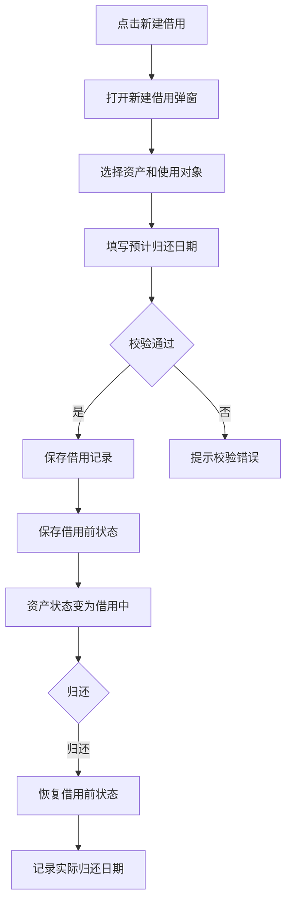

# 借用登记 PRD

## 版本记录

| 版本 | 日期 | 说明 | 影响范围 |
| --- | --- | --- | --- |
| v0.1 | 2026-08-03 | 初稿 | 全文 |
| v0.2 | 2026-08-11 | 同步原型迭代（ISS-009 回写）：借出弹窗改为主单+资产明细两段式，与出库表单统一；借用人改为组织树抽屉选人并自动回显借用人部门（禁用）；移除“使用部门”与“借用后位置”字段；新增业务办理详情只读抽屉 | 页面信息架构、功能需求、数据与校验、验收标准 |
| v0.3 | 2026-08-12 | 调整资产状态范围，借用资产仅允许选择在库资产 | 功能范围、页面信息架构、功能需求、数据与校验、验收标准 |
| v0.4 | 2026-08-13 | 统一与资产派发表单的业务术语；借用继续仅允许选择在库资产 | 页面信息架构、验收标准 |
| v0.5 | 2026-08-13 | 角色模型同步：部门管理员可办理本部门借用，普通用户不进入 Web 日常管理 | 使用角色、权限规则、验收标准 |
| v0.6 | 2026-08-17 | 统一菜单“借用登记”与新建业务名称：按钮和弹窗统一为“新建借用”，并按按钮不超过 4 个字的规范修正文案 | 页面信息架构、功能需求、交互与验收标准、原型/工程关联 |

## 规划来源

- 产品规划文档：`001_产品规划/03-功能模块-03-日常管理模块.md`
- 对应模块：日常管理模块
- 关联页面：借用登记
- 端类型：web
- 关联实体：借用记录、资产、使用对象
- 关联权限：`07-权限逻辑约定.md` 中日常管理—借用登记（查看、新建、归还、作废、导出）
- 相关通用规则：`06-通用业务规则.md` 中借用与使用变更互斥、借用逾期提醒

## 背景与目标

单位管理员通过借用登记页面管理资产的临时交付和按期归还。借用必须有归还闭环，保存借用前状态，归还后恢复。借用中资产不得并行使用变更、维保或报废。

## 使用角色与诉求

| 角色 | 使用场景 | 关键诉求 | 页面主要动作 |
| --- | --- | --- | --- |
| 单位管理员 | 资产临时借用与归还 | 登记借出、登记归还、作废更正 | 新建、归还、作废、查看、导出 |
| 部门管理员 | 本部门资产临时借用与归还 | 仅处理本部门名下资产，保存即生效 | 新建、归还、作废、查看 |
| 普通用户 | 个人资产查看 | 不进入 Web 借用登记；仅在移动端查看本人资产并自主点验 | 不开放 Web |

## 功能范围

### 本期包含

- 借用记录列表展示（含关键字、状态筛选）
- 新建借用弹窗（主单：创建人、借用人、借用人部门、借用日期、预计归还时间、备注；明细：仅在库资产可借出）
- 组织树抽屉选人（借用人）与部门自动回显
- 业务办理详情（只读抽屉）
- 归还操作（恢复借用前状态）
- 作废更正（二次确认）
- 逾期提醒（超过预计归还日期标记逾期）
- 受控导出

### 本期不包含

- 借用编辑（保存即生效，不支持编辑）
- 审批流程

### 边界说明

借用表达临时使用并要求归还，使用变更表达持续生效变化。借用中资产不得执行使用变更、维保或报废。

## 页面与入口

| 页面 | 端类型 | 路由/页面路径建议 | 入口 | 页面关系 | 说明 |
| --- | --- | --- | --- | --- | --- |
| 借用登记 | web | /asset-management/borrow-records | 日常管理 > 借用登记 | 上游为资产清单 | 借用管理页 |

## 页面信息架构

| 页面 | 区域 | 信息层级 | 主体内容 | 关键操作区 |
| --- | --- | --- | --- | --- |
| 借用登记 | 顶部 | 主 | 页面标题“借用登记” | 新建借用按钮、导出按钮 |
| 借用登记 | 筛选区 | 主 | 关键字、状态 | 查询、重置 |
| 借用登记 | 表格区 | 主 | 借用单号、日期、资产编号、资产名称、使用对象、预计归还日期、实际归还日期、状态 | 归还、作废、查看详情 |
| 借用登记 | 新建借用弹窗 | 主 | 主单（创建人、借用人、借用人部门、借用日期、预计归还时间、备注）+ 资产明细（仅在库可借出） | 组织树选人、保存 |
| 借用登记 | 详情抽屉 | 辅助 | 业务办理详情（只读） | — |

## 业务流程

## 功能需求

| 编号 | 功能点 | 规则说明 | 适用页面 | 优先级 |
| --- | --- | --- | --- | --- |
| FR-1 | 列表展示 | 展示借用单号、日期、资产、使用对象、预计归还、实际归还、状态；支持关键字和状态筛选 | 借用登记 | P0 |
| FR-2 | 新建借用 | 主单+资产明细两段式弹窗；仅在库资产可借出；保存即生效 | 借用登记 | P0 |
| FR-3 | 组织树选人 | 借用人通过组织树抽屉选择；选定后自动回显借用人部门且禁用不可编辑 | 借用登记 | P0 |
| FR-4 | 业务办理详情 | 只读抽屉展示借用单主单与明细 | 借用登记 | P1 |
| FR-5 | 归还操作 | 恢复借用前状态，记录实际归还日期；原子写入 | 借用登记 | P0 |
| FR-6 | 作废更正 | 作废借用记录并恢复借用前状态，二次确认 | 借用登记 | P0 |
| FR-7 | 逾期提醒 | 超过预计归还日期且未归还标记逾期，持续提醒但不自动关闭 | 借用登记 | P1 |
| FR-8 | 受控导出 | 按筛选条件导出 | 借用登记 | P1 |

## 状态与操作

| 状态 | 可见操作 | 禁用/隐藏规则 | 操作后状态变化 | 结果反馈 |
| --- | --- | --- | --- | --- |
| 借用中 | 归还、作废、查看、导出 | 无 | 归还→已归还；作废→已作废 | — |
| 已归还 | 查看、导出 | 归还和作废隐藏 | 无 | — |
| 已作废 | 查看、导出 | 无 | 无 | — |

## 字段与展示

| 页面区域 | 字段 | 字段含义 | 类型/示例 | 展示规则 | 数据来源 |
| --- | --- | --- | --- | --- | --- |
| 借用弹窗 | 借用人 | 临时使用人 | 组织树选择 | 必填，选人后回显部门 | 基础信息 |
| 借用弹窗 | 借用日期 | 借用生效日期 | 日期 | 默认当天 | 用户输入 |
| 借用弹窗 | 预计归还时间 | 归还期限 | 日期时间 | 必须晚于借用日期 | 用户输入 |
| 资产明细 | 资产 | 借用资产 | 资产选择 | 仅在库资产 | 资产当前值 |
| 列表 | 状态 | 借用业务状态 | 标签 | 借用中/已归还/已作废 | 借用记录 |

## 权限规则

| 权限对象 | 规则 | 无权限表现 | 数据可见范围 |
| --- | --- | --- | --- |
| 页面 | 单位管理员和部门管理员可见；部门管理员仅本部门范围；普通用户不进入 Web | 无权限提示或导航隐藏 | 单位管理员：本单位；部门管理员：本部门名下资产 |
| 新建、归还、作废 | 单位管理员和部门管理员可用；部门管理员仅限本部门资产 | 无权限隐藏 | 受数据权限约束 |
| 查看、导出 | 单位管理员可导出；部门管理员仅查看 | 导出入口按权限隐藏 | 受数据权限约束 |

## 数据与校验规则

| 字段/数据项 | 默认值 | 必填 | 格式/范围校验 | 计算口径 | 刷新/同步规则 |
| --- | --- | --- | --- | --- | --- |
| 创建人 | 当前登录人 | 是 | 不可编辑 | — | 登录态 |
| 借用人 | — | 是 | 组织树抽屉选择的有效人员 | — | 选定后自动回填 |
| 借用人部门 | — | 是 | 随借用人自动回显，禁用不可编辑 | — | 选人联动 |
| 借用日期 | 当天 | 是 | 日期 | — | — |
| 预计归还时间 | — | 是 | 晚于借用日期 | — | — |
| 借用资产 | — | 是 | 仅在库，不得为借用中、维保中或已报废 | — | 明细至少 1 条 |
| 备注 | — | 否 | 文本，限 200 字 | — | — |
| 实际归还日期 | — | 否 | 归还时填写 | — | 归还操作自动记录 |

## 异常与空状态

| 场景 | 触发条件 | 页面表现 | 用户可执行操作 | 恢复/兜底规则 |
| --- | --- | --- | --- | --- |
| 资产不可借 | 选中借用中/维保中/已报废资产 | 校验提示 | 更换资产 | 阻止保存 |
| 逾期 | 超过预计归还日期未归还 | 逾期标记 | 归还 | 持续提醒 |

## 验收标准

### 页面验收

- 借用页面可通过“日常管理 > 借用登记”菜单进入
- 表格展示借用单号、日期、资产、使用对象、预计归还、实际归还、状态
- 新建借用弹窗为主单+资产明细两段式，与资产派发表单的交互结构统一；明细仅允许在库资产
- 借用人通过组织树抽屉选择，选定后自动回显借用人部门且不可编辑
- 列表行“查看详情”打开只读业务办理详情抽屉

### 功能验收

- 新建借用保存即生效，记录借用前状态，资产变为借用中
- 归还恢复借用前状态，记录实际归还日期，原子写入
- 借用中资产不可并行使用变更、维保或报废
- 逾期记录标记并持续提醒

### 状态验收

- 借用中可归还和作废
- 已归还不可再操作
- 已作废不可再操作

## 原型/工程关联

- PRD 类型：项目 PRD
- PRD 文件：`002_PRD/barracks-admin/借用登记.md`
- 原型项目：`003_prototype/barracks-admin/`
- 页面文件：`src/views/daily/BorrowRecords.vue`（共享组件 `PersonPickerDrawer.vue`、`AssetDetailEditor.vue`）
- 文档映射：`src/doc/manifest.json` 已登记 `/asset-management/borrow-records`
- 说明：本轮已同步 `BorrowRecords.vue` 的按钮、弹窗标题和成功提示为“新建借用/借用登记”。
