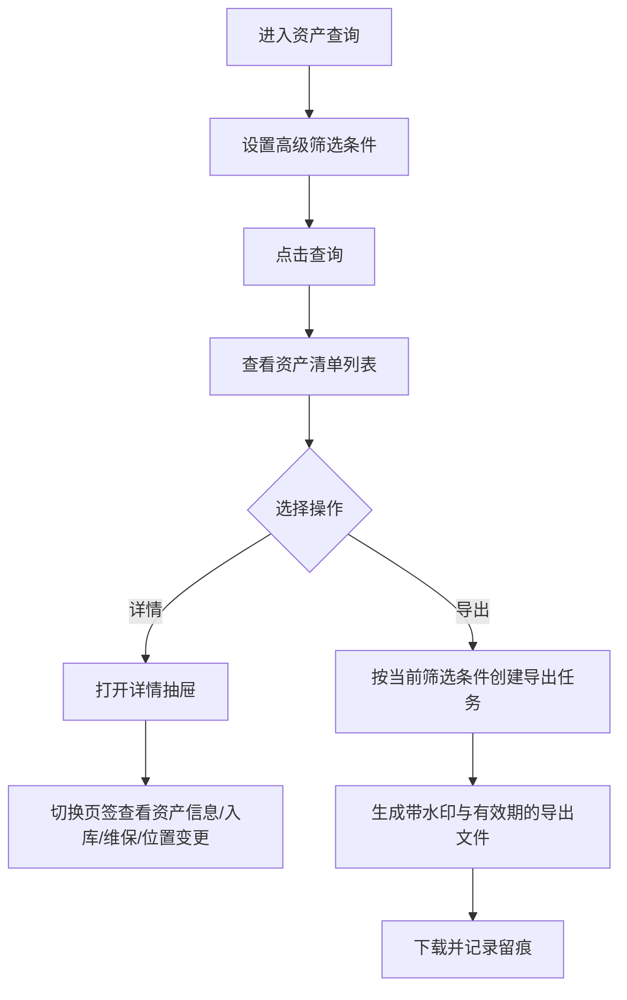

# 查询导出 PRD

## 版本记录

| 版本 | 日期 | 说明 | 影响范围 |
| --- | --- | --- | --- |
| v0.1 | 2026-08-03 | 初稿 | 全文 |
| v0.2 | 2026-08-11 | 同步原型迭代（ISS-009 回写，DEC-017）：独立导出中心页面移除，查询导出能力由"查询导出 > 资产查询"页面承接；页面提供高级筛选（7 项，默认折叠后 3 项）、资产清单列表、详情抽屉（资产信息 + 入库/维保/位置变更时间线）与"导出筛选结果"入口；受控导出语义（水印、有效期、留痕）保留为导出业务规则 | 全文 |
| v0.3 | 2026-08-13 | 删除位置类型和仓库筛选，资产查询改为按具体位置树和资产分类查询；补充标准型号和派发事实展示 | 全文 |
| v0.4 | 2026-08-17 | 导出按钮统一简化为“导出”，保留按当前筛选条件创建受控导出任务的业务语义 | 页面信息架构、功能需求、验收标准、原型/工程关联 |
| v0.4 | 2026-08-13 | 删除审计人员角色，查询导出仅由单位管理员使用；部门管理员和普通用户不开放组织级查询导出 | 使用角色、权限规则、验收标准 |
| v0.5 | 2026-08-18 | 同步资产属性模型：资产查询详情和受控导出读取资产属性与当前三级分类专属属性快照，字段定义由资产分类页面统一维护 | 背景目标、功能需求、字段与展示、数据与校验、验收标准 |

## 规划来源

- 产品规划文档：`001_产品规划/03-功能模块-05-查询导出模块.md`
- 对应模块：查询导出模块
- 关联页面：资产查询（查询导出能力承接页）
- 端类型：web
- 关联实体：资产、资产属性、专属属性、导出记录、数据权限范围
- 关联权限：`07-权限逻辑约定.md` 中查询导出（查看、创建、下载）
- 相关通用规则：`06-通用业务规则.md` 中导出口径一致、统一查询上下文（F-13）、导出留痕
- 关联决策：DEC-017（查询导出由资产查询页承接，独立导出中心移除）

## 背景与目标

单位管理员通过"查询导出 > 资产查询"页面按本单位范围查询资产并生成受控导出。部门管理员和普通用户不开放组织级查询导出；普通用户仅在移动端查看本人名下资产。页面以高级筛选定位资产清单，详情抽屉追溯单资产的资产属性、当前三级分类专属属性、入库、维保与位置变更历史；底部“导出”按当前筛选条件创建导出任务，导出文件带水印和有效期并记录下载留痕。独立导出中心不再提供，历史导出任务查询并入后续版本评估。

## 使用角色与诉求

| 角色 | 使用场景 | 关键诉求 | 页面主要动作 |
| --- | --- | --- | --- |
| 单位管理员 | 查询本单位资产并导出 | 高级筛选、查看详情、导出 | 查看、创建导出 |
| 部门管理员 | 不进入组织级查询导出 | 仅通过部门资产清单和库存查看本部门资产 | 不开放 |
| 普通用户 | 个人资产查询 | 不进入组织级查询导出；仅在移动端查看本人名下资产 | 不开放 Web |

## 功能范围

### 本期包含

- 高级筛选（6 项：具体位置、资产分类、资产名称、入库批次、使用部门、资产状态；默认显示前 4 项，展开后显示全部）
- 资产清单列表（序号跨页连续、编码(SN/RFID)双行列、资产状态标签、分页）
- 详情抽屉（资产信息 + 入库信息/维保信息/位置变更三个时间线页签）
- 导出（按当前筛选条件创建受控导出任务）

### 本期不包含

- 独立导出中心页面（任务编号筛选、导出配置弹窗，DEC-017 移除）
- 历史导出任务列表与下载入口（后续版本评估）
- 审批流程

### 边界说明

导出口径一致：查询结果、统计数量和导出数量必须使用同一数据权限条件。单位管理员只能导出本单位数据；部门管理员和普通用户不提供组织级导出。导出文件带水印（导出人、时间、数据范围）与有效期，下载留痕。

## 页面与入口

| 页面 | 端类型 | 路由/页面路径建议 | 入口 | 页面关系 | 说明 |
| --- | --- | --- | --- | --- | --- |
| 资产查询 | web | /statistics/asset-query | 查询导出 > 资产查询 | 上游为资产清单与各业务记录 | 高级筛选 + 清单 + 详情抽屉 + 导出 |

## 页面信息架构

| 页面 | 区域 | 信息层级 | 主体内容 | 关键操作区 |
| --- | --- | --- | --- | --- |
| 资产查询 | 筛选区 | 主 | 具体位置、资产分类、资产名称、入库批次（默认）；使用部门、资产状态（展开后） | 展开/收起、查询、重置 |
| 资产查询 | 表格区 | 主 | 序号（跨页连续）、资产分类、资产名称、标准型号、编码(SN/RFID)双行、入库批次、失效日期、位置、使用部门、资产状态 | 详情 |
| 资产查询 | 底部操作区 | 主 | 导出按钮 + 分页（默认 10 条/页） | 导出 |
| 资产查询 | 详情抽屉 | 辅助 | 4 页签：资产信息（含资产属性和当前三级分类专属属性快照）、入库信息（时间线）、维保信息（时间线）、位置变更（时间线，变更前→后对比） | — |

## 业务流程

## 功能需求

| 编号 | 功能点 | 规则说明 | 适用页面 | 优先级 |
| --- | --- | --- | --- | --- |
| FR-1 | 高级筛选 | 6 项筛选：具体位置、资产分类、资产名称、入库批次、使用部门、资产状态；默认显示前 4 项，展开后显示全部；点查询生效并回到第一页，重置清空全部条件 | 资产查询 | P0 |
| FR-2 | 列表展示 | 展示序号（跨页连续）、资产分类、资产名称、标准型号、编码(SN/RFID)双行、入库批次、失效日期、所在位置、使用部门、资产状态；分页默认 10 条/页，筛选结果变化时回收越界页码，切换每页条数回到第一页 | 资产查询 | P0 |
| FR-3 | 详情抽屉 | 行内"详情"打开右侧抽屉（默认资产信息页签）；资产信息展示标准型号、名称、分类、资产属性快照、当前三级分类专属属性快照、SN/RFID、入库批次、失效日期、资产状态、具体位置、使用部门 | 资产查询 | P0 |
| FR-4 | 流转时间线 | 入库信息、维保信息、位置变更三个页签以时间线展示该资产历史记录（操作人、时间、状态标签）；位置变更以变更前→后对比展示；无记录时空态提示 | 资产查询 | P1 |
| FR-5 | 导出 | 底部按钮按当前筛选条件创建导出任务并提示命中条数；导出受数据权限、水印和有效期控制，下载留痕 | 资产查询 | P0 |

## 字段与展示

| 页面区域 | 字段 | 字段含义 | 类型/示例 | 展示规则 | 数据来源 |
| --- | --- | --- | --- | --- | --- |
| 筛选区 | 具体位置 | 资产当前位置筛选 | 树形选择 | 可按完整路径搜索 | 位置管理 |
| 筛选区 | 资产分类 | 资产分类筛选 | 下拉选择 | 仅启用分类 | 资产分类 |
| 表格 | 标准型号 | 入库时引用的模板 | 文本 | 未引用显示“—” | 资产当前值 |
| 详情抽屉 | 资产属性 | 单位级资产属性及实际值 | 按属性定义 | 展示入库时保存的资产属性快照；无值显示“—” | 资产属性配置/资产快照 |
| 详情抽屉 | 专属属性 | 当前三级分类专属属性及实际值 | 按属性定义 | 展示入库时保存的分类属性快照；无值显示“—” | 专属属性配置/资产快照 |
| 表格 | 所在位置 | 资产当前具体位置 | 文本 | 展示完整路径 | 资产当前值 |
| 表格 | 资产状态 | 资产当前状态 | 标签 | 按状态展示 | 资产当前值 |

## 状态与操作

| 状态 | 可见操作 | 禁用/隐藏规则 | 操作后状态变化 | 结果反馈 |
| --- | --- | --- | --- | --- |
| 有查询结果 | 查看详情、导出 | 无 | 不改变资产状态 | — |
| 无查询结果 | 调整筛选、重置 | 导出无命中时禁用 | 无 | 空态提示 |

## 导出业务规则（受控导出）

| 规则 | 说明 |
| --- | --- |
| 数据权限 | 源数据条件与查询结果一致，复用同一数据权限条件 |
| 水印 | 导出文件带导出人、导出时间、数据范围水印 |
| 有效期 | 导出文件带有效期，到期失效需重新导出 |
| 留痕 | 导出与下载行为记录审计日志 |
| 范围约束 | 单位管理员只能导出本单位数据；部门管理员和普通用户不可用组织级导出 |

## 权限规则

| 权限对象 | 规则 | 无权限表现 | 数据可见范围 |
| --- | --- | --- | --- |
| 页面 | 仅单位管理员可见 | 无权限提示或导航隐藏 | 本单位 |
| 导出 | 仅单位管理员可用 | 不展示入口 | 本单位 |
| 数据 | 服务端先应用权限和数据范围 | 空结果提示"无权限" | 查询和导出复用同一数据权限条件 |

## 数据与校验规则

| 字段/数据项 | 默认值 | 必填 | 格式/范围校验 | 计算口径 | 刷新/同步规则 |
| --- | --- | --- | --- | --- | --- |
| 具体位置 | 全部 | 否 | 启用位置树节点，可按完整路径搜索 | — | 来源于位置管理 |
| 资产分类 | 全部 | 否 | 启用分类 | — | 来源于资产分类 |
| 资产状态 | 全部 | 否 | 资产状态枚举 | — | 资产当前值 |
| 位置名称/资产名称/入库批次/使用部门 | — | 否 | 文本模糊匹配 | — | — |
| 失效日期 | — | — | 日期，空值显示"—" | — | 资产当前值 |
| 导出条数 | — | 是 | 与当前筛选命中数一致 | 命中条数在导出提示中展示 | 筛选联动 |
| 导出属性值 | 当前资产快照 | 否 | 仅导出当前用户有权查看且已保存的资产属性、专属属性值 | — | 与详情抽屉使用同一资产快照 |

## 异常与空状态

| 场景 | 触发条件 | 页面表现 | 用户可执行操作 | 恢复/兜底规则 |
| --- | --- | --- | --- | --- |
| 无数据 | 筛选无命中 | 空态提示"暂无资产数据" | 调整筛选条件 | — |
| 无权限 | 查询授权失败 | 明确失败提示 | 返回工作台 | 不以空结果替代失败 |
| 导出失败 | 导出服务异常 | 错误提示 | 重试 | — |
| 时间线无记录 | 该资产无入库/维保/位置变更记录 | 对应页签空态提示 | — | — |
| 页码越界 | 筛选后结果变少 | 自动回收至最后一页 | — | — |

## 验收标准

### 页面验收

- 资产查询页面可通过左侧导航"查询导出 > 资产查询"菜单进入
- 筛选区默认显示具体位置、资产分类、资产名称、入库批次 4 项，展开后显示使用部门、资产状态
- 表格展示序号、资产分类、资产名称、标准型号、编码(SN/RFID)双行、入库批次、失效日期、位置、使用部门、资产状态
- 表格底部提供“导出”按钮与分页

### 功能验收

- 点查询生效并回到第一页，重置清空全部筛选条件
- 序号跨页连续；筛选结果变化时回收越界页码
- 行内"详情"打开抽屉，默认资产信息页签，展示资产属性与专属属性快照，可切换入库信息、维保信息、位置变更时间线
- 位置变更以变更前→后对比标签展示
- 导出按当前筛选条件创建任务并提示命中条数，导出文件包含已保存的资产属性和专属属性值
- 导出文件带水印（导出人、时间、数据范围）与有效期，下载留痕
- 查询结果、统计数量和导出数量使用同一数据权限条件
- 单位管理员只能导出本单位数据；部门管理员和普通用户不可导出组织级数据

### 状态验收

- 独立导出中心页面不再提供（DEC-017）
- 资产状态列以彩色标签区分状态

## 原型/工程关联

- PRD 类型：项目 PRD
- PRD 文件：`002_PRD/barracks-admin/查询导出.md`
- 原型项目：`003_prototype/barracks-admin/`
- 页面文件：`src/views/statistics/AssetQuery.vue`
- 文档映射：`src/doc/manifest.json` 已登记 `/statistics/asset-query`
- 说明：本轮已同步 `AssetQuery.vue` 的导出按钮文案为“导出”。
