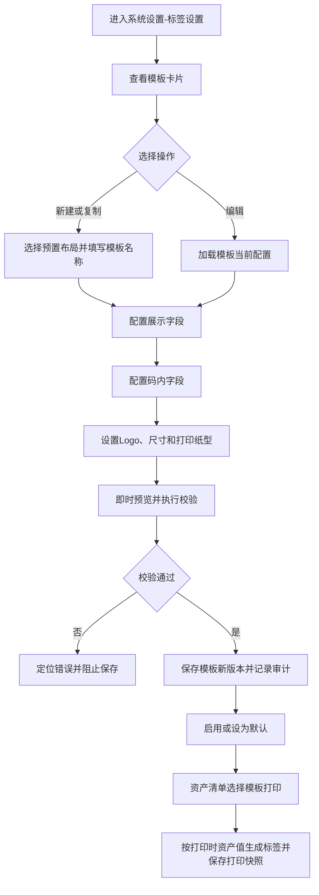

# 标签设置 PRD

## 版本记录

| 版本 | 日期 | 说明 | 影响范围 |
| --- | --- | --- | --- |
| v0.1 | 2026-08-13 | 初稿：新增标签模板设置、二维码/条形码内容配置、资产字段选择、标签尺寸与打印版式配置 | 全文 |
| v0.2 | 2026-08-13 | 根据新增参考图补充预置模板库：40×80 1 种、50×70 1 种、50×100 3 种，明确模板尺寸方向、版式差异和加入使用规则 | 功能范围、功能需求、字段与展示、数据与校验规则、验收标准 |
| v0.3 | 2026-08-13 | 根据新增参考图将 40×80 规格扩充为 10 种默认可选样式，覆盖二维码、条形码、Logo、普通文字字段和 RFID 标识版式；预置模板总数调整为 14 种 | 功能范围、预置模板清单、功能需求、字段与展示、数据与校验规则、验收标准 |
| v0.4 | 2026-08-13 | 将 40×80 的 10 种默认模板编号统一调整为模板 1–10 连续编号，保持版式和模板数量不变 | 预置模板清单、功能需求、字段与展示、数据与校验规则、验收标准 |
| v0.6 | 2026-08-13 | 删除审计人员角色；部门管理员和普通用户不进入标签设置 | 使用角色、权限规则、验收标准 |

## 规划来源

- 产品规划文档：`001_产品规划/03-功能模块-06-系统设置模块.md`、`001_产品规划/08-版本规划.md`
- 对应模块：系统设置模块
- 关联页面：标签设置、标签模板编辑
- 端类型：web
- 关联范围：`IN-002`（资产清单已规划标签打印入口）；标签模板与打印机适配在版本规划中登记为 `LATER-003` 标签增强方向
- 关联实体：资产、资产分类、标准型号、资产位置、使用对象、标签模板（本功能新增配置对象）、标签打印记录
- 关联权限：沿用权限模型的单位管理员维护、部门管理员和普通用户不可访问原则；标签设置专用权限需纳入 `asset-management:label-template:*` 资源权限
- 相关通用规则：`001_产品规划/06-通用业务规则.md` 中唯一数据源、统一查询上下文、历史不可覆盖、全链路审计、敏感二维码最小必要信息；`001_产品规划/07-权限逻辑约定.md` 中默认拒绝、数据范围与高风险操作二次校验
- 来源补充：用户本轮输入及提供的标签模板设置参考截图（含 40×80、50×70、50×100 三种规格，以及 40×80 的 10 种默认样式）

> 本 PRD 仅新增正式 PRD 文档，不修改 `001_产品规划/`、原型页面、路由或 `src/doc/manifest.json`。上游规划暂未登记“标签设置”二级功能和标签模板实体，本 PRD 将其作为用户本轮提出的后续标签增强设计范围记录。

## 背景与目标

现有资产清单已具备“打印标签”业务入口，但标签版式、展示字段和二维码内容不能由单位管理员按业务需要配置。不同单位、不同资产类型对标签尺寸、码制和字段信息的要求不同，固定标签会造成信息缺失、标签空间浪费或二维码携带信息不足。

本功能在“系统设置”中提供标签模板配置能力，使单位管理员能够：

- 从多种预置标签布局中选择二维码+文字或条形码+文字样式；
- 选择标签上展示的资产字段，并设置展示顺序、字段名显示、字号和加粗；
- 选择二维码或条形码中存储的资产字段，并按配置顺序生成码内容；
- 设置 Logo、标签尺寸、边距和打印纸型，通过预览确认最终效果；
- 将已启用模板供资产清单打印标签时选择，并保留打印时的模板和字段快照。

## 使用角色与诉求

| 角色 | 使用场景 | 关键诉求 | 页面主要动作 |
| --- | --- | --- | --- |
| 单位管理员 | 为本单位配置资产标签 | 选择合适样式，自定义标签字段和码内字段，适配不同打印纸型 | 新建、编辑、预览、启用/停用、设为默认、删除 |
| 部门管理员 | 使用部门资产 | 不维护单位级标签模板 | 不开放标签设置入口 |
| 普通用户 | 查看本人资产标签信息 | 不进入 Web 标签设置 | 不开放标签设置入口 |

## 功能范围

### 本期包含

- 标签模板列表及预置样式预览。
- 预置模板库：40×80 规格 10 种、50×70 规格 1 种、50×100 规格 3 种，共 14 种模板；模板卡片提供“加入使用”入口。
- 新建、编辑、复制、启用、停用、设为默认和受控删除标签模板。
- 二维码+文字、条形码+文字两类码文组合样式。
- 标签展示字段选择、顺序调整、字段名显示/隐藏、字号和加粗设置。
- 码内字段选择、顺序调整和码内容预览。
- Logo 开关、Logo 上传与预览。
- 电脑端打印和移动端打印的标签宽高、上下边距、左右边距设置。
- 标签专用纸、A4 两列、A4 三列等打印纸型设置，并提供示例图查看。
- 标签模板即时预览、打印预览和保存校验。
- 资产清单打印标签时读取已启用模板，并在标签打印记录中保存模板快照。

### 预置模板清单

尺寸书写统一采用“高×宽”，单位为毫米。预置模板的初始尺寸固定，管理员点击“加入使用”后可直接启用；也可复制后调整字段、版式和尺寸形成自定义模板。

| 模板编号 | 预置规格（高×宽） | 版式说明 | 码制 | 适用场景 |
| --- | --- | --- | --- | --- |
| 40×80-模板1 | 40×80 | 二维码左侧，Logo 位于二维码右上，1 行文字字段位于 Logo 下方 | 二维码 | 小尺寸横向标签，适合仅展示 1 个核心字段 |
| 40×80-模板2 | 40×80 | 二维码左侧，Logo 位于二维码右上，2 行文字字段位于 Logo 下方 | 二维码 | 小尺寸横向标签，适合展示 2 个核心字段 |
| 40×80-模板3 | 40×80 | 二维码左侧，右侧不显示 Logo，纵向展示 3 行文字字段 | 二维码 | 小尺寸横向标签，适合不需要 Logo 的 3 字段标签 |
| 40×80-模板4 | 40×80 | 二维码左侧，右侧不显示 Logo，纵向展示 4 行文字字段 | 二维码 | 小尺寸横向标签，适合字段密度较高的场景 |
| 40×80-模板5 | 40×80 | 二维码左侧，右侧显示较大 Logo，Logo 下方展示自定义文字字段 | 二维码 | Logo 强展示标签，适合单位标识优先的场景 |
| 40×80-模板6 | 40×80 | Logo 左侧，二维码右侧，自定义文字字段位于下方 | 二维码 | 左右分区标签，适合同时突出 Logo 和二维码 |
| 40×80-模板7 | 40×80 | 上方纵向展示 3 行文字字段，下方横向铺满条形码 | 条形码 | 条形码标签，适合文字信息与大宽度条形码组合 |
| 40×80-模板8 | 40×80 | Logo 位于左上，自定义文字字段位于 Logo 下方，下方横向铺满条形码 | 条形码 | 带 Logo 的条形码标签，适合人工识别与扫码并重的场景 |
| 40×80-模板9（RFID） | 40×80 | Logo 左侧，二维码右上，自定义文字字段位于 Logo 下方 | 二维码+RFID 标识 | RFID 适配标签，保留 RFID 样式标识并支持二维码辅助识别 |
| 40×80-模板10（RFID） | 40×80 | Logo 左侧，二维码右上，自定义文字字段纵向展示 3 行 | 二维码+RFID 标识 | RFID 适配标签，适合展示 3 个辅助识别字段 |
| 50×70-模板1 | 50×70 | 单位名称位于顶部，资产字段表格居中，二维码位于右下角 | 二维码 | 中等尺寸标签，适合在有限高度内突出单位和资产基本信息 |
| 50×100-模板1 | 50×100 | Logo/二维码位于左侧，资产字段表格位于右侧，底部可展示提示语 | 二维码 | 横向宽版标签，适合展示较多资产字段和使用提示 |
| 50×100-模板2 | 50×100 | Logo 和二维码位于左侧，资产字段表格位于右侧 | 二维码 | 横向宽版标签，适合资产字段较多但不需要底部提示语的场景 |
| 50×100-模板3 | 50×100 | Logo 位于左上，资产字段表格纵向排列，二维码位于左下 | 二维码 | 横向宽版标签，适合字段密度较高的资产 |

### 本期不包含

- 自由拖拽任意元素、绘制任意图形或自定义脚本的设计器。
- 自定义码制、条形码颜色、二维码纠错等级等底层编码参数配置；本期二维码使用二维码标准码制，条形码使用 Code 128。
- 打印机驱动、打印机发现、打印机队列、打印机联网和打印失败重试策略。
- 标签打印记录的独立查询页面；打印记录沿用资产清单和既有审计留痕能力。
- 修改资产主数据字段、分类、位置、使用对象或编码；标签设置只引用资产字段。
- 批量导入标签模板。

### 边界说明

1. 标签模板是展示和编码规则配置，不是资产主数据。资产字段的唯一数据源仍为资产清单及其主数据模块。
2. 标签设置负责“模板如何展示和编码”；资产清单负责“选择资产、选择模板、发起打印”。资产清单的打印入口不在本 PRD 中重复定义业务登记规则。
3. 标签打印时按打印瞬间的资产当前值生成内容。模板后续修改不回写历史标签打印记录，历史记录保留当次模板版本、字段配置和资产值快照。
4. 模板可同时配置展示字段和码内字段，两者互不自动同步；管理员必须分别选择，避免误将敏感字段写入二维码或条形码。
5. 单位管理员只能维护本单位模板；部门管理员和普通用户不开放系统设置入口。

## 页面与入口

| 页面 | 端类型 | 路由/页面路径建议 | 入口 | 页面关系 | 说明 |
| --- | --- | --- | --- | --- | --- |
| 标签设置 | web | `/asset-management/label-settings` | 系统设置 > 标签设置 | 进入标签模板编辑；被资产清单打印标签引用 | 展示模板卡片、状态、默认模板和操作 |
| 标签模板编辑 | web | `/asset-management/label-settings/edit?id=<模板标识>` | 标签设置 > 新建/编辑/复制；点击模板卡片 | 保存后返回标签设置；可打开打印预览 | 三栏编辑器：模板选择、画布预览、配置面板 |
| 标签打印预览 | web | `/asset-management/asset-ledger/print-label?templateId=<模板标识>` | 资产清单 > 打印标签 | 返回资产清单 | 仅复用模板配置完成待打印标签预览；具体打印操作由资产清单承接 |

> 上述路由为 PRD 路径建议，当前原型尚未实现，因此不创建路由、不创建页面文件、不更新 manifest 映射。

## 页面信息架构

| 页面 | 区域 | 信息层级 | 主体内容 | 关键操作区 |
| --- | --- | --- | --- | --- |
| 标签设置 | 页面头部 | 主 | 页面标题“标签设置”、模板数量、默认模板提示 | 新建模板 |
| 标签设置 | 模板卡片区 | 主 | 模板缩略图、模板名称、码制、尺寸、状态、更新时间、默认标识 | 编辑、复制、预览、启停、设为默认、删除 |
| 标签模板编辑 | 左侧模板样式区 | 主 | 多种二维码+文字、条形码+文字预置布局缩略图 | 选择布局 |
| 标签模板编辑 | 中部预览区 | 主 | 按当前配置渲染的标签画布、示例资产数据、打印预览入口 | 缩放、打印预览 |
| 标签模板编辑 | 右侧编辑区 | 主 | 模板名称、Logo、展示字段、码内字段、标签尺寸、打印纸型 | 添加/删除/排序字段、切换选项、保存 |
| 标签模板编辑 | 底部操作区 | 辅助 | 保存状态和未保存提示 | 保存、取消 |

## 业务流程

前置条件：用户已登录且具有标签设置查看权限；新建、编辑、启停、设为默认和删除还需对应操作权限。资产清单打印前必须存在至少一个启用模板。

## 功能需求

| 编号 | 功能点 | 规则说明 | 适用页面 | 优先级 |
| --- | --- | --- | --- | --- |
| FR-1 | 模板列表 | 以卡片展示模板缩略图、名称、码制、尺寸、状态、默认标识和更新时间；按更新时间倒序，默认模板置顶 | 标签设置 | P0 |
| FR-2 | 选择预置样式 | 系统提供 14 种默认可选择模板：40×80 10 种、50×70 1 种、50×100 3 种；40×80 覆盖二维码、条形码、Logo 和 RFID 标识等版式；50×70 和 50×100 覆盖字段表格、单位名称和提示语等版式；另提供二维码/条形码组合布局用于后续自定义模板 | 标签设置、标签模板编辑 | P0 |
| FR-2a | 默认模板选择与加入使用 | 模板选择区默认展示全部 14 种预置模板；点击模板卡片可预览，点击“加入使用”后将该预置模板复制为本单位模板并启用，保留预置尺寸和版式；再次加入同一模板不重复创建 | 标签设置 | P0 |
| FR-3 | 新建模板 | 单位管理员选择预置布局或预置模板、填写模板名称后进入编辑；保存生成独立模板，不覆盖预置布局或其他模板 | 标签设置、标签模板编辑 | P0 |
| FR-4 | 编辑模板 | 可编辑自建模板的名称、Logo、展示字段、码内字段、尺寸、边距和打印纸型；保存后生成新的模板配置版本 | 标签模板编辑 | P0 |
| FR-5 | 复制模板 | 复制当前模板全部配置，名称自动增加“副本”后缀；复制结果为新模板，默认不设为默认模板 | 标签设置 | P1 |
| FR-6 | 展示字段选择 | 从系统资产字段目录中选择字段；字段按列表顺序显示，支持添加、删除和调整顺序；同一字段不可重复添加 | 标签模板编辑 | P0 |
| FR-7 | 展示字段样式 | 每个展示字段可设置字段名显示/隐藏、字号和加粗；字段值过长时按标签宽度自动换行，不覆盖其他字段 | 标签模板编辑 | P0 |
| FR-8 | 码制选择 | 模板在二维码和条形码中二选一；预置布局决定默认码制，管理员可在允许的样式范围内切换 | 标签模板编辑 | P0 |
| FR-9 | 码内字段选择 | 从系统资产字段目录中选择一个或多个字段，支持调整顺序；码内容只读取打印时资产当前值，不读取页面示例值 | 标签模板编辑 | P0 |
| FR-10 | 码内容规则 | 二维码按所选字段顺序生成“字段名=字段值”的换行文本；条形码按所选字段顺序生成“字段名=字段值”并以 `|` 连接；空值字段不写入码内容 | 标签模板编辑、标签打印预览 | P0 |
| FR-11 | Logo 设置 | 支持开启/关闭 Logo；开启后上传 JPG/PNG 图片并在画布中预览；关闭后不占用 Logo 区域 | 标签模板编辑 | P1 |
| FR-12 | 尺寸设置 | 分别设置电脑端打印、移动端打印的标签宽度、高度、上下边距、左右边距，单位为毫米；预置模板默认使用 40×80、50×70 或 50×100，画布按比例缩放展示；尺寸方向按“高×宽”向用户展示 | 标签模板编辑 | P0 |
| FR-13 | 打印纸型 | 选择标签专用纸、A4 两列标签、A4 三列标签；页面提供对应示例图，纸型变化仅影响排版预览，不接管打印机驱动 | 标签模板编辑 | P1 |
| FR-14 | 即时预览 | 模板名称、码制、字段、Logo、尺寸、边距和纸型任一变化后，预览区刷新；选择 40×80 任一默认样式时，预览保持对应二维码/条形码、Logo、文字字段或 RFID 标识的位置关系；示例数据只用于预览，不写入业务数据 | 标签模板编辑 | P0 |
| FR-15 | 打印预览 | 点击“打印预览”打开当前模板和示例资产的打印预览；未保存修改时明确提示“预览包含未保存配置” | 标签模板编辑 | P1 |
| FR-16 | 启用/停用 | 启用模板才可在资产清单打印标签时被选择；停用模板保留历史引用，不再出现在打印选择器 | 标签设置 | P0 |
| FR-17 | 默认模板 | 单位内最多一个默认模板；设置新默认模板后，原默认模板自动取消默认但不改变启用状态 | 标签设置 | P0 |
| FR-18 | 删除模板 | 未被标签打印记录引用且不是默认模板的自建模板可删除；已引用模板只能停用，不能物理删除；删除前二次确认 | 标签设置 | P1 |
| FR-19 | 清单引用 | 资产清单打印标签选择模板时只展示当前单位、启用状态且用户有数据范围权限的模板；默认模板优先回显 | 资产清单打印标签 | P0 |
| FR-20 | 打印快照 | 生成标签时保存模板名称、模板版本、码制、展示字段配置、码内字段配置、尺寸、纸型和资产字段值快照，并关联资产和操作者 | 资产清单打印标签 | P0 |

## 字段与展示

### 标签模板字段

| 页面区域 | 字段 | 字段含义 | 类型/示例 | 展示规则 | 数据来源 |
| --- | --- | --- | --- | --- | --- |
| 模板卡片 | 模板名称 | 模板识别名称 | 文本，如“办公设备二维码标签” | 必须显示；列表和编辑页一致 | 标签模板 |
| 模板卡片 | 码制 | 当前模板使用的码类型 | 二维码/条形码 | 显示码制标签 | 标签模板 |
| 模板卡片 | 标签尺寸 | 打印标签尺寸 | 40×80 mm、50×70 mm 或 50×100 mm | 统一以“高×宽”展示预置或当前打印端配置 | 标签模板 |
| 模板卡片 | 状态 | 是否可被打印选择 | 启用/停用 | 启用显示可用状态；停用显示停用状态 | 标签模板 |
| 模板卡片 | 默认标识 | 快速打印默认模板 | 是/否 | 最多一个模板显示默认标识 | 标签模板 |
| 编辑区 | 预置布局 | 标签版式骨架 | 40×80 10 种、50×70 1 种、50×100 3 种预置模板及二维码/条形码+文字自定义布局 | 默认展示全部 14 种；选择后显示大纲、尺寸和“加入使用”操作；已保存模板不可切换到会丢失现有字段的布局 | 标签模板 |
| 编辑区 | 模板名称 | 模板名称 | 文本 | 必填，列表、预览和打印快照使用同一名称 | 用户输入 |
| Logo 区 | 是否显示 Logo | 是否在标签上展示单位 Logo | 开关 | 默认关闭；关闭时不占用布局区域 | 用户输入 |
| Logo 区 | Logo 图片 | 标签 Logo 图片 | JPG/PNG | 单个文件，最大 10 MB；建议透明或白色背景 | 用户上传 |
| 展示字段区 | 展示字段 | 标签上显示的资产字段 | 字段选择器 | 每个模板至少 1 个；按列表顺序渲染 | 资产字段目录 |
| 展示字段区 | 字段名显示 | 是否显示字段名称 | 复选框 | 默认显示；关闭后仅展示字段值 | 用户输入 |
| 展示字段区 | 字号 | 当前字段字号 | 数字，单位 pt | 默认 10 pt；按标签尺寸限制在 6–24 pt | 用户输入 |
| 展示字段区 | 加粗 | 当前字段是否加粗 | 复选框 | 默认关闭 | 用户输入 |
| 码内字段区 | 码内字段 | 写入二维码/条形码的资产字段 | 字段选择器 | 至少 1 个；按列表顺序拼接 | 资产字段目录 |
| 预览区 | 示例资产值 | 用于渲染预览的示例值 | 文本 | 不写入资产或打印记录 | 页面示例数据 |
| 尺寸区 | 标签宽度/高度 | 单张标签尺寸 | 数字，单位 mm；预置规格为 40×80、50×70、50×100 | 电脑端和移动端分别配置；界面按“高×宽”展示，保存时分别记录宽和高 | 用户输入 |
| 预置模板区 | 模板编号 | 默认模板识别标识 | 40×80-模板1 至 40×80-模板10、50×70-模板1、50×100-模板1 至模板3 | 40×80 默认显示连续 10 种：模板1至模板10，其中模板9、10标识 RFID | 标签模板 |
| 预置模板区 | 版式标识 | 预置模板的码区、Logo、字段区和 RFID 标识布局 | 二维码、条形码、二维码+RFID 标识 | 预览缩略图与模板清单保持一致 | 标签模板 |
| 尺寸区 | 上下/左右边距 | 标签内容与边缘间距 | 数字，单位 mm | 不得为负数；预览实时反映 | 用户输入 |
| 打印区 | 打印端 | 适用打印端 | 电脑端打印/移动端打印 | 分页签展示不同尺寸配置 | 用户输入 |
| 打印区 | 打印纸型 | 标签纸排版规格 | 标签专用纸/A4 两列/A4 三列 | 选择后展示示例图和排版预览；标签专用纸支持 40×80、50×70、50×100 规格 | 用户输入 |

### 可选资产字段目录

字段目录只引用系统已有资产及主数据字段，不在标签设置中新增字段。管理员可将以下字段分别加入“标签展示字段”和“码内字段”：

| 字段分组 | 可选字段 |
| --- | --- |
| 资产识别 | 资产编号、资产名称、资产状态、SN、RFID |
| 分类与标准型号 | 资产分类、标准型号、资产名称、计量单位、品牌、型号、制造商、供货单位、取得方式 |
| 存放与使用 | 具体位置、使用对象、使用部门、负责人 |

字段选择器仅展示当前用户有权引用且在打印数据范围内可获取的字段。字段名称随系统字段字典展示；资产字段值为空时，标签展示区显示“—”，码内容按码内容规则跳过该字段。

## 状态与操作

| 状态 | 可见操作 | 禁用/隐藏规则 | 操作后状态变化 | 结果反馈 |
| --- | --- | --- | --- | --- |
| 草稿 | 编辑、预览、保存、删除 | 草稿不可被资产清单打印选择；当前版本保存即转为启用或停用，列表不长期展示独立草稿状态 | 保存后按保存时选择进入启用/停用 | 保存成功提示并返回模板列表 |
| 启用 | 编辑、复制、预览、停用、设为默认、删除（未被引用时） | 已被打印记录引用时隐藏物理删除；默认模板不可直接删除 | 停用后变为停用；设为默认后其他默认模板取消默认 | 状态更新并记录审计 |
| 停用 | 编辑、复制、预览、启用、删除（未被引用时） | 停用模板不可在资产清单打印选择器中选择；已被引用时不可删除 | 启用后变为启用 | 状态更新并记录审计 |
| 默认且启用 | 编辑、复制、预览、停用、取消默认（设置其他模板为默认）、删除不可用 | 必须先设置其他默认模板或取消默认后才能删除；单位内需始终存在默认模板时不提供取消默认 | 新模板设为默认后当前模板取消默认 | 提示默认模板已切换 |

## 交互规则

| 交互类型 | 适用页面/区域 | 规则 |
| --- | --- | --- |
| 进入/返回 | 标签设置、标签模板编辑 | 新建、编辑或复制进入编辑页；保存成功返回列表；取消返回列表且丢弃未保存修改，若有修改需二次确认 |
| 样式选择 | 编辑页左侧 | 默认展示 14 种预置模板；点击样式卡片切换预置布局，卡片展示规格、缩略图和“加入使用”；若会导致当前字段或 Logo 位置不兼容，先提示并要求确认，确认后保留可复用配置并清理不兼容的布局项 |
| 字段选择 | 展示字段/码内字段 | 下拉选择可搜索；已选字段不再出现在可选项；同一字段可同时存在于展示字段和码内字段；至少保留一项 |
| 字段排序 | 展示字段/码内字段 | 列表顺序就是渲染和码内容顺序；通过上移/下移调整，保存后预览立即更新 |
| 长文本 | 预览区和打印预览 | 展示字段超出当前行宽自动换行；超出标签可用高度时提示减少字段、缩小字号或调整标签尺寸，禁止保存溢出配置 |
| 码制切换 | 编辑页码制区 | 切换二维码/条形码时保留已选码内字段；若条形码内容超过可编码长度，预览区提示并阻止保存 |
| Logo 上传 | 编辑页 Logo 区 | 支持点击或拖拽上传；上传中显示进度；格式或大小不符合时不替换原 Logo |
| 尺寸输入 | 编辑页尺寸区 | 失焦后校验并刷新预览；预置模板默认回显 40×80、50×70 或 50×100，界面按“高×宽”展示；输入非法值时保留原值并提示；修改电脑端和移动端配置不互相覆盖 |
| 未保存提示 | 编辑页 | 离开页面、切换模板或切换路由前，存在未保存修改时弹出确认；保存中禁止重复提交 |
| 保存 | 编辑页 | 保存前执行名称、字段、尺寸、Logo、码内容和溢出校验；校验通过后保存配置、生成新模板版本并记录审计 |
| 启停/默认 | 模板列表 | 启用、停用和设为默认均需确认；设为默认后立即影响资产清单打印的默认回显，不改变历史打印快照 |
| 删除 | 模板列表 | 删除前二次确认；已被打印记录引用时阻止并提示“该模板已被历史打印记录引用，只能停用” |
| 打印预览 | 编辑页 | 预览展示当前编辑值；未保存时明确标注“未保存配置”，预览不生成正式打印记录 |

## 权限规则

| 权限对象 | 规则 | 无权限表现 | 数据可见范围 |
| --- | --- | --- | --- |
| 页面 | 仅单位管理员可见；部门管理员和普通用户不开放系统设置 | 无权限提示或导航隐藏，不以空列表替代无权限 | 单位管理员：本单位 |
| 新建/复制/编辑 | 仅单位管理员，需 `asset-management:label-template:manage` | 无权限隐藏或禁用编辑入口 | 仅本单位模板 |
| 启用/停用/设为默认/删除 | 仅单位管理员，需 `asset-management:label-template:manage` | 无权限隐藏；权限校验失败时阻止操作 | 仅本单位模板 |
| 查看/预览 | 仅单位管理员需 `asset-management:label-template:view` | 明确提示无查看权限 | 仅本单位模板 |
| 资产字段 | 模板可引用字段必须同时满足字段可见权限和资产数据范围 | 不展示无权字段；已保存模板引用字段权限失效时提示重新配置 | 模板配置不跨单位共享 |
| 清单打印引用 | 打印权限沿用资产清单打印权限；模板选择与资产列表复用同一数据范围 | 无打印权限时不显示打印入口 | 只打印当前用户可见资产 |
| 审计 | 新增、编辑、启停、默认切换、删除和正式打印均不可执行 | 只读查看和预览 | 授权单位范围 |

所有维护、启停、默认切换、删除、字段配置保存和打印行为均需二次校验权限与数据范围，并写入审计日志；权限缓存过期或授权状态不明时拒绝高风险操作。

## 数据与校验规则

| 字段/数据项 | 默认值 | 必填 | 格式/范围校验 | 计算口径 | 刷新/同步规则 |
| --- | --- | --- | --- | --- | --- |
| 模板名称 | 选择布局名称或“新建模板” | 是 | 同单位内不重复；去除首尾空格后不能为空 | — | 保存时校验唯一性 |
| 模板类型 | 选择的预置布局 | 是 | 预置模板必须属于 40×80、50×70、50×100 三种规格之一；40×80 默认可选模板1至模板10，50×70 默认可选模板1，50×100 默认可选模板1至模板3；自定义模板必须基于支持的二维码/条形码+文字布局 | — | 加入使用时复制预置配置；保存后不可改变为不兼容布局 |
| 码制 | 由布局带出 | 是 | 二维码/条形码二选一；条形码按 Code 128 生成 | — | 切换后即时刷新码区 |
| 展示字段 | 无 | 是 | 至少 1 个；同一模板内不重复；最多 8 个 | 按列表顺序渲染 | 添加/删除/排序即时刷新预览 |
| 码内字段 | 无 | 是 | 至少 1 个；同一模板内不重复 | 按列表顺序生成码内容 | 添加/删除/排序即时刷新预览 |
| 码内容 | — | 是 | 二维码为换行文本；条形码为 `|` 分隔单行文本；所有字段为空时禁止保存 | 读取打印时资产当前值 | 预览使用示例值，正式打印使用当前值 |
| 字段字号 | 10 pt | 是 | 6–24 pt 的整数 | — | 修改后重新计算文本占用空间 |
| 字段名显示 | 显示 | 是 | 显示/隐藏 | — | 仅影响标签展示，不影响码内容 |
| 字段加粗 | 不加粗 | 是 | 加粗/常规 | — | 仅影响标签展示 |
| 标签宽度 | 预置模板按规格带出 80 mm、70 mm 或 100 mm | 是 | 正数，最大 300 mm；40×80 默认模板宽度 80 mm，50×70 默认模板宽度 70 mm，50×100 默认模板宽度 100 mm，复制后可调整 | — | 与打印纸型联动预览 |
| 标签高度 | 预置模板按规格带出 40 mm 或 50 mm | 是 | 正数，最大 300 mm；40×80 默认模板高度 40 mm，50×70 和 50×100 默认模板高度 50 mm，复制后可调整 | — | 与打印纸型联动预览 |
| 上下边距 | 2 mm | 是 | 0–标签高度的一半 | — | 预览实时更新 |
| 左右边距 | 2 mm | 是 | 0–标签宽度的一半 | — | 预览实时更新 |
| Logo 文件 | 无 | 否 | JPG/PNG，单文件不超过 10 MB | — | 上传成功后更新预览；历史打印保存 Logo 快照引用 |
| 打印纸型 | 标签专用纸 | 是 | 标签专用纸/A4 两列/A4 三列；标签专用纸规格支持 40×80、50×70、50×100 | A4 纸型按列数排版 | 修改后更新打印预览 |
| 模板状态 | 启用 | 是 | 启用/停用 | 停用不进入打印选择器 | 状态变化记录审计 |
| 默认模板 | 否 | 是 | 单位内最多一个默认模板 | 新默认模板替换旧默认模板 | 资产清单打印选择器优先回显默认模板 |
| 模板版本 | 1 | 是 | 每次保存递增 | 保存时生成新版本 | 打印记录保存打印时版本 |

保存时必须同时校验：模板名称唯一、至少一项展示字段、至少一项码内字段、尺寸合法、边距合法、Logo 文件合法、二维码/条形码可生成、预览内容不溢出。任一校验失败不得保存。

## 异常与空状态

| 场景 | 触发条件 | 页面表现 | 用户可执行操作 | 恢复/兜底规则 |
| --- | --- | --- | --- | --- |
| 无模板 | 单位尚未创建模板 | 空态提示“暂无标签模板”，提供新建入口 | 新建模板 | 首次创建后可设为默认 |
| 无启用模板 | 所有模板均停用 | 资产清单打印时提示“暂无可用标签模板，请先在系统设置中启用模板” | 返回标签设置 | 不允许进入正式打印 |
| 字段目录加载失败 | 资产字段目录不可用 | 编辑页提示加载失败 | 重试或返回 | 不允许保存不完整配置 |
| 字段权限失效 | 已保存模板引用字段不再有权限 | 字段显示权限失效提示，预览标记缺失字段 | 移除无权限字段并重新保存 | 不自动将无权限字段写入标签或码内容 |
| 资产字段全为空 | 正式打印时所选码内字段均无值 | 码区提示“当前资产无可编码字段” | 返回修改资产或更换模板 | 阻止该资产生成标签；批量打印时只跳过该资产并返回失败明细 |
| 码内容过长 | 条形码文本超出 Code 128 可生成长度或标签可用区域 | 预览区提示缩短内容、减少字段或增大尺寸 | 调整字段/尺寸后重试 | 阻止保存和正式打印 |
| 展示内容溢出 | 字段换行后超出标签可用高度 | 标记溢出区域并提示调整 | 减少字段、缩小字号、关闭字段名或调整尺寸 | 阻止保存 |
| 图片格式或大小错误 | Logo 非 JPG/PNG 或超过 10 MB | 上传失败提示，保留原 Logo | 重新选择文件 | 不影响已保存模板 |
| 模板名称冲突 | 同单位存在同名模板 | 名称输入框提示冲突 | 修改名称 | 阻止保存 |
| 默认模板删除 | 删除对象是当前默认模板 | 阻止删除并提示先设置其他默认模板 | 设置其他模板为默认后重试 | 默认模板不因删除操作失效 |
| 已引用模板删除 | 模板已有标签打印记录引用 | 二次确认后仍阻止删除，提示只能停用 | 停用模板 | 保留模板和历史快照 |
| 保存失败 | 权限失败、数据冲突或保存异常 | 明确错误提示，保留编辑内容 | 重试或返回 | 不生成半成品模板版本 |
| 并发修改 | 同一模板在其他会话已保存新版本 | 提示模板已更新，要求重新加载 | 重新加载后重做修改 | 不覆盖他人已保存版本 |
| 无权限 | 用户没有页面或操作权限 | 页面提示无权限；导航和按钮按权限隐藏 | 返回可访问页面 | 不以空数据替代权限失败 |

## 验收标准

### 页面验收

- 通过“系统设置 > 标签设置”可进入标签模板列表；页面展示模板卡片、码制、尺寸、状态和默认标识。
- 标签模板编辑页采用“左侧样式选择 + 中部标签预览 + 右侧配置面板”结构，能够同时查看布局和配置结果。
- 样式选择区默认展示 14 种预置模板：40×80 10 种、50×70 1 种、50×100 3 种；每张卡片展示缩略图、规格和“加入使用”，并能在选择后更新画布。
- 配置面板包含模板名称、Logo、展示字段、码内字段、标签尺寸、边距和打印纸型设置。
- 资产字段选择器展示资产编号、资产名称、资产分类、使用对象等可用资产字段，并支持搜索选择。

### 功能验收

- 单位管理员可以新建、编辑和复制模板；模板名称在同单位内不可重复。
- 预置模板规格和数量与模板库一致：40×80 10 种、50×70 1 种、50×100 3 种，共 14 种；点击“加入使用”后生成本单位可用模板且不重复创建。
- 40×80 默认样式必须按模板 1–10 连续编号；其中模板 1–4 为二维码+文字，模板 5–6 为 Logo/二维码+文字组合，模板 7–8 为条形码+文字，模板 9–10 为 RFID 标识版式。
- 预置模板版式与规格一致：40×80 提供 10 种二维码、条形码、Logo 和 RFID 标识组合，50×70 为顶部单位名称+右下码区，50×100 提供 3 种字段表格与码区组合。
- 展示字段和码内字段可分别选择，互不自动同步；同一配置区不可重复选择同一字段。
- 展示字段支持增删、排序、字段名显示/隐藏、字号和加粗；顺序变化能同步反映到预览。
- 二维码按所选字段顺序生成“字段名=字段值”的换行内容；条形码按所选字段顺序生成 `|` 分隔内容；空值字段不写入码内容。
- 可切换二维码和条形码样式；条形码按 Code 128 规则校验内容，无法生成或超长时阻止保存。
- Logo 上传仅接受 JPG/PNG 且不超过 10 MB；关闭 Logo 后预览不显示 Logo 区域。
- 电脑端和移动端打印配置可分别设置宽度、高度、上下边距和左右边距，单位为毫米；预置规格准确展示为 40×80、50×70、50×100，尺寸方向按“高×宽”呈现。
- 标签专用纸、A4 两列、A4 三列切换后，预览显示对应排版，实际打印机适配不在本期验收范围。
- 预览使用示例资产值，正式打印使用打印瞬间的资产当前值；示例值不得写入资产或打印记录。
- 启用模板可被资产清单打印选择，停用模板不可被选择；默认模板最多一个，设置新默认模板后旧默认模板自动取消默认。
- 被标签打印记录引用的模板不能物理删除，只能停用；删除前必须二次确认。
- 标签打印记录至少保存模板版本、码制、字段配置、尺寸、纸型和打印时资产字段值快照。

### 状态与权限验收

- 单位管理员可以维护本单位模板；部门管理员和普通用户看不到标签设置入口。
- 无页面权限时显示明确无权限提示，不展示空列表；无操作权限时对应按钮隐藏或禁用。
- 模板保存、启停、默认切换、删除和打印均执行权限及数据范围校验并写入审计日志。
- 模板编辑发生并发修改时，不覆盖其他会话已保存的新版本。
- 展示内容溢出、码内字段为空、条形码超长、尺寸或边距非法时，系统给出可定位提示并阻止保存或打印。

## 原型/工程关联

- PRD 类型：项目 PRD
- PRD 文件：`002_PRD/barracks-admin/标签设置.md`
- 原型项目：`003_prototype/barracks-admin/`
- 页面文件：`003_prototype/barracks-admin/src/views/settings/LabelSettings.vue`
- 路由：`/asset-management/label-settings`
- 文档映射：`003_prototype/barracks-admin/src/doc/manifest.json` 已登记 `/asset-management/label-settings` → `标签设置.md`
- 现有关联入口：`资产清单.md` 已定义资产清单打印标签能力；本 PRD 作为后续标签模板配置能力的上游设计文档
