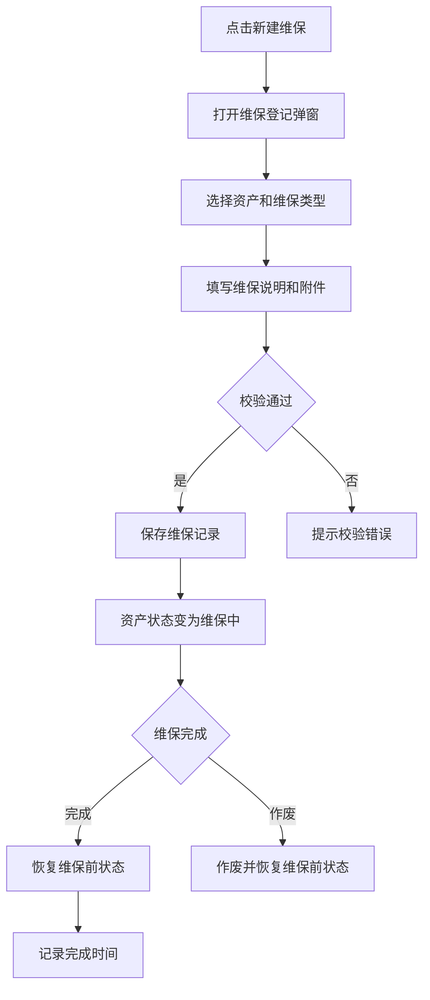

# 维保登记 PRD

## 版本记录

| 版本 | 日期 | 说明 | 影响范围 |
| --- | --- | --- | --- |
| v0.1 | 2026-08-03 | 初稿 | 全文 |
| v0.2 | 2026-08-11 | 同步原型迭代（ISS-009 回写）：登记弹窗改为主单+资产明细两段式；新增业务办理详情只读抽屉与作废二次确认；补充页面信息架构与功能需求 | 功能范围、页面信息架构、功能需求、验收标准 |
| v0.3 | 2026-08-13 | 角色模型同步：部门管理员可办理本部门维保，普通用户不进入 Web 日常管理 | 使用角色、权限规则、验收标准 |

## 规划来源

- 产品规划文档：`001_产品规划/03-功能模块-03-日常管理模块.md`
- 对应模块：日常管理模块
- 关联页面：维保登记
- 端类型：web
- 关联实体：资产维保记录、资产、附件
- 关联权限：`07-权限逻辑约定.md` 中日常管理—维保登记（查看、新建、完成、作废、导出）
- 相关通用规则：`06-通用业务规则.md` 中维保状态与资产状态不同步

## 背景与目标

单位管理员通过维保登记页面记录资产的故障维修和例行保养。维保只支持故障维修和例行保养两类。维保开始和完成通过同一主责能力更新资产维保状态，失败时整单回滚。

## 使用角色与诉求

| 角色 | 使用场景 | 关键诉求 | 页面主要动作 |
| --- | --- | --- | --- |
| 单位管理员 | 资产维修或保养登记 | 登记维保、完成维保、作废更正 | 新建、完成、作废、查看、导出 |
| 部门管理员 | 本部门资产维保 | 仅处理本部门名下资产，保存即生效 | 新建、完成、作废、查看 |
| 普通用户 | 个人资产查看 | 不进入 Web 日常管理；在移动端查看本人资产并自主点验 | 不开放 Web |

## 功能范围

### 本期包含

- 维保记录列表展示（含关键字、状态筛选）
- 维保登记弹窗（主单：创建人、维保类型、维保说明、附件；明细：资产清单）
- 业务办理详情（只读抽屉）
- 维保完成操作（恢复维保前状态）
- 作废更正（二次确认）
- 附件上传（维保证明材料）
- 受控导出

### 本期不包含

- 维保编辑（保存即生效，不支持编辑）
- 审批流程
- 维保类型扩展（不得增加故障维修和例行保养以外的类型）

## 页面与入口

| 页面 | 端类型 | 路由/页面路径建议 | 入口 | 页面关系 | 说明 |
| --- | --- | --- | --- | --- | --- |
| 维保登记 | web | /asset-management/maintenance-records | 日常管理 > 维保登记 | 上游为资产清单 | 维保管理页 |

## 页面信息架构

| 页面 | 区域 | 信息层级 | 主体内容 | 关键操作区 |
| --- | --- | --- | --- | --- |
| 维保登记 | 顶部 | 主 | 页面标题“维保登记” | 新建维保按钮、导出按钮 |
| 维保登记 | 筛选区 | 主 | 关键字、状态 | 查询、重置 |
| 维保登记 | 表格区 | 主 | 维保单号、日期、资产编号、资产名称、维保类型、状态 | 完成、作废、查看详情 |
| 维保登记 | 登记弹窗 | 主 | 主单（创建人、维保类型、维保说明、附件）+ 资产明细 | 保存 |
| 维保登记 | 详情抽屉 | 辅助 | 业务办理详情（只读） | — |

## 功能需求

| 编号 | 功能点 | 规则说明 | 适用页面 | 优先级 |
| --- | --- | --- | --- | --- |
| FR-1 | 列表展示 | 展示维保单号、日期、资产、维保类型、状态；支持关键字和状态筛选 | 维保登记 | P0 |
| FR-2 | 维保登记 | 主单+资产明细两段式弹窗；保存即生效，资产变为维保中 | 维保登记 | P0 |
| FR-3 | 业务办理详情 | 只读抽屉展示维保单主单与明细 | 维保登记 | P1 |
| FR-4 | 维保完成 | 恢复维保前状态，记录完成时间 | 维保登记 | P0 |
| FR-5 | 作废更正 | 作废维保记录并恢复维保前状态，二次确认 | 维保登记 | P0 |
| FR-6 | 附件上传 | 上传维保证明材料 | 维保登记 | P1 |
| FR-7 | 受控导出 | 按筛选条件导出 | 维保登记 | P1 |

## 业务流程

## 状态与操作

| 状态 | 可见操作 | 禁用/隐藏规则 | 操作后状态变化 | 结果反馈 |
| --- | --- | --- | --- | --- |
| 维保中 | 完成、作废、查看、导出 | 无 | 完成→已完成；作废→已作废 | — |
| 已完成 | 查看、导出 | 无 | 无 | — |
| 已作废 | 查看、导出 | 无 | 无 | — |

## 数据与校验规则

| 字段/数据项 | 默认值 | 必填 | 格式/范围校验 | 计算口径 | 刷新/同步规则 |
| --- | --- | --- | --- | --- | --- |
| 维保资产 | — | 是 | 不得为借用中、维保中或已报废状态 | — | — |
| 维保类型 | — | 是 | 故障维修/例行保养 | — | 不得增加其他类型 |
| 维保说明 | — | 是 | 文本 | — | — |
| 附件 | — | 否 | 图片/文档 | — | 维保证明材料 |

## 异常与空状态

| 场景 | 触发条件 | 页面表现 | 用户可执行操作 | 恢复/兜底规则 |
| --- | --- | --- | --- | --- |
| 资产不可维保 | 选中借用中/维保中/已报废资产 | 校验提示 | 更换资产 | 阻止保存 |
| 完成失败 | 整单回滚 | 错误提示 | 重试 | 恢复维保前状态 |

## 验收标准

### 页面验收

- 维保页面可通过“日常管理 > 维保登记”菜单进入
- 表格展示维保单号、日期、资产、维保类型、状态
- 登记弹窗为主单+资产明细两段式
- 列表行“查看详情”打开只读业务办理详情抽屉

### 功能验收

- 维保类型只支持故障维修和例行保养
- 维保保存即生效，资产变为维保中
- 维保完成恢复维保前状态，记录完成时间
- 作废恢复维保前状态
- 维保开始和完成通过同一主责能力更新资产维保状态，失败时整单回滚

### 状态验收

- 维保中可完成和作废
- 已完成和已作废不可再操作

## 原型/工程关联

- PRD 类型：项目 PRD
- PRD 文件：`002_PRD/barracks-admin/维保登记.md`
- 原型项目：`003_prototype/barracks-admin/`
- 页面文件：`src/views/daily/MaintenanceRecords.vue`（共享组件 `AssetDetailEditor.vue`）
- 文档映射：`src/doc/manifest.json` 已登记 `/asset-management/maintenance-records`
