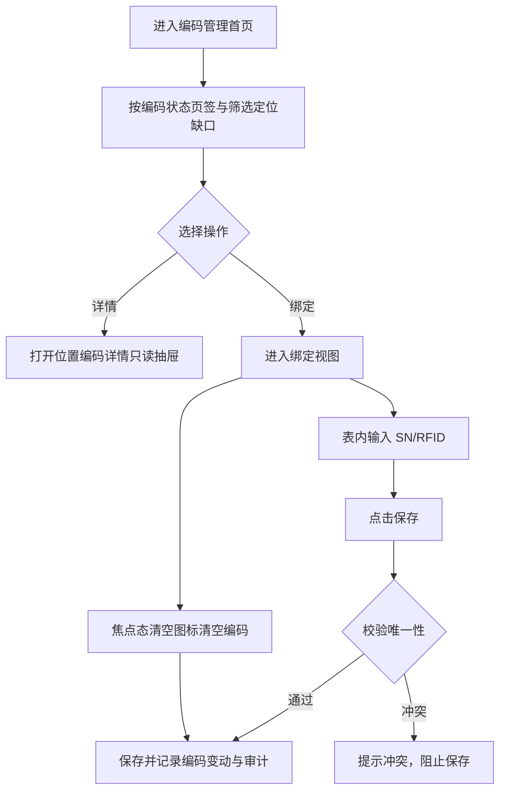

# 编码管理 PRD

## 版本记录

| 版本 | 日期 | 说明 | 影响范围 |
| --- | --- | --- | --- |
| v0.1 | 2026-08-03 | 初稿 | 全文 |
| v0.2 | 2026-08-11 | 同步原型迭代（ISS-009 回写）：页面重构为"存放位置聚合首页 + 绑定视图"两级结构；首页按位置级实时聚合资产清单，提供编码状态页签与位置编码详情只读抽屉；绑定视图按所选位置范围表内编辑 SN/RFID | 全文 |
| v0.3 | 2026-08-12 | 调整资产状态范围，位置聚合仅覆盖在库和维保中资产 | 全文 |
| v0.5 | 2026-08-13 | 角色模型同步：编码维护与导出仅单位管理员可用，普通用户不进入 Web 编码管理 | 使用角色、权限规则、验收标准 |
| v0.6 | 2026-08-18 | 质量整改：将绑定视图标题中的变量占位符改为明确的页面展示字段说明 | 页面信息架构、验收标准 |

## 规划来源

- 产品规划文档：`001_产品规划/03-功能模块-04-资产盘点模块.md`
- 对应模块：资产盘点模块
- 关联页面：编码管理
- 端类型：web
- 关联实体：编码变动记录、RFID 标签、资产、资产位置
- 关联权限：`07-权限逻辑约定.md` 中资产盘点—编码管理（查看、编辑（表内维护）、清空（焦点态）、导出）
- 相关通用规则：`06-通用业务规则.md` 中统一查询上下文（F-13）、RFID 唯一性、编码清空控制

## 背景与目标

单位管理员通过编码管理页面维护资产的 SN 和 RFID 编码。页面以存放位置聚合视图作为首页，实时聚合资产清单数据定位编码完善缺口；进入绑定视图后按所选位置范围表内编辑编码。RFID 在有效资产范围内必须唯一；不提供行级"解绑"按钮，清空编码只能通过焦点态清空图标触发。已报废资产的编码仅供历史查询，不允许继续录入、修改或清空。

## 使用角色与诉求

| 角色 | 使用场景 | 关键诉求 | 页面主要动作 |
| --- | --- | --- | --- |
| 单位管理员 | 定位编码缺口、维护资产编码 | 按位置查看完善进度、进入绑定视图表内编辑、清空编码、查看位置编码详情 | 查看、编辑、清空、导出 |
| 部门管理员 | 部门资产编码查看 | 不进入编码管理；仅通过本部门资产清单查看必要编码信息 | 不开放编码管理 |
| 普通用户 | 个人资产编码查看 | 不进入 Web 编码管理；移动端个人资产展示必要编码信息 | 不开放 Web |

## 功能范围

### 本期包含

- 存放位置聚合首页（位置级实时聚合：序号、所属部门、位置名称、完整路径、资产数量、编码状态(SN/RFID)完善进度）
- 编码状态页签（全部/待完善/部分完善/已完善，带数量与状态色点）
- 首页筛选（所属部门、位置名称/完整路径）
- 位置编码详情（只读抽屉：位置信息 + 资产编码明细表）
- 绑定视图表内编辑 SN 和 RFID（保存、焦点态清空图标）
- 绑定视图筛选（关键字、编码状态）与编码状态概览
- 受控导出

### 本期不包含

- 行级"解绑"按钮（不提供独立解绑操作）
- 已报废资产编码修改（仅供历史查询）

### 边界说明

聚合口径：在库、维保中资产按当前具体位置聚合，在用、借用中资产按使用人聚合（使用人缺失时归入“待落实使用人”），已报废资产不纳入聚合。资产派发形成派发事实并使资产进入在用状态，不新增独立“已派发”资产状态。编码管理不设置独立“解绑”动作权限，清空编码属于 `code:manage` 下的高风险变更。资产清单页不维护编码，编码维护由本页承接。

## 页面与入口

| 页面 | 端类型 | 路由/页面路径建议 | 入口 | 页面关系 | 说明 |
| --- | --- | --- | --- | --- | --- |
| 编码管理 | web | /asset-management/code-management | 资产盘点 > 编码管理 | 上游为资产清单 | 存放位置聚合首页 + 绑定视图 |

## 页面信息架构

| 页面 | 区域 | 信息层级 | 主体内容 | 关键操作区 |
| --- | --- | --- | --- | --- |
| 编码管理（首页） | 页签区 | 主 | 全部/待完善/部分完善/已完善页签（数量+状态色点） | 页签切换 |
| 编码管理（首页） | 筛选区 | 主 | 所属部门、位置名称/完整路径 | 查询、重置 |
| 编码管理（首页） | 表格区 | 主 | 序号、所属部门、位置名称、完整路径、资产数量、编码状态(SN/RFID)（状态标签+SN/RFID 完善进度） | 详情、绑定 |
| 编码管理（首页） | 详情抽屉 | 辅助 | 位置编码详情（位置名称、完整路径、所属部门、资产数量、SN/RFID 完善进度 + 资产编码明细表，只读） | — |
| 编码管理（绑定视图） | 顶部 | 主 | 返回按钮、"编码绑定：当前所选位置名称"、位置元信息 | 返回 |
| 编码管理（绑定视图） | 概览区 | 主 | 已完善/部分完善/待完善数量（状态色点） | — |
| 编码管理（绑定视图） | 筛选区 | 主 | 关键字（资产编号/名称）、编码状态 | 搜索、重置 |
| 编码管理（绑定视图） | 表格区 | 主 | 资产编号、资产名称、SN（表内输入+清空图标）、RFID（表内输入+清空图标）、编码状态 | 保存 |

## 业务流程

## 功能需求

| 编号 | 功能点 | 规则说明 | 适用页面 | 优先级 |
| --- | --- | --- | --- | --- |
| FR-1 | 存放位置聚合 | 实时聚合资产清单：在库/维保中按具体位置聚合，在用/借用中按使用人聚合，已报废不纳入；展示资产数量与 SN/RFID 完善进度 | 编码管理首页 | P0 |
| FR-2 | 编码状态页签 | 全部/待完善/部分完善/已完善页签，展示各状态数量与状态色点，切换过滤列表 | 编码管理首页 | P0 |
| FR-3 | 首页筛选 | 支持所属部门、位置名称或完整路径筛选；重置同时还原页签 | 编码管理首页 | P0 |
| FR-4 | 位置编码详情 | 行内"详情"打开只读抽屉，展示位置信息与完善进度及该位置下资产编码明细表 | 编码管理首页 | P1 |
| FR-5 | 绑定视图表内编辑 | 行内"绑定"进入所选位置范围的绑定视图；SN/RFID 单元格内输入，点击"保存"校验唯一性后保存并记录变动 | 编码管理绑定视图 | P0 |
| FR-6 | 清空编码 | 通过输入框焦点态清空图标触发；不提供行级"解绑"按钮 | 编码管理绑定视图 | P0 |
| FR-7 | 编码状态概览 | 绑定视图顶部展示该位置已完善/部分完善/待完善数量 | 编码管理绑定视图 | P1 |
| FR-8 | 受控导出 | 按筛选条件导出 | 编码管理 | P1 |

## 字段与展示

| 页面区域 | 字段 | 字段含义 | 类型/示例 | 展示规则 | 数据来源 |
| --- | --- | --- | --- | --- | --- |
| 首页表格 | 位置名称 | 聚合位置节点名称 | 文本 | 展示位置名称和完整路径 | 位置管理 |
| 首页表格 | 编码状态 | 位置范围内编码完善度 | 标签/进度 | 展示 SN/RFID 完善进度 | 资产当前值 |
| 绑定视图 | SN | 资产序列号 | 文本输入 | 可编辑，单位内唯一 | 资产当前值 |
| 绑定视图 | RFID | 射频编码 | 文本输入 | 可编辑，有效范围内唯一 | 资产当前值 |

## 状态与操作

| 资产状态 | 可见操作 | 禁用/隐藏规则 | 操作后状态变化 | 结果反馈 |
| --- | --- | --- | --- | --- |
| 在库/维保中 | 按具体位置聚合、编辑、清空、查看、导出 | 无 | 编码状态自动更新 | — |
| 在用/借用中 | 按使用人聚合、编辑、清空、查看、导出 | 无 | 编码状态自动更新 | — |
| 已报废 | 不纳入聚合首页；绑定视图中编辑和清空禁用 | 输入框禁用、保存禁用 | 无 | 提示"已报废终态，仅供历史查询" |

## 权限规则

| 权限对象 | 规则 | 无权限表现 | 数据可见范围 |
| --- | --- | --- | --- |
| 页面 | 仅单位管理员可见；部门管理员和普通用户不可见 | 无权限提示或导航隐藏 | 本单位 |
| 表内编辑/保存 | 仅单位管理员 | 无权限隐藏 | — |
| 清空图标 | 仅单位管理员 | 无权限隐藏清空图标 | — |
| 导出按钮 | 仅单位管理员可见 | 无权限隐藏 | 本单位 |

## 数据与校验规则

| 字段/数据项 | 默认值 | 必填 | 格式/范围校验 | 计算口径 | 刷新/同步规则 |
| --- | --- | --- | --- | --- | --- |
| SN | — | 否 | 单位内唯一 | — | 保存时校验唯一性 |
| RFID | — | 否 | 有效范围内唯一 | — | 保存时校验唯一性，清空记录前后值 |
| 编码状态 | 待完善 | 是 | 待完善/部分完善/已完善 | SN和RFID均空为待完善；均有为已完善 | 由编码变动自动更新 |
| 位置聚合状态 | — | 是 | 待完善/部分完善/已完善 | 组内全部资产双码完善为已完善；双码均为空为待完善；其余为部分完善 | 资产清单实时聚合 |
| 变动记录 | — | 是 | 记录录入、修改、清空和换标的前后值 | — | 系统自动记录 |

## 异常与空状态

| 场景 | 触发条件 | 页面表现 | 用户可执行操作 | 恢复/兜底规则 |
| --- | --- | --- | --- | --- |
| 无数据 | 无可聚合资产 | 空态提示"暂无位置编码数据" | — | — |
| RFID 冲突 | 输入已存在 RFID | 冲突提示 | 修改后重试 | 阻止保存 |
| 已报废限制 | 对已报废资产编辑或清空 | 输入框与保存禁用 | — | 阻止操作 |
| 绑定视图无数据 | 该位置无匹配资产 | 空态提示"暂无资产数据" | 调整筛选 | — |

## 验收标准

### 页面验收

- 编码管理页面可通过"资产盘点 > 编码管理"菜单进入
- 首页展示编码状态页签（含数量与状态色点）与位置聚合表格（序号、所属部门、位置名称、完整路径、资产数量、编码状态(SN/RFID)）
- 行内"详情"打开位置编码详情只读抽屉，"绑定"进入绑定视图

### 功能验收

- 在库/维保中按具体位置聚合，在用/借用中按使用人聚合，已报废不纳入
- 绑定视图表内编辑 SN 和 RFID，保存时校验唯一性，冲突阻止保存
- 不提供行级"解绑"按钮，清空编码只能通过焦点态清空图标触发
- 已报废资产输入框与保存禁用，仅供历史查询
- 编码状态与位置聚合状态随编码变动自动更新
- 编码变动记录录入、修改、清空的前后值

### 状态验收

- 页签切换与筛选组合过滤生效，重置还原页签与筛选
- 绑定视图返回后回到首页聚合列表

## 原型/工程关联

- PRD 类型：项目 PRD
- PRD 文件：`002_PRD/barracks-admin/编码管理.md`
- 原型项目：`003_prototype/barracks-admin/`
- 页面文件：`src/views/inventory/CodeManagement.vue`
- 文档映射：`src/doc/manifest.json` 已登记 `/asset-management/code-management`
