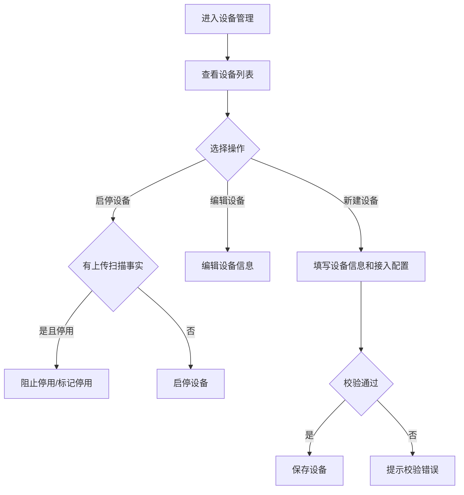

# 设备管理 PRD

## 版本记录

| 版本 | 日期 | 说明 | 影响范围 |
| --- | --- | --- | --- |
| v0.1 | 2026-08-03 | 初稿 | 全文 |
| v0.3 | 2026-08-13 | 删除审计人员角色并补充普通用户不进入系统设置 | 使用角色、权限规则、验收标准 |

## 规划来源

- 产品规划文档：`001_产品规划/03-功能模块-06-系统设置模块.md`
- 对应模块：系统设置模块
- 关联页面：设备管理
- 端类型：web
- 关联实体：RFID 设备、资产位置
- 关联权限：`07-权限逻辑约定.md` 中系统设置—设备管理（查看、新建、编辑、启停）
- 相关通用规则：`06-通用业务规则.md` 中唯一数据源、设备唯一标识

## 背景与目标

单位管理员通过设备管理页面维护 RFID 设备接入配置、位置和状态。设备标识在当前部署范围内唯一。停用设备不得继续上传新扫描事实。

## 使用角色与诉求

| 角色 | 使用场景 | 关键诉求 | 页面主要动作 |
| --- | --- | --- | --- |
| 单位管理员 | 维护 RFID 设备配置 | 新建设备、编辑、启停、查看 | 新建、编辑、启停、查看 |
| 部门管理员 | 使用盘点设备 | 不维护设备配置；不进入系统设置 | 不开放 Web |
| 普通用户 | 个人资产查看 | 不进入 Web 系统设置 | 不开放 Web |

## 功能范围

### 本期包含

- RFID 设备列表展示
- 新建设备（设备标识、名称、类型、关联位置、接入配置）
- 编辑设备
- 设备启停
- 查看设备详情

### 本期不包含

- 设备导入
- 设备导出
- 审批流程

### 边界说明

设备标识在当前部署范围内唯一。停用设备不得继续上传新扫描事实。设备关联位置引用系统设置中的位置数据。

## 页面与入口

| 页面 | 端类型 | 路由/页面路径建议 | 入口 | 页面关系 | 说明 |
| --- | --- | --- | --- | --- | --- |
| 设备管理 | web | /asset-management/device-management | 系统设置 > 设备管理 | 上游为位置管理 | 设备配置页 |

## 页面信息架构

| 页面 | 区域 | 信息层级 | 主体内容 | 关键操作区 |
| --- | --- | --- | --- | --- |
| 设备管理 | 顶部 | 主 | 页面标题"设备管理" | 新建设备按钮 |
| 设备管理 | 筛选区 | 主 | 设备标识、类型、状态 | 搜索、重置 |
| 设备管理 | 表格区 | 主 | 设备标识、名称、类型、关联位置、接入配置、状态 | 编辑、启停、查看详情 |
| 设备管理 | 分页区 | 辅助 | 总数、每页条数、页码跳转 | — |

## 业务流程

## 功能需求

| 编号 | 功能点 | 规则说明 | 适用页面 | 优先级 |
| --- | --- | --- | --- | --- |
| FR-1 | 列表展示 | 展示设备标识、名称、类型、关联位置、接入配置、状态 | 设备管理 | P0 |
| FR-2 | 新建设备 | 创建 RFID 设备，校验设备标识唯一性 | 设备管理 | P0 |
| FR-3 | 编辑设备 | 编辑设备信息、关联位置和接入配置 | 设备管理 | P0 |
| FR-4 | 设备启停 | 停用设备不得继续上传新扫描事实 | 设备管理 | P0 |

## 状态与操作

| 状态 | 可见操作 | 禁用/隐藏规则 | 操作后状态变化 | 结果反馈 |
| --- | --- | --- | --- | --- |
| 启用 | 编辑、停用、查看 | 无 | 停用→停用 | — |
| 停用 | 查看 | 编辑禁用 | 无 | 提示"停用设备不可上传新扫描" |

## 权限规则

| 权限对象 | 规则 | 无权限表现 | 数据可见范围 |
| --- | --- | --- | --- |
| 页面 | 仅单位管理员可见；部门管理员和普通用户不可见 | 无权限提示或导航隐藏 | 本单位 |
| 新建按钮 | 仅单位管理员 | 无权限隐藏 | — |
| 编辑按钮 | 仅单位管理员 | 无权限隐藏 | — |
| 启停 | 仅单位管理员 | 无权限隐藏 | — |

## 数据与校验规则

| 字段/数据项 | 默认值 | 必填 | 格式/范围校验 | 计算口径 | 刷新/同步规则 |
| --- | --- | --- | --- | --- | --- |
| 设备标识 | — | 是 | 部署范围内唯一 | — | — |
| 设备名称 | — | 是 | 文本 | — | — |
| 设备类型 | — | 是 | 手持终端/固定读写器 | — | — |
| 关联位置 | — | 否 | 启用位置 | — | 从系统设置同步 |
| 接入配置 | — | 否 | IP/端口/频率等 | — | — |

## 异常与空状态

| 场景 | 触发条件 | 页面表现 | 用户可执行操作 | 恢复/兜底规则 |
| --- | --- | --- | --- | --- |
| 无设备 | 无设备数据 | 空态提示 | 引导到新建设备 | — |
| 标识冲突 | 输入已存在设备标识 | 冲突提示 | 修改后重试 | 阻止保存 |
| 停用有上传 | 停用设备有新上传 | 阻止上传 | 重新启用设备 | — |

## 验收标准

### 页面验收

- 设备管理页面可通过"系统设置 > 设备管理"菜单进入
- 表格展示设备标识、名称、类型、关联位置、接入配置、状态

### 功能验收

- 可新建、编辑 RFID 设备
- 设备标识在部署范围内唯一
- 可启停设备
- 停用设备不得继续上传新扫描事实

### 状态验收

- 启用设备可编辑和停用
- 停用设备不可编辑、不可上传新扫描

## 原型/工程关联

- PRD 类型：项目 PRD
- PRD 文件：`002_PRD/barracks-admin/设备管理.md`
- 原型项目：`003_prototype/barracks-admin/`
- 页面文件：`src/views/settings/DeviceManagement.vue`（设备列表 + 新增/编辑弹窗 + 启停）
- 文档映射：`src/doc/manifest.json` 已登记 `/asset-management/device-management`
