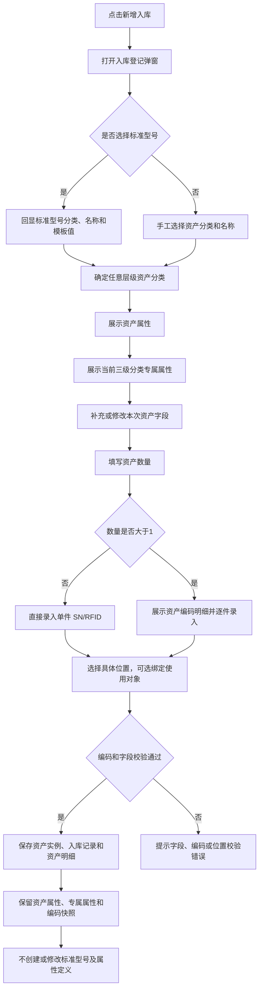

# 资产入库 PRD

## 版本记录

| 版本 | 日期 | 说明 | 影响范围 |
| --- | --- | --- | --- |
| v0.1 | 2026-08-03 | 初稿 | 全文 |
| v0.2 | 2026-08-04 | 支持选择标准型号后回显模板字段 | 字段说明、交互与验收标准 |
| v0.3 | 2026-08-11 | 同步原型迭代：补充批量导入、作废和业务办理详情 | 功能范围、页面信息架构、功能需求、验收标准 |
| v0.4 | 2026-08-12 | 补充盘盈入库自动生成口径 | 背景目标、边界说明、数据校验、验收标准 |
| v0.6 | 2026-08-13 | 删除审计人员角色；补充部门管理员仅从资产清单/库存查看入库结果，普通用户不进入入库 | 使用角色、权限规则、验收标准 |
| v0.7 | 2026-08-14 | 统一入库表单字段文案：入库数量改为“资产数量”，入库位置改为“所在位置” | 入库弹窗字段、校验提示、验收标准 |
| v0.8 | 2026-08-17 | 支持录入 SN/RFID；入库弹窗调整为大尺寸三列布局并明确输入宽度；补充批量导入模板字段表、逐行校验和原子写入规则；统一录入、列表、详情、导出字段及按钮命名 | 页面信息架构、功能需求、字段与展示、交互规则、数据与校验、验收标准、原型/工程关联 |
| v0.9 | 2026-08-17 | 同步两级字段配置：入库表单先展示通用默认字段，再按标准型号展示专属字段；批量导入增加专属字段扩展区并补齐计量单位、使用部门字段 | 功能范围、页面信息架构、功能需求、字段与展示、批量导入逻辑、验收标准 |
| v1.0 | 2026-08-17 | 专属字段支持下拉选项类型；入库按标准型号配置渲染下拉框，并补充导入选项校验规则 | 字段与展示、交互、数据校验、异常与验收标准 |
| v1.1 | 2026-08-18 | 按用户本轮要求同步字段来源：资产属性由资产分类页面统一维护并支持单位管理员新增，专属属性改为按三级资产分类维护；入库字段改为“资产属性 + 当前分类专属属性”，批量导入改按资产分类匹配专属属性 | 背景目标、功能范围、页面信息架构、功能需求、字段与展示、批量导入、数据校验、异常与验收标准 |
| v1.2 | 2026-08-18 | 修复资产数量与 SN/RFID 一对多关系：增加逐件资产编码明细，支持无编码批量入库、部分编码保存、编码唯一性校验和数量变更保护 | 业务流程、功能需求、页面信息架构、字段与展示、交互规则、批量导入、数据校验、异常与验收标准、原型关联 |
| v1.3 | 2026-08-19 | 入库信息增加取得方式、取得日期、使用方向、使用状况四个系统默认属性；“参考单价”重命名为“参考价值”，“实际单价”重命名为“实际价值” | 默认属性、字段与展示、导入模板、数据校验、验收标准、原型实现 |
| v1.4 | 2026-08-20 | 资产分类改为 GB/T 14885—2022 四级树形分类；入库资产分类使用树形选择器，门类、大类、中类、小类均可直接选择，四级小类沿用所属三级中类专属属性 | 资产分类字段、属性解析、交互、导入规则、验收标准、原型实现 |

## 规划来源

- 产品规划文档：`001_产品规划/03-功能模块-02-仓储管理模块.md`
- 对应模块：仓储管理模块
- 关联页面：资产入库
- 端类型：web
- 关联实体：仓储流转记录、资产、标准型号、资产分类、资产属性、专属属性、资产位置、使用对象
- 关联权限：`07-权限逻辑约定.md` 中仓储管理—资产入库（查看、新建、作废、导出）
- 相关通用规则：`06-通用业务规则.md` 中原子业务动作、唯一数据源、历史不可覆盖、盘盈盘亏审核处置闭环
- 本轮业务变更来源：用户本轮输入；属性定义详见 `002_PRD/barracks-admin/资产分类.md`

## 背景与目标

单位管理员通过入库登记页面记录资产进入单位管理范围的事实。入库时必须将资产放入一个启用的具体位置，可选绑定使用对象；可录入可选的 SN 与 RFID 编码，保存即生效，生成资产和入库记录。资产数量表示本次生成的资产实例数量，SN/RFID 按资产实例维护，不允许使用一组编码代表多件资产。

标准型号是可选的资产模板。资产录入确定任意层级资产分类后，系统从“系统设置 > 资产分类”读取最新有效的资产属性，并在能确定对应三级中类时读取该中类专属属性，形成“资产属性 + 专属属性”的录入字段集合。其中“取得方式、取得日期、使用方向、使用状况”为系统默认属性，默认启用且不可关闭。选择标准型号时，先回显标准型号的资产分类、资产名称及可提供的模板值；不选择标准型号时，仍必须展示全部有效资产属性，并在选择分类后按规则展示对应专属属性。手工录入或修改只保存为本次资产快照，不新增或修改标准型号及属性定义。

## 使用角色与诉求

| 角色 | 使用场景 | 关键诉求 | 页面主要动作 |
| --- | --- | --- | --- |
| 单位管理员 | 新购、调拨、盘盈入库 | 选择或跳过标准型号，按资产分类填写资产属性和专属属性，指定具体位置、绑定使用对象和 SN/RFID | 新建、导入、作废、查看、导出 |
| 部门管理员 | 入库结果核对 | 不进入入库页面；仅可在本部门资产清单/库存查看已派发资产 | 仅查看部门范围投影 |
| 普通用户 | 个人资产查看 | 不进入 Web 入库页面 | 不开放 Web |

## 功能范围

### 本期包含

- 入库记录列表展示和查询
- 入库登记：可选标准型号、通过四级树选择任意层级资产分类、填写资产属性和可确定的三级中类专属属性、指定具体位置、可选绑定使用对象和 SN/RFID
- 资产数量与资产编码明细：数量为 1 时直接录入 SN/RFID；数量大于 1 时按资产明细逐件录入，未编码明细允许后续在编码管理中补录
- 选择标准型号后按“资产属性 → 当前三级分类专属属性”顺序回显
- 不选择标准型号时，仍展示全部有效资产属性；选择分类后展示该分类专属属性
- 批量导入、业务办理详情、入库作废和受控导出
- 盘盈审核处置自动生成入库记录，并按盘盈处置时的分类读取属性

### 本期不包含

- 已生效入库记录直接编辑
- 入库时创建或补充标准型号、资产属性或专属属性
- 仓库主数据、仓库类型或独立仓库选择
- 审批流程

### 边界说明

资产属性和专属属性的定义与启停只在“系统设置 > 资产分类”维护；资产入库只读取有效定义并保存本次资产实际值。资产属性对所有资产分类生效，专属属性只对所属三级分类生效。属性配置变更不回写历史资产快照；新增属性对已存在资产无历史值时展示“—”。

资产位置由“系统设置 > 位置管理”唯一维护，入库仅引用启用位置的具体节点，不使用仓库字段。入库后资产当前位置为入库位置；未绑定使用对象时状态为在库，绑定使用对象时状态为在用，并保存使用对象和使用部门。盘盈入库由资产盘点审核处置自动生成，仍需写入具体位置和可选使用对象。

## 页面与入口

| 页面 | 端类型 | 路由/页面路径建议 | 入口 | 页面关系 | 说明 |
| --- | --- | --- | --- | --- | --- |
| 资产入库 | web | /asset-management/asset-inbound | 仓储管理 > 资产入库 | 下游为资产清单、资产库存；上游引用资产分类的属性配置 | 入库登记弹窗页 |

## 页面信息架构

| 页面 | 区域 | 信息层级 | 主体内容 | 关键操作区 |
| --- | --- | --- | --- | --- |
| 资产入库 | 顶部 | 主 | 页面标题“资产入库” | 新增入库、批量导入、导出 |
| 资产入库 | 筛选区 | 主 | 关键字（入库单号/资产名称）、状态 | 查询、重置 |
| 资产入库 | 表格区 | 主 | 入库单号、入库日期、入库来源、资产名称、资产分类、资产数量、价格、编码(SN/RFID)、所在位置、使用对象、使用部门、状态 | 详情、作废 |
| 资产入库 | 入库弹窗 | 主 | 三列布局展示标准型号、资产属性、专属属性、资产数量、资产编码明细、所在位置、使用对象、使用部门和价格信息 | 选择标准型号、选择分类、调整数量、逐件录入编码、选择位置、选择使用对象、保存 |
| 资产入库 | 导入弹窗 | 辅助 | 固定业务字段、当前资产属性列、专属属性扩展表、模板下载、文件选择、逐行校验结果 | 导入、取消 |
| 资产入库 | 详情抽屉 | 辅助 | 主单信息、资产属性快照、专属属性快照、资产明细及每件资产的 SN/RFID、位置、使用对象和使用部门 | — |

## 业务流程

## 功能需求

| 编号 | 功能点 | 规则说明 | 适用页面 | 优先级 |
| --- | --- | --- | --- | --- |
| FR-1 | 列表展示 | 展示入库单号、日期、来源、资产名称、资产分类、资产数量、价格、编码(SN/RFID)、所在位置、使用对象、使用部门和状态；支持关键字与状态筛选 | 资产入库 | P0 |
| FR-2 | 选择标准型号 | 标准型号为非必选，仅显示启用标准型号；选择后回显标准型号分类、名称和模板值，字段定义仍以资产分类页面的有效资产属性和专属属性为准 | 资产入库 | P0 |
| FR-3 | 解析资产属性 | 确定资产分类后，按资产分类页面的启用状态和顺序展示全部资产属性；取得方式、取得日期、使用方向、使用状况四个系统默认属性始终可用；单位管理员新增并启用的属性从后续所有资产录入表单生效 | 资产入库 | P0 |
| FR-4 | 解析专属属性 | 确定任意层级分类后，若能确定对应三级中类则展示该中类启用的专属属性；选择“计算机”或其下级小类展示 CPU、内存、显卡等配置项，其他分类不展示计算机专属属性 | 资产入库 | P0 |
| FR-5 | 手工录入资产 | 不选择标准型号时，手工填写资产分类、资产名称及资产属性；选择任意层级分类后按规则补充专属属性；保存成功后不创建或补充标准型号 | 资产入库 | P0 |
| FR-6 | 所在位置 | 入库时必须选择一个启用的具体位置节点；不展示、不使用仓库字段 | 资产入库 | P0 |
| FR-7 | 入库绑定使用对象 | 入库时可选择有效使用对象；选择后自动回显使用部门；未选择时资产暂不绑定使用对象 | 资产入库 | P0 |
| FR-8 | 入库登记 | 填写四个系统默认属性、资产数量、实际价值等信息；数量为 1 时直接录入编码，数量大于 1 时展示资产编码明细；保存即生效，按明细生成资产实例、入库记录、位置当前值和审计日志 | 资产入库 | P0 |
| FR-9 | 批量导入 | 下载并按最新模板导入资产入库数据；模板包含固定业务字段和当前启用资产属性，专属属性通过资产分类代码和属性 key 匹配；逐行校验属性、分类、数量、位置、SN/RFID 唯一性和数值格式；全部校验通过后原子写入 | 资产入库 | P1 |
| FR-10 | 业务办理详情 | 只读展示入库主单、资产属性快照、专属属性快照、资产明细及每件资产的 SN/RFID、具体位置、使用对象、使用部门和来源信息 | 资产入库 | P1 |
| FR-11 | 入库作废 | 已生效记录可二次确认后作废；保留原始轨迹并按规则恢复资产状态 | 资产入库 | P0 |
| FR-12 | 受控导出 | 按当前筛选条件导出入库记录及已保存的属性快照 | 资产入库 | P1 |

## 字段与展示

| 页面区域 | 字段 | 字段含义 | 类型/示例 | 展示规则 | 数据来源 |
| --- | --- | --- | --- | --- | --- |
| 弹窗 | 标准型号 | 可复用模板引用 | 树形/搜索下拉 | 非必选；仅显示启用标准型号；可清空 | 系统设置 |
| 弹窗 | 资产属性 | 单位级资产通用属性集合 | 按属性定义 | 确定分类后展示全部启用资产属性；选择标准型号后可回显模板值，可修改本次资产值 | 资产分类属性配置/标准型号/用户输入 |
| 弹窗 | 资产分类 | 资产归属分类 | 四级树形选择 | 展示门类、大类、中类、小类及完整编码；门类、大类、中类、小类均可直接选择；选择标准型号后回显且可按本次资产修改；未选标准型号时必填 | 标准型号/资产分类/用户输入 |
| 弹窗 | 资产名称 | 本次资产名称 | 文本 | 选择标准型号后回显且可修改；未选标准型号时必填 | 标准型号/用户输入 |
| 弹窗 | 专属属性 | 当前分类对应的三级中类专属属性集合 | 文本/数字/日期/下拉选项 | 排在资产属性之后；确定分类后按规则动态展示；专属必填属性必须填写 | 资产分类专属属性配置/用户输入 |
| 弹窗 | 取得方式 | 资产取得来源或方式 | 文本 | 系统默认属性；非必填；可由标准型号带出并允许修改本次入库值 | 资产分类属性配置/标准型号/用户输入 |
| 弹窗 | 取得日期 | 资产取得日期 | 日期 | 系统默认属性；非必填；可由标准型号带出并允许修改本次入库值 | 资产分类属性配置/标准型号/用户输入 |
| 弹窗 | 使用方向 | 资产使用方向 | 文本 | 系统默认属性；非必填；支持手动录入 | 资产分类属性配置/用户输入 |
| 弹窗 | 使用状况 | 资产当前使用状况 | 文本 | 系统默认属性；非必填；支持手动录入 | 资产分类属性配置/用户输入 |
| 弹窗 | 资产数量 | 本次生成的资产实例数量 | 正整数 | 默认 1；数量大于 1 时资产编码明细行数必须等于数量；盘盈入库固定 1 | 用户输入/业务规则 |
| 弹窗 | 参考价值 | 标准型号或资产属性参考值 | 数字 | 选择标准型号后回显；可留空 | 标准型号/资产属性模板值 |
| 弹窗 | 实际价值 | 本次资产实际价值 | 数字 | 常规入库未填时取参考价值；盘盈可留空 | 用户输入 |
| 弹窗 | 入库金额 | 本次入库金额 | 数字只读 | 数量 × 实际价值；实际价值为空时为空 | 系统计算 |
| 弹窗 | 所在位置 | 资产初始具体位置 | 树形选择 | 必填；仅显示启用位置节点；不含仓库字段 | 位置管理 |
| 弹窗 | 资产编码明细 | 单件资产的编码明细集合 | 表格 | 数量为 1 时直接展示 SN/RFID；数量大于 1 时展示序号、SN、RFID 明细表；未编码明细允许为空 | 用户输入/批量导入 |
| 弹窗/明细表 | SN | 单件资产序列号 | 文本（如 SN20260101001） | 非必填；单位内唯一；一行只对应一件资产；无值留空 | 用户输入/批量导入 |
| 弹窗/明细表 | RFID | 单件资产 RFID 标签编码 | 文本（如 E2003412） | 非必填；单位内唯一；一行只对应一件资产；无值留空 | 用户输入/批量导入 |
| 表格/详情 | 编码(SN/RFID) | 资产外部编码组合展示 | 双行文本/明细表 | 数量为 1 展示实际编码；数量大于 1 展示“已录入 x/N 件”，详情中逐件展示明细 | 资产字段快照 |
| 弹窗 | 使用对象 | 入库时绑定的实际使用对象 | 人员选择 | 非必填；选定后回显使用部门 | 基础信息 |
| 弹窗 | 使用部门 | 使用对象的所属部门 | 文本只读 | 选择使用对象后自动回显；不可手动修改 | 基础信息 |
| 弹窗 | 备注 | 入库说明 | 多行文本 | 非必填 | 用户输入 |

### 动态属性展示规则

1. 资产属性来源于资产分类页面的单位级有效配置，按配置顺序展示；“取得方式、取得日期、使用方向、使用状况”属于系统默认属性，始终展示且不可关闭，历史数据中的 `purchaseDate` 键继续按“取得日期”展示。
2. 专属属性来源于当前分类对应的三级中类，按该分类的配置顺序展示；例如选择“计算机”或其下级小类时展示 CPU、内存、显卡，选择其他分类时展示“资产属性 + 其他分类专属属性”。
3. 选择标准型号不会改变资产属性和专属属性定义；标准型号只回显与当前分类匹配的模板值，录入人员可以修改本次资产值。
4. 属性值按照定义的文本、数字、日期或下拉选项控件录入；空值统一按页面规则展示“—”。

## 状态与操作

| 状态 | 可见操作 | 禁用/隐藏规则 | 操作后状态变化 | 结果反馈 |
| --- | --- | --- | --- | --- |
| 已完成 | 详情、作废、导出 | 无 | 作废后变为已作废，资产按更正规则恢复 | 成功提示 |
| 已作废 | 详情、导出 | 作废按钮禁用 | 无 | — |

## 交互规则

| 交互类型 | 适用页面/区域 | 规则 |
| --- | --- | --- |
| 选择标准型号 | 入库弹窗 | 选择后回显标准型号分类、名称和模板值，再按该分类读取资产属性与专属属性；清空后保留已填本次资产字段并继续展示已选分类的属性 |
| 选择资产分类 | 入库弹窗 | 使用可展开、可搜索的四级树形选择器；门类、大类、中类、小类均可直接选中；分类变更后保留资产属性值，清空不适用的未保存专属属性，并刷新对应三级中类专属属性 |
| 手工录入 | 入库弹窗 | 未选标准型号时仍展示全部启用资产属性；资产分类、资产名称必填；确定任意层级分类后按规则展示对应专属属性 |
| 动态属性 | 入库弹窗 | 资产属性统一排在前面，专属属性排在后面；新增属性保存成功后，后续打开的表单读取最新配置 |
| 属性配置冲突 | 入库弹窗 | 打开表单后属性被停用或改版，保存时重新校验属性版本；冲突时提示刷新，不覆盖无冲突的已填写字段 |
| 选择位置 | 入库弹窗 | 使用树形选择器选择具体节点；父节点和叶节点均可作为具体位置，只要节点启用 |
| 选择使用对象 | 入库弹窗 | 选择有效人员作为使用对象；选择后自动回显部门；清空使用对象时同步清空使用部门 |
| 调整资产数量 | 入库弹窗 | 数量变化时同步生成或移除资产编码明细行；减少数量会删除已录入编码时阻止变更并提示先清空对应明细；数量始终等于明细行数 |
| 录入资产编码 | 入库弹窗 | 数量为 1 时直接录入 SN/RFID；数量大于 1 时逐件录入明细；SN/RFID 可只填一个；不允许把一组编码复制到多件资产 |
| 保存 | 入库弹窗 | 保存前校验资产属性、专属属性、位置状态、人员有效性、明细数量、SN/RFID 唯一性、数量和价格；部分资产未编码时二次确认；整单保存成功后关闭弹窗并刷新列表 |
| 导入 | 导入弹窗 | 固定业务列和资产属性列按模板解析；专属属性按“资产分类代码 + 属性 key”匹配并按属性类型校验；全部通过后一次性写入，失败行不写入 |
| 作废 | 表格区 | 作废前二次确认；作废不物理删除入库记录，保留原始资产属性、专属属性、位置、SN/RFID、使用对象和操作轨迹 |

### 批量导入业务逻辑

批量导入与手工入库共用同一套字段口径。用户从“导入资产”弹窗下载模板，模板包含固定业务列、四个系统默认属性列和当前启用的自定义资产属性列；新下载模板反映最新属性定义，不允许通过导入绕过手工入库校验。导入支持两种行模式：SN/RFID 均为空时，一行可代表多件无编码资产；填写任一 SN/RFID 时，一行只代表一件资产，资产数量必须为 1。

| 顺序 | 模板字段 | 必填 | 示例 | 填写规则 |
| --- | --- | --- | --- | --- |
| 1 | 标准型号 | 否 | 台式计算机 | 可填写启用标准型号；为空时按资产名称、资产分类和属性列手工录入 |
| 2 | 资产名称 | 是 | 台式计算机 | 非空文本 |
| 3 | 资产分类 | 是 | 计算机 | 必须为有效四级树节点；允许选择任意层级；用于解析对应三级中类专属属性 |
| 4 | 计量单位 | 否 | 台 | 当前启用资产属性列；可由标准型号带出 |
| 5 | 品牌 | 否 | 联想 | 当前启用资产属性列；文本 |
| 6 | 型号 | 否 | ThinkCentre M75 | 当前启用资产属性列；文本 |
| 7 | 制造商 | 否 | 联想（北京）有限公司 | 当前启用资产属性列；文本 |
| 8 | 供货单位 | 否 | 联想授权经销商 | 当前启用资产属性列；文本 |
| 9 | 取得方式 | 否 | 采购 | 系统默认属性；填写有效取得方式 |
| 10 | 取得日期 | 否 | 2026-01-12 | 系统默认属性；日期格式 |
| 11 | 使用方向 | 否 | 办公使用 | 系统默认属性；文本 |
| 12 | 使用状况 | 否 | 正常 | 系统默认属性；文本 |
| 13 | SN | 否 | SN20260101001 | 单位内唯一；填写时该行只代表一件资产；没有序列号时留空 |
| 14 | RFID | 否 | E2003412 | 单位内唯一；填写时该行只代表一件资产；没有标签时留空 |
| 15 | 参考价值 | 否 | 4500 | 非负数 |
| 16 | 实际价值 | 否 | 4450 | 非负数；为空时按参考价值计算 |
| 17 | 资产数量 | 是 | 1 | 正整数；SN/RFID 任一有值时必须为 1；两者均为空时可大于 1；盘盈入库固定为 1 |
| 18 | 所在位置 | 是 | LOC-A01 | 必须为启用的具体位置编码 |
| 19 | 使用对象 | 否 | 王小明 | 必须为有效人员；为空表示暂不绑定 |
| 20 | 使用部门 | 否 | 综合科 | 有使用对象时由基础信息回填；不建议手工维护 |
| 21 | 备注 | 否 | 年度采购 | 不超过 200 字 |

资产属性扩展列用于承载不在固定业务列中的单位自定义属性：

| 扩展字段 | 必填 | 示例 | 填写规则 |
| --- | --- | --- | --- |
| 属性 key | 是（属性启用且必填时） | color | 必须为当前启用的自定义资产属性 key；系统默认属性不重复放入扩展区 |
| 属性值 | 按属性定义 | 黑色 | 按资产属性类型填写；必填属性不能为空；新增属性应出现在新下载模板中 |

专属属性不追加为全量固定列，而是作为分类属性扩展区维护以下匹配关系：

| 扩展字段 | 必填 | 示例 | 填写规则 |
| --- | --- | --- | --- |
| 资产分类代码 | 是 | A02010100 | 必须与该行资产分类一致；按 GB/T 14885—2022 使用 1 位字母加 4 组 2 位数字 |
| 属性 key | 是（属性启用且必填时） | cpu | 必须为该三级中类已启用的专属属性 key |
| 属性值 | 按属性定义 | Intel Core i7 | 按专属属性类型填写；专属必填属性不能为空 |

处理顺序如下：

1. 读取模板表头并校验字段完整性；空行跳过，未知列和重复列提示错误；新下载模板包含当前有效的资产属性列。
2. 按行校验资产名称、分类、数量、价格格式、位置启用状态、使用对象有效性以及资产属性必填项。
3. 根据资产分类读取其对应三级中类专属属性；校验分类属性扩展区的资产分类代码、属性 key、属性类型、必填性和下拉选项。
4. SN、RFID 分别校验文件内不重复，并与系统已有资产编码比对；两种编码均可为空，但已填写的编码必须唯一；若任一编码有值且资产数量大于 1，定位到资产数量字段报错。
5. 标准型号有值时读取该型号模板值，但不覆盖导入文件已填写的资产属性；标准型号停用、分类不匹配或不存在时，定位到标准型号字段报错。
6. 使用对象有值时由基础信息回填使用部门，模板不允许单独维护使用部门，避免录入和展示口径不一致。
7. 常规入库实际价值为空时取参考价值；无编码批量行按数量生成多条资产明细；有编码行按一行一件生成资产明细；任一行失败时不写入任何行，返回失败行号、字段和原因；全部通过后一次性生成入库记录和资产明细。
8. 导入完成后返回成功数量、失败数量和失败原因，并刷新列表；导入动作记录操作日志。

## 权限规则

| 权限对象 | 规则 | 无权限表现 | 数据可见范围 |
| --- | --- | --- | --- |
| 页面 | 仅单位管理员可见；部门管理员和普通用户不进入入库 | 无权限提示或导航隐藏 | 本单位 |
| 新建、批量导入、作废 | 仅单位管理员 | 无权限隐藏 | — |
| 查看、导出 | 仅单位管理员可用 | 无权限隐藏 | 本单位 |
| 标准型号选择 | 读取系统设置中启用标准型号；属性定义读取资产分类页面的有效配置 | 无可用模板时允许手工录入 | — |

## 数据与校验规则

| 字段/数据项 | 默认值 | 必填 | 格式/范围校验 | 计算口径 | 刷新/同步规则 |
| --- | --- | --- | --- | --- | --- |
| 标准型号 | 空 | 否 | 只能选择启用且与资产分类匹配的标准型号 | — | 选择时回显模板值，不建立强绑定要求 |
| 资产分类 | 标准型号回显值或空 | 是 | 必须选择 GB/T 14885—2022 四级树中的有效节点；门类、大类、中类、小类均可选择 | — | 保存资产快照；按所选节点确定专属属性集合 |
| 资产名称 | 标准型号回显值或空 | 是 | 非空文本 | — | 保存资产快照 |
| 资产属性 | 空或标准型号模板值 | 按资产属性配置 | 按当前有效属性 key、类型和必填性校验 | — | 保存资产属性快照；不回写标准型号或属性定义 |
| 专属属性 | 空或分类默认值 | 按对应三级中类属性配置 | 按当前分类属性 key、类型和必填性校验；下拉值必须属于配置选项 | — | 保存专属属性快照；不影响其他分类 |
| 资产数量 | 1 | 是 | 正整数；资产编码明细行数必须一致；盘盈固定为 1 | — | 生成对应数量的资产实例和资产明细 |
| 资产编码明细 | 1 行 | 是 | 明细行数必须等于资产数量；每行最多一组 SN/RFID；空编码允许 | — | 逐件保存资产编码快照；列表汇总展示，详情逐件展示 |
| SN | 空 | 否 | 文本；单位内唯一；同一入库单内不得重复；空值允许 | — | 保存所属资产实例的编码快照 |
| RFID | 空 | 否 | 文本；单位内唯一；同一入库单内不得重复；空值允许 | — | 保存所属资产实例的编码快照 |
| 取得方式 | 空或标准型号模板值 | 否 | 文本或空 | — | 保存系统默认属性快照 |
| 取得日期 | 空或标准型号模板值 | 否 | 日期或空 | — | 保存系统默认属性快照；兼容历史 `purchaseDate` 键 |
| 使用方向 | 空 | 否 | 文本或空 | — | 保存系统默认属性快照 |
| 使用状况 | 空 | 否 | 文本或空 | — | 保存系统默认属性快照 |
| 参考价值 | 标准型号参考值或空 | 否 | 非负数或空 | — | 保存本次入库参考快照 |
| 实际价值 | 参考价值 | 常规入库是；盘盈否 | 正数或空 | — | 常规未填写时取参考价值；盘盈可空 |
| 入库金额 | — | 否 | — | 数量 × 实际价值 | 实际价值为空时为空 |
| 所在位置 | 空 | 是 | 启用的具体位置节点 | — | 从位置管理同步；停用时阻止保存 |
| 使用对象 | 空 | 否 | 基础信息中的有效人员 | — | 选人后回填部门；保存当前使用对象快照 |
| 使用部门 | 空 | 使用对象有值时是 | 由使用对象所属部门带出，不可手填 | — | 随使用对象变更同步 |
| 入库来源 | 常规入库 | 是 | 常规入库/盘盈入库 | — | 盘盈由盘点审核处置自动标记 |
| 属性配置版本 | 当前有效版本 | 是 | 保存时必须仍有效 | — | 表单打开和保存时校验；冲突时要求刷新 |

## 异常与空状态

| 场景 | 触发条件 | 页面表现 | 用户可执行操作 | 恢复/兜底规则 |
| --- | --- | --- | --- | --- |
| 无数据 | 无入库记录 | 空态提示并引导新建 | 新增入库 | — |
| 无标准型号 | 没有启用标准型号 | 标准型号选择器提示无可用模板 | 跳过选择并手工选择分类 | 不阻止入库 |
| 无资产属性 | 属性定义加载失败或为空 | 提示资产属性不可用 | 重试或联系管理员 | 不允许提交不完整表单 |
| 无专属属性 | 所选层级不能确定三级中类，或对应三级中类未配置专属属性 | 不展示专属属性区域或显示“暂无专属属性” | 继续填写资产属性 | 不阻止入库 |
| 属性配置变更 | 表单打开后属性被停用、删除或改版 | 保存时提示字段配置已变化 | 刷新配置并补充受影响字段 | 保留无冲突的已填写值 |
| 未选所在位置 | 所在位置为空 | 定位所在位置字段并提示 | 选择启用位置 | 阻止保存 |
| 位置已停用 | 打开表单后所选位置被停用 | 保存时提示位置不可用 | 重新选择位置 | 阻止保存 |
| 未选标准型号 | 标准型号为空 | 仍展示资产属性；选择任意层级分类后按规则展示专属属性 | 填写资产分类和名称 | 不创建标准型号 |
| 专属属性必填缺失 | 所选分类对应的三级中类存在必填专属属性但未填写 | 定位对应专属属性并提示 | 补充属性值 | 阻止保存 |
| 下拉选项无效 | 手工录入或导入值不在属性配置选项内 | 定位属性并提示可选范围 | 重新选择或修改值 | 阻止保存/导入 |
| 使用对象无效 | 人员被停用或无权限 | 提示重新选择使用对象 | 更换或清空使用对象 | 阻止保存 |
| SN/RFID 重复 | 文件内或系统已有资产使用相同编码 | 定位到对应字段并提示编码重复 | 修改编码或留空 | 阻止保存/导入 |
| 数量与明细不一致 | 明细行数不等于资产数量 | 提示调整数量或补齐明细 | 调整数量或补齐明细 | 阻止保存 |
| 减少数量将删除编码 | 待删除明细中存在 SN/RFID | 阻止数量变更并提示先清空编码 | 清空编码后再减少数量 | 不丢失已录编码 |
| 部分资产未编码 | 数量大于 1 且仅部分明细录入编码 | 展示已编码/未编码数量并二次确认 | 继续保存或返回补录 | 继续保存后未编码明细可在编码管理补录 |
| 资产不完整 | 分类、名称或必填属性为空 | 字段级错误提示 | 补充字段 | 阻止保存 |
| 未选择导入文件 | 导入弹窗未选择文件 | 提示先选择文件 | 选择文件重试 | 阻止导入 |
| 导入逐行失败 | 行缺少位置、分类、名称或属性值不合规 | 展示失败原因和成功数量 | 修正失败行后重试 | 失败行不写入 |
| 保存失败 | 保存异常或数据冲突 | 错误提示，保留表单内容 | 重试或修改 | 整单回滚 |

## 验收标准

### 页面验收

- 入库页面可通过“仓储管理 > 资产入库”进入。
- 入库弹窗不展示仓库字段，使用大尺寸弹窗按三列展示标准型号、资产属性、资产分类、资产名称、专属属性、品牌、型号、制造商、供货单位、取得方式、取得日期、使用方向、使用状况、SN、RFID、参考价值、实际价值、资产数量、所在位置、使用对象、自动带出的使用部门；输入控件不超出列宽。
- 入库列表和详情展示具体位置、使用对象、使用部门、SN 和 RFID，并展示已保存的资产属性和专属属性快照；表格以“编码(SN/RFID)”双行展示，不展示仓库字段。
- 入库页面顶部按钮为“新增入库”“批量导入”“导出”，每个按钮名称不超过 4 个字。

### 功能验收

- 标准型号可以不选择；选择启用标准型号后，标准型号分类、名称和模板值正确回显，但资产属性和专属属性定义仍来自资产分类页面。
- 不选择标准型号时，资产分类和资产名称必填；资产分类使用四级树形选择器且任意层级可选，所有启用资产属性均展示，并按所选分类确定对应三级中类专属属性。
- 入库表单始终展示并允许填写“取得方式、取得日期、使用方向、使用状况”四个系统默认属性，无论是否选择标准型号；选择标准型号时可回显对应模板值。
- 资产录入选择三级分类“计算机”或其下级小类时，可填写或展示 CPU、内存、显卡等专属属性；选择其他分类时展示“资产属性 + 其他分类专属属性”，不展示计算机专属属性。
- 资产属性排在专属属性之前；属性类型、必填性、默认值、下拉选项和排序按资产分类页面配置生效。
- 手工录入或修改的资产不会新增、修改或补充标准型号、资产属性或专属属性定义。
- 资产数量为 1 时直接展示 SN/RFID；资产数量大于 1 时展示资产编码明细表，明细行数始终等于资产数量，不能把同一组 SN/RFID 复制给多件资产。
- 保存即生效，按资产编码明细生成对应数量的资产实例、入库记录、位置当前值、可选使用对象快照、资产属性/专属属性快照和审计日志；未绑定使用对象的资产为在库，绑定使用对象的资产为在用。
- 数量大于 1 且仅部分明细录入编码时，保存前展示已编码/未编码数量并二次确认；未编码明细允许后续在编码管理中补录。
- 常规入库实际价值为空时默认使用标准型号参考价值；盘盈入库实际价值允许为空，数量固定 1。
- 批量导入新模板包含当前启用资产属性；无编码批量行允许数量大于 1，填写任一 SN/RFID 时该行数量必须为 1；专属属性扩展区通过“资产分类代码 + 属性 key”匹配，属性类型、必填性和下拉选项校验与手工录入一致；存在失败行时不写入成功行。
- 作废记录保留原始资产属性和专属属性快照，已作废记录不能再次作废。

### 状态验收

- 停用位置不能用于新入库；历史入库记录仍展示原位置快照。
- 停用标准型号不能被新入库选择，但不影响历史资产标准型号、资产属性和专属属性快照。
- 停用资产属性后，后续录入和新下载导入模板不再展示该属性；历史资产值不被删除。
- 停用三级中类专属属性后，仅该中类及其下级小类的后续录入不再展示该属性；其他分类不受影响。
- 部门管理员和普通用户不可进入入库页面；部门管理员通过资产清单/库存查看授权范围内结果。

## 原型/工程关联

- PRD 类型：项目 PRD
- PRD 文件：`002_PRD/barracks-admin/资产入库.md`
- 原型项目：`003_prototype/barracks-admin/`
- 页面文件：`src/views/warehouse/AssetInbound.vue`
- 文档映射：`src/doc/manifest.json` 已登记 `/asset-management/asset-inbound`
- 说明：已同步实现资产数量与 SN/RFID 的逐件明细交互、数量变更保护、编码唯一性校验、部分未编码二次确认和入库详情逐件展示；批量导入模板同步展示一行一件/无编码批量两种规则。
