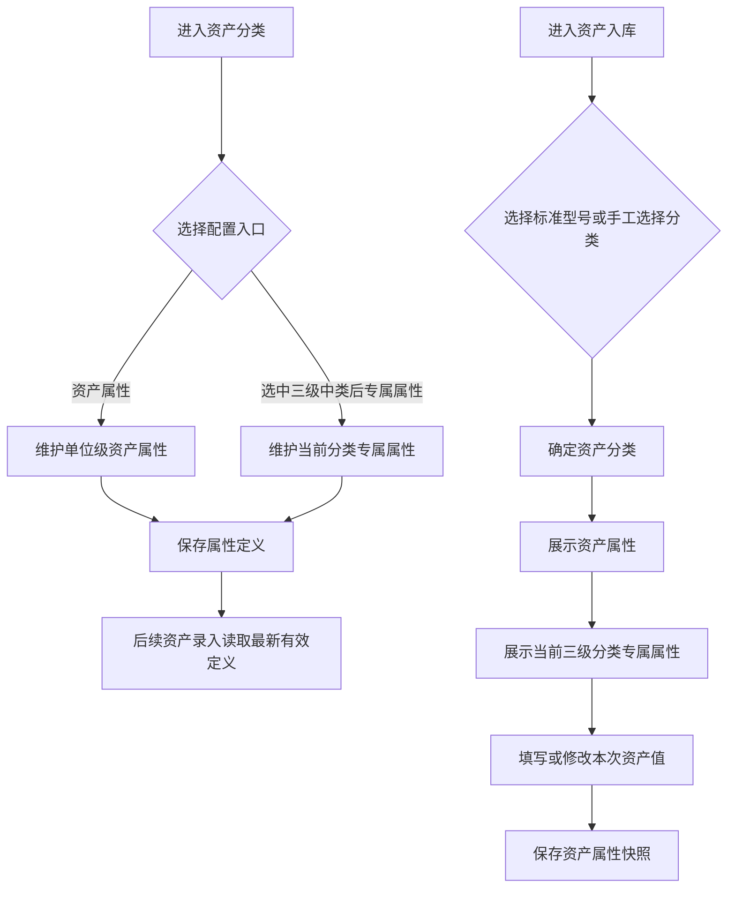

# 资产分类与标准型号 PRD

## 版本记录

| 版本 | 日期 | 说明 | 影响范围 |
| --- | --- | --- | --- |
| v0.1 | 2026-08-03 | 初稿 | 全文 |
| v0.2 | 2026-08-04 | 扩充标准型号字段并拆分资产分类与标准型号页面 | 全文 |
| v0.3 | 2026-08-11 | 同步原型迭代：分类与标准型号分别维护，补充查询、详情、启停和受控删除 | 全文 |
| v0.5 | 2026-08-13 | 删除审计人员角色并补充普通用户不进入系统设置；标准型号管理仅单位管理员可用 | 使用角色、权限规则、验收标准 |
| v0.6 | 2026-08-17 | 标准型号页面新增按钮和弹窗标题统一为“新增型号”，与菜单名称保持关联，按钮名称不超过 4 个字 | 页面信息架构、功能需求、交互与验收标准 |
| v0.7 | 2026-08-17 | 按两级字段配置方案改造：增加全局默认字段设置，新增型号拆分为基本信息与专属字段两步，明确资产展示顺序及入库/导入扩展字段规则 | 页面信息架构、业务流程、功能需求、字段与展示、交互、验收标准 |
| v0.8 | 2026-08-17 | 明确标准型号专属字段支持用户新增、编辑、删除和排序，并在默认字段弹窗提示专属字段入口 | 页面信息架构、功能需求、交互与验收标准 |
| v0.9 | 2026-08-17 | 专属字段增加“下拉选项”类型，支持使用逗号分隔录入选项值，并在入库时按选项下拉选择 | 字段与展示、交互、数据校验、验收标准 |
| v1.0 | 2026-08-18 | 按用户本轮要求将“默认字段”迁移至资产分类页面并更名为“资产属性”，将“专属字段”迁移至资产分类页面并更名为“专属属性”；资产属性改为单位级可扩展定义，专属属性改为三级分类级定义，标准型号不再维护属性定义 | 全文；关联资产入库的录入、导入、字段展示和校验 |
| v1.1 | 2026-08-19 | 明确资产属性中的系统默认属性：取得方式、取得日期、使用方向、使用状况默认启用且不可关闭；参考单价统一更名为参考价值 | 资产属性定义、标准型号模板值、入库字段口径、验收标准 |
| v1.2 | 2026-08-20 | 按 GB/T 14885—2022 将资产分类调整为四级树（门类、大类、中类、小类）；所有业务分类选择改为树形控件，允许选择任意层级；补充国标编码规则与代表性分类数据边界 | 分类主数据、分类选择、标准型号、资产入库及相关查询筛选 |

## 规划来源

- 产品规划文档：`001_产品规划/03-功能模块-06-系统设置模块.md`
- 对应模块：系统设置模块
- 关联页面：资产分类、标准型号
- 端类型：web
- 关联实体：资产分类、资产属性定义、分类专属属性定义、标准型号、资产
- 关联权限：`07-权限逻辑约定.md` 中系统设置—资产分类与标准型号（查看、新建、编辑、删除、停用、导出）
- 相关通用规则：`06-通用业务规则.md` 中唯一数据源、分类标准、历史不可覆盖
- 本轮业务变更来源：用户本轮输入

## 背景与目标

单位管理员通过资产分类页面维护分类及资产字段定义，通过标准型号页面维护可复用的资产模板。本期字段定义分为两级：

- **国标分类**：资产分类按 GB/T 14885—2022 展示为“门类 → 大类 → 中类 → 小类”四级树。分类编码采用“1 位字母 A + 4 组 2 位数字”，上级节点未细分时以 `00` 补位，`99` 表示收容项；原型内置房屋和构筑物、设备、文物和陈列品、图书和档案、家具和用具、特种动植物、物资七个门类的代表性分类样例。
- **资产属性**：单位级资产通用属性。系统提供默认属性“取得方式、取得日期、使用方向、使用状况”，默认启用且不可关闭；单位管理员可在其基础上新增、启停和排序自定义属性。启用后的资产属性在所有新建资产录入、批量导入和资产信息展示中可用，不因是否选择标准型号而改变。
- **专属属性**：绑定三级资产分类的属性。单位管理员可在“计算机”等三级分类下配置“CPU、内存、显卡”等属性；录入资产选择该分类或其下级小类时展示并允许填写，选择其他分类时不展示计算机专属属性。

资产录入的属性集合为“资产属性 + 当前分类对应的三级中类专属属性（如有）”。标准型号仅提供资产分类、资产名称及可复用的属性模板值，不再负责新增、编辑、删除或排序属性定义。资产实际填写值仍归属于资产本身，属性配置变更不回写历史资产快照。

### 国标分类与选择规则

- 分类树固定展示四级：一级为门类、二级为大类、三级为中类、四级为小类；分类维护表同时展示四级名称和完整分类编码。
- 资产分类、标准型号、资产入库、资产清单、资产盘点和资产查询中的分类选择均使用可展开、可搜索的树形选择器；开启严格节点选择后，门类、大类、中类、小类均可直接选中，不强制选择末级。
- 选择四级小类时，若其所属三级中类配置了专属属性，则沿用该三级中类的专属属性；选择其他层级时仅在能唯一确定对应三级中类时加载专属属性。
- 原型静态数据使用附件国标中的代表性分类样例，生产实现应以经确认的完整 GB/T 14885—2022 分类目录作为可维护的标准主数据；标准节点只读，自定义分类仅可按规则新增下一级节点。

## 使用角色与诉求

| 角色 | 使用场景 | 关键诉求 | 页面主要动作 |
| --- | --- | --- | --- |
| 单位管理员 | 维护分类、属性和标准型号 | 维护四级分类树，配置单位级资产属性和三级分类专属属性，维护标准型号 | 新建、编辑、删除、启停、资产属性、专属属性、导出 |
| 部门管理员 | 业务字段引用 | 不维护资产分类、资产属性、专属属性和标准型号；仅在部门业务中使用已有配置 | 不开放系统设置 |
| 普通用户 | 个人资产查看 | 不进入 Web 系统设置；移动端仅查看本人资产 | 不开放 Web |

## 功能范围

### 本期包含

- 按 GB/T 14885—2022 四级分类树维护和标准分类查询，分类选择可选任意层级
- 资产分类页面的“资产属性”配置：展示系统初始属性，允许单位管理员新增、编辑、启停、排序自定义属性
- 三级分类页面的“专属属性”配置：按当前三级分类新增、编辑、删除、启停、排序分类专属属性
- 标准型号列表、查询、新增、编辑、详情、启停、受控删除和导出
- 标准型号引用当前分类及当前有效属性定义，保存可复用的模板值，但不维护属性定义
- 资产录入按“资产属性 → 当前三级分类专属属性”的顺序展示；标准型号选中后仅回显其可提供的模板值
- 资产清单、资产查询和资产详情按资产快照展示资产属性及专属属性
- 批量导入按最新有效资产属性生成属性列，专属属性按资产分类和属性 key 匹配

### 本期不包含

- 在标准型号页面新增、编辑、删除或排序资产属性、专属属性
- 通过标准型号自动创建资产
- 入库手工录入资产反向生成标准型号或补充属性定义
- 修改系统初始属性的稳定 key；取得方式、取得日期、使用方向、使用状况以及资产分类、资产名称等系统默认属性不可关闭
- 标准分类口径修改和审批流程

### 边界说明

资产分类是分类主数据；资产属性是本单位所有资产共用的字段定义；专属属性是绑定三级分类的字段定义；标准型号是可复用的资产模板；资产是入库形成的业务实体。资产属性与专属属性只在资产分类页面维护，标准型号页面只维护模板值和生命周期状态。

启用的新资产属性从保存成功后应用于后续新建资产、批量导入和相关资产展示；已存在资产的历史字段快照不被回写，新增属性在历史资产详情中无历史值时显示“—”。停用或删除自定义属性不清除历史资产已保存的属性值；停用后不再出现在后续录入和新模板配置中。

## 页面与入口

| 页面 | 端类型 | 路由/页面路径建议 | 入口 | 页面关系 | 说明 |
| --- | --- | --- | --- | --- | --- |
| 资产分类 | web | /asset-management/asset-category | 系统设置 > 资产分类 | 维护分类、资产属性和专属属性；资产入库引用 | 四级分类树与分类表；选中三级中类后维护其专属属性 |
| 标准型号 | web | /asset-management/asset-archive | 系统设置 > 标准型号 | 资产入库可选引用 | 标准型号列表、模板值和生命周期管理；不提供属性定义按钮 |

## 页面信息架构

| 页面 | 区域 | 信息层级 | 主体内容 | 关键操作区 |
| --- | --- | --- | --- | --- |
| 资产分类 | 顶部与查询条 | 主 | 页面标题、分类名称/代码查询 | 新增分类、资产属性、查询、重置 |
| 资产分类 | 分类树与表格 | 主 | 四级分类层级、完整代码、更新时间、状态 | 新增下一级、编辑、删除；选中三级中类后维护专属属性 |
| 资产分类 | 资产属性弹窗 | 辅助 | 系统初始属性、自定义属性、类型、必填性、启用状态和顺序 | 新增属性、编辑、启停、上移、下移、保存、取消 |
| 资产分类 | 专属属性弹窗 | 辅助 | 当前三级分类的专属属性、类型、必填性、默认值和顺序 | 新增属性、编辑、删除、启停、上移、下移、保存、取消 |
| 标准型号 | 顶部与查询条 | 主 | 页面标题“标准型号”、标准型号编码、标准型号名称、资产分类查询 | 新增型号、查询、重置、导出 |
| 标准型号 | 列表区 | 主 | 标准型号编码、资产名称、资产分类、品牌、型号、状态、更新时间 | 详情、编辑、启停、删除 |
| 标准型号 | 新增/编辑型号弹窗 | 主 | 标准型号基本信息及可复用模板值 | 保存、取消 |
| 标准型号 | 详情抽屉 | 辅助 | 标准型号基本信息、模板值、关联分类属性摘要和状态 | 关闭 |

## 业务流程

## 功能需求

| 编号 | 功能点 | 规则说明 | 适用页面 | 优先级 |
| --- | --- | --- | --- | --- |
| FR-1 | 分类树形维护 | 按 GB/T 14885—2022 展示门类、大类、中类、小类四级树；标准分类只读，自定义分类仅可在二级或三级节点下新增下一级；查询和分类筛选支持任意层级 | 资产分类 | P0 |
| FR-2 | 资产属性设置 | 在资产分类页面通过“资产属性”入口维护单位级属性；系统初始属性默认存在，单位管理员可新增自定义属性、配置类型/必填性/默认值/启停/顺序；资产分类和资产名称为必显属性 | 资产分类 | P0 |
| FR-3 | 专属属性设置 | 选中三级中类后通过“专属属性”入口维护当前分类属性；四级小类录入沿用所属三级中类属性；支持新增、编辑、删除、启停和排序，属性名称在当前分类内不可重复 | 资产分类 | P0 |
| FR-4 | 标准型号列表 | 展示标准型号编码、资产名称、资产分类、品牌、型号、状态和更新时间；支持编码、名称、分类查询 | 标准型号 | P0 |
| FR-5 | 标准型号维护 | 新增、编辑、详情、启停、受控删除标准型号；标准型号可保存模板值，但不提供资产属性或专属属性定义入口 | 标准型号 | P0 |
| FR-6 | 属性解析 | 资产录入确定任意层级资产分类后，按“已启用资产属性 → 可确定的三级中类已启用专属属性”解析字段；不能确定三级中类时不展示专属属性 | 资产分类、资产入库 | P0 |
| FR-7 | 模板值回显 | 选择启用标准型号后回显其任意层级资产分类、资产名称和可提供的资产属性模板值；专属属性按回显分类对应的三级中类读取，标准型号不决定专属属性集合 | 标准型号、资产入库 | P0 |
| FR-8 | 资产字段展示 | 资产清单、资产查询和详情按资产快照展示资产属性及当前分类专属属性；属性值为空时展示占位符 | 资产清单、资产查询 | P0 |
| FR-9 | 标准型号启停 | 停用标准型号后不可被入库选择；历史资产保留引用的标准型号和属性快照 | 标准型号 | P0 |
| FR-10 | 标准型号删除 | 无资产入库引用的标准型号可删除，删除前二次确认；已引用的标准型号只能停用 | 标准型号 | P1 |
| FR-11 | 受控导出 | 按当前筛选导出标准型号及其模板值和启用状态；资产导出包含当前有效资产属性和已保存专属属性值 | 标准型号、资产清单、资产查询 | P1 |

## 字段与展示

### 资产属性配置

| 页面区域 | 字段 | 字段含义 | 类型/示例 | 展示规则 | 数据来源 |
| --- | --- | --- | --- | --- | --- |
| 资产属性弹窗 | 属性 key | 属性稳定标识 | 文本（系统生成，如 `purchaseDate`） | 系统初始属性 key 不可修改；自定义属性保存后保持稳定 | 系统生成 |
| 资产属性弹窗 | 属性名称 | 单位级资产属性展示名称 | 文本（如“取得日期”） | 系统初始属性名称按系统定义；自定义属性必填且单位内不可重复 | 系统定义/管理员输入 |
| 资产属性弹窗 | 属性类型 | 属性录入控件类型 | 文本/数字/日期/下拉选项 | 决定资产入库、导入和详情展示方式 | 管理员配置 |
| 资产属性弹窗 | 选项值 | 下拉属性的可选值 | 文本（如“采购,调拨,捐赠”） | 仅下拉选项显示；逗号分隔，保存时去空格、去重 | 管理员配置 |
| 资产属性弹窗 | 是否必填 | 新建资产时是否必须填写 | 开关 | 资产分类、资产名称固定必填；自定义属性默认非必填，可由管理员配置 | 系统定义/管理员配置 |
| 资产属性弹窗 | 默认值 | 新建资产的初始值 | 按属性类型 | 可为空；仅作为新资产和标准型号模板值的初始回显 | 管理员配置 |
| 资产属性弹窗 | 是否启用 | 是否进入后续资产录入 | 开关 | 停用后不出现在新建资产和新导入模板；历史值保留 | 管理员配置 |
| 资产属性弹窗 | 展示顺序 | 单位级属性排列顺序 | 正整数 | 支持上移/下移；专属属性统一排在资产属性之后 | 管理员配置 |

### 系统初始资产属性

| 页面区域 | 属性 | 含义 | 类型/示例 | 展示规则 | 数据来源 |
| --- | --- | --- | --- | --- | --- |
| 资产属性弹窗/资产录入 | 资产分类 | 资产所属分类 | 分类选择 | 必显、必填、不可删除或关闭 | 资产分类 |
| 资产属性弹窗/资产录入 | 资产名称 | 资产名称 | 文本 | 必显、必填、不可删除或关闭 | 用户输入/标准型号 |
| 资产属性弹窗/资产录入 | 计量单位 | 资产计量口径 | 文本/下拉 | 按启用状态展示 | 系统初始定义/用户输入 |
| 资产属性弹窗/资产录入 | 品牌 | 品牌信息 | 文本 | 按启用状态展示 | 系统初始定义/用户输入 |
| 资产属性弹窗/资产录入 | 型号 | 型号信息 | 文本 | 按启用状态展示 | 系统初始定义/用户输入 |
| 资产属性弹窗/资产录入 | 制造商 | 制造方 | 文本 | 按启用状态展示 | 系统初始定义/用户输入 |
| 资产属性弹窗/资产录入 | 供货单位 | 供货方 | 文本 | 按启用状态展示 | 系统初始定义/用户输入 |
| 资产属性弹窗/资产录入 | 取得方式 | 资产取得方式 | 文本 | 系统默认、启用且不可关闭 | 系统初始定义/用户输入 |
| 资产属性弹窗/资产录入 | 取得日期 | 资产取得日期 | 日期 | 系统默认、启用且不可关闭；兼容历史 key `purchaseDate` | 系统初始定义/标准型号/用户输入 |
| 资产属性弹窗/资产录入 | 使用方向 | 资产使用方向 | 文本 | 系统默认、启用且不可关闭 | 系统初始定义/用户输入 |
| 资产属性弹窗/资产录入 | 使用状况 | 资产当前使用状况 | 文本 | 系统默认、启用且不可关闭 | 系统初始定义/用户输入 |
| 资产属性弹窗/资产录入 | 参考价值 | 入库时的默认价值参考 | 数字 | 按启用状态展示；只影响后续入库默认值 | 系统初始定义/用户输入 |
| 资产属性弹窗/资产录入 | 备注 | 资产或模板说明 | 多行文本 | 按启用状态展示 | 系统初始定义/用户输入 |

### 专属属性配置

| 页面区域 | 字段 | 字段含义 | 类型/示例 | 展示规则 | 数据来源 |
| --- | --- | --- | --- | --- | --- |
| 专属属性弹窗 | 所属三级分类 | 属性适用的资产类型 | 分类标识（如“计算机”） | 由当前选中的三级分类确定，不可在弹窗中修改 | 资产分类 |
| 专属属性弹窗 | 属性 key | 分类专属属性稳定标识 | 文本（系统生成，如 `cpu`） | 保存后不因名称变化而改变，用于资产值和导入扩展区匹配 | 系统生成 |
| 专属属性弹窗 | 属性名称 | 分类专属属性标签 | 文本（如 CPU、内存、显卡） | 必填；同一三级分类内不可重复 | 管理员输入 |
| 专属属性弹窗 | 属性类型 | 属性录入类型 | 文本/数字/日期/下拉选项 | 决定入库输入控件和导入校验 | 管理员配置 |
| 专属属性弹窗 | 选项值 | 下拉属性的可选值 | 文本 | 仅下拉选项显示；至少一个有效选项 | 管理员配置 |
| 专属属性弹窗 | 是否必填 | 当前分类资产录入时是否必须填写 | 开关 | 仅约束选择该三级分类的资产 | 管理员配置 |
| 专属属性弹窗 | 默认值 | 当前分类资产录入的初始值 | 按属性类型 | 可为空；不影响其他分类 | 管理员配置 |
| 专属属性弹窗 | 是否启用 | 是否在该分类资产录入时展示 | 开关 | 停用后不出现在该分类的新录入；历史值保留 | 管理员配置 |
| 专属属性弹窗 | 展示顺序 | 当前分类专属属性顺序 | 正整数 | 排在资产属性之后 | 管理员配置 |

### 标准型号与资产属性值

| 页面区域 | 字段 | 字段含义 | 类型/示例 | 展示规则 | 数据来源 |
| --- | --- | --- | --- | --- | --- |
| 标准型号表单 | 标准型号编码 | 模板唯一标识 | 文本（系统生成） | 只读；单位内唯一 | 系统生成 |
| 标准型号表单 | 资产分类 | 模板归属分类 | 树形选择 | 必填；确定录入时的专属属性来源 | 资产分类 |
| 标准型号表单 | 资产名称 | 标准型号对应的资产名称 | 文本 | 必填 | 用户输入 |
| 标准型号表单 | 资产属性模板值 | 选择型号时可回显的通用属性值 | 按资产属性类型 | 只能填写当前有效资产属性的值，不能新增、删除或排序属性 | 用户输入 |
| 资产/入库表单 | 专属属性值 | 当前资产的分类专属属性值 | 按专属属性类型 | 根据资产分类动态展示，保存为资产实际值 | 管理员配置/用户输入 |

## 状态与操作

| 对象/状态 | 可见操作 | 禁用/隐藏规则 | 操作后状态变化 | 结果反馈 |
| --- | --- | --- | --- | --- |
| 资产分类已选中三级分类 | 查看、资产属性、专属属性、分类维护 | 未选三级分类时“专属属性”不可用；非三级分类不可配置专属属性 | 保存后刷新分类及属性摘要 | 成功提示 |
| 自定义资产属性启用 | 编辑、停用、排序 | 已被历史资产使用时不可物理删除，只能停用 | 停用后不进入后续录入 | 成功提示 |
| 自定义资产属性停用 | 查看、编辑、启用、删除（无历史值时） | 不进入新建资产和新导入模板 | 启用后恢复后续录入 | 成功提示 |
| 三级分类专属属性启用 | 编辑、停用、排序 | 仅对当前三级分类生效 | 停用后该分类新录入不展示 | 成功提示 |
| 标准型号启用 | 查看、编辑、停用、删除（无引用时）、导出 | 不提供资产属性或专属属性配置操作 | 停用或删除 | 成功提示 |
| 标准型号停用 | 查看、启用、导出 | 不可被新入库选择 | 启用后可供新入库选择 | 成功提示 |

## 交互规则

| 交互类型 | 适用页面/区域 | 规则 |
| --- | --- | --- |
| 资产属性 | 资产分类页面 | 点击“资产属性”打开单位级属性配置；系统初始属性与自定义属性统一按顺序展示；标准型号页面不再提供“默认字段”入口 |
| 专属属性 | 资产分类页面 | 先选中三级分类，再点击“专属属性”；未选三级分类或选中非三级分类时按钮禁用并提示“请选择三级分类” |
| 新增自定义属性 | 资产属性弹窗 | 填写属性名称、类型、必填性、默认值和启用状态；属性名称在本单位内不可重复；保存后生成稳定 key |
| 新增专属属性 | 专属属性弹窗 | 为当前三级分类填写属性名称、类型、必填性、默认值和启用状态；属性名称仅要求在当前分类内唯一 |
| 下拉选项 | 资产属性/专属属性弹窗 | 选择“下拉选项”后显示选项值；多个选项使用英文逗号或中文逗号分隔；保存时去重，默认值必须属于选项 |
| 属性排序 | 资产属性/专属属性弹窗 | 资产属性按单位级顺序排列；专属属性按当前分类顺序排列；资产录入先展示资产属性，再展示专属属性 |
| 选择标准型号 | 标准型号/资产入库 | 仅显示启用标准型号；选择后回显标准型号资产分类、资产名称和可提供的资产属性模板值；专属属性始终按回显后的三级分类读取 |
| 选择资产分类 | 资产分类、标准型号、资产入库及查询筛选 | 使用可展开、可搜索的四级树形选择器；门类、大类、中类、小类均可直接选中，显示分类名称和完整编码；选择四级小类时沿用所属三级中类专属属性 |
| 选择资产分类 | 资产入库 | 未选择标准型号时由录入人员选择分类；分类确定后刷新专属属性；切换分类保留资产属性值并清空不适用的未保存专属属性值 |
| 属性配置生效 | 资产入库、批量导入 | 新增或启用属性保存成功后，后续打开的录入表单和新下载的导入模板读取最新定义；已打开表单在保存时重新校验属性版本 |
| 批量导入 | 资产入库导入弹窗 | 固定业务列与当前启用资产属性列共同组成模板；专属属性在扩展区按“资产分类代码 + 属性 key”匹配，不按标准型号匹配 |

## 权限规则

| 权限对象 | 规则 | 无权限表现 | 数据可见范围 |
| --- | --- | --- | --- |
| 资产分类、资产属性、专属属性、标准型号页面 | 仅单位管理员可见；部门管理员和普通用户不可见 | 无权限提示或导航隐藏 | 本单位 |
| 分类、资产属性、专属属性、标准型号的新建/编辑/删除/启停/导出 | 仅单位管理员 | 无权限隐藏 | — |
| 资产属性与专属属性配置 | 仅单位管理员；资产属性为本单位范围，专属属性为当前三级分类范围 | 无权限隐藏 | 本单位/当前分类 |
| 资产属性和专属属性引用 | 业务录入人员按其业务权限读取有效定义；不因读取属性获得系统设置权限 | 无权限时不返回字段定义并阻止提交 | 与资产录入数据权限一致 |

## 数据与校验规则

| 字段/数据项 | 默认值 | 必填 | 格式/范围校验 | 计算口径 | 刷新/同步规则 |
| --- | --- | --- | --- | --- | --- |
| 资产属性定义 | 系统初始属性 | 否 | 属性 key 在单位内唯一；名称不可重复；系统必显属性不可删除或关闭 | — | 保存后供后续资产录入和导入读取 |
| 自定义资产属性 | 未启用 | 否 | 名称非空；类型有效；key 稳定；下拉选项至少 1 个有效值 | — | 启用后所有后续资产录入均展示该属性 |
| 专属属性定义 | 当前三级分类无专属属性 | 否 | 名称在当前三级分类内唯一；类型有效；下拉选项有效 | — | 仅对当前三级分类的后续资产录入生效 |
| 属性必填性 | 系统必显属性必填；自定义属性默认非必填 | 按配置 | 必填属性无值时阻止保存；非必填属性允许为空 | — | 资产属性作用于所有分类；专属属性只作用于所属分类 |
| 属性默认值 | 空 | 否 | 按属性类型校验；下拉默认值必须命中选项 | — | 作为新资产或标准型号模板值初始回显，不直接写入历史资产 |
| 资产属性值 | 空或模板值 | 按属性定义 | 按属性类型校验；保存为资产快照 | — | 不回写属性定义或标准型号 |
| 专属属性值 | 空或分类默认值 | 按专属属性定义 | 按当前三级分类的属性 key 和类型校验 | — | 保存为资产快照；不影响其他分类 |
| 标准型号编码 | — | 是 | 单位内唯一；系统生成，不可手填 | 分类代码与顺序号由系统生成 | 保存时生成 |
| 标准型号状态 | 启用 | 是 | 启用/停用 | — | 停用后从入库选择器移除 |
| 历史资产属性快照 | 已保存值 | — | 不因属性配置变化而重写 | — | 新增属性对历史资产无值时显示“—” |

## 异常与空状态

| 场景 | 触发条件 | 页面表现 | 用户可执行操作 | 恢复/兜底规则 |
| --- | --- | --- | --- | --- |
| 无可配置三级分类 | 未选分类或选中非三级分类 | “专属属性”按钮禁用并提示选择三级分类 | 选择三级分类 | 不允许打开专属属性弹窗 |
| 无资产属性 | 属性定义加载为空 | 提示系统初始属性不可用 | 重试或联系管理员 | 资产分类、资产名称仍需由系统保证可用 |
| 属性名称为空或重复 | 新增/编辑时违反唯一性 | 定位属性名称并提示 | 修改名称 | 阻止保存 |
| 属性类型或选项无效 | 类型缺失、下拉选项为空或默认值不在选项中 | 定位配置项并提示 | 补充配置 | 阻止保存 |
| 必显属性关闭 | 尝试关闭资产分类或资产名称 | 开关不可操作或保存时提示 | 保持启用 | 阻止保存 |
| 属性配置版本冲突 | 打开录入表单后属性被停用、删除或改版 | 提示字段配置已变化并刷新 | 确认刷新后重新填写受影响字段 | 不覆盖已填写的无冲突字段 |
| 切换资产分类 | 录入中从计算机切换到其他三级分类 | 清除未保存的计算机专属属性并展示新分类属性 | 确认切换或取消 | 资产属性值保留 |
| 删除已使用属性 | 属性已有历史资产值 | 阻止物理删除并提示只能停用 | 停用属性 | 历史值继续可查 |
| 删除被引用标准型号 | 已有资产入库引用 | 阻止删除并提示只能停用 | 停用标准型号 | 保留历史引用 |
| 无可用标准型号 | 没有启用标准型号 | 标准型号选择器提示无可用模板 | 跳过选择并手工选择分类 | 不阻止资产录入 |
| 字段配置加载失败 | 资产属性或专属属性读取失败 | 提示加载失败，阻止提交不完整表单 | 重试或取消 | 不写入不完整资产快照 |

## 验收标准

### 页面验收

- 资产分类页面提供“资产属性”按钮；标准型号页面不再提供“默认字段”按钮。
- 分类树按 GB/T 14885—2022 展示门类、大类、中类、小类四级结构，表格展示四级名称和完整编码；标准分类节点只读。
- 资产分类页面的分类筛选、标准型号、资产入库及相关查询筛选使用树形选择器，门类、大类、中类、小类均可直接选择。
- 选中三级分类后，资产分类页面提供“专属属性”按钮；未选三级分类时按钮不可用。
- 资产属性弹窗同时展示系统初始属性和单位管理员新增的自定义属性；专属属性弹窗只展示当前三级分类属性。
- 标准型号页面仍提供标准型号查询、新增、编辑、详情、启停、删除和导出，但不提供资产属性或专属属性定义入口。

### 功能验收

- 资产属性弹窗默认展示“取得方式、取得日期、使用方向、使用状况”四个系统属性，四项均默认启用且不可关闭、删除；其中取得日期为日期型，其余为文本型。
- 入库和标准型号模板值统一使用“参考价值”文案；历史数据中的参考单价内部键保持兼容，不影响历史资产展示。
- 单位管理员可在三级分类“计算机”下新增“CPU”“内存”“显卡”等专属属性；资产录入选择“计算机”时展示并可填写这些属性，选择其他三级分类时不展示计算机专属属性。
- 资产录入在确定分类后，字段顺序为“资产属性 + 对应三级中类专属属性（如有）”；属性类型、必填性、默认值、下拉选项和排序均按配置生效。
- 选择启用标准型号后，资产分类、资产名称和可用模板值正确回显；专属属性集合由回显后的三级分类决定，不由标准型号决定。
- 标准型号新增、编辑和详情不允许新增、编辑、删除或排序属性定义；其模板值只能引用当前有效属性。
- 属性配置变更不回写已入库资产的历史属性快照；历史资产查看新增属性时无值显示“—”。
- 批量导入新模板包含当前启用资产属性；专属属性通过“资产分类代码 + 属性 key”匹配，属性类型、必填性和下拉选项校验与手工录入一致。
- 已被历史资产使用的自定义属性不能物理删除，只能停用；停用后不进入新资产录入，但历史值仍可查看。

### 状态验收

- 停用标准型号不可被新建入库选择，已引用资产仍可查看其历史标准型号和属性快照。
- 停用资产属性后，后续资产录入和新导入模板不再展示该属性；已保存资产的历史属性值不被删除。
- 停用三级分类专属属性后，仅该分类的后续资产录入不再展示该属性，其他分类不受影响。
- 部门管理员和普通用户不可进入资产分类、资产属性、专属属性与标准型号配置页面。

## 原型/工程关联

- PRD 类型：项目 PRD
- PRD 文件：`002_PRD/barracks-admin/资产分类.md`
- 原型项目：`003_prototype/barracks-admin/`
- 页面文件：`src/views/settings/AssetCategory.vue`（资产分类）、`src/views/settings/AssetArchive.vue`（标准型号，当前原型文件名沿用旧命名）
- 文档映射：`src/doc/manifest.json` 已登记 `/asset-management/asset-category` 与 `/asset-management/asset-archive`，均映射 `资产分类.md`
- 说明：本轮同步更新四级分类模拟数据、分类维护表、分类树形选择器及相关页面引用；页面路由、文件名和 manifest 映射未调整。
