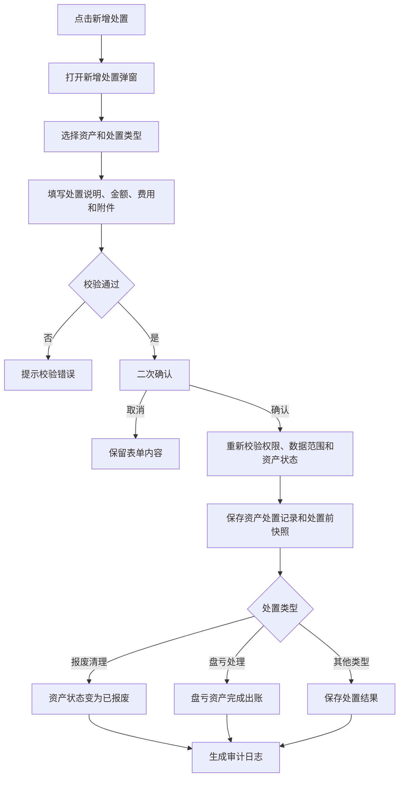

# 资产处置 PRD

## 版本记录

| 版本 | 日期 | 说明 | 影响范围 |
| --- | --- | --- | --- |
| v0.1 | 2026-08-03 | 初稿（原“报废登记”） | 全文 |
| v0.2 | 2026-08-11 | 同步原型迭代：主单+资产明细两段式、二次确认、业务详情抽屉 | 功能范围、页面结构、交互 |
| v0.3 | 2026-08-12 | 按 DEC-020 补充盘亏自动生成记录口径 | 盘亏规则、数据校验、验收 |
| v0.4 | 2026-08-13 | “报废登记”重构为“资产处置”；新增六类处置类型、创建人部门、金额/费用、附件和明细金额字段，并按参考图统一表单样式 | 全文、路由、字段、交互、验收 |
| v0.5 | 2026-08-13 | 将处置类型“毁损情况”重命名为“损毁清理” | 处置类型枚举、表单下拉、列表筛选、文档验收 |
| v0.7 | 2026-08-13 | 角色模型同步：部门管理员可办理本部门资产处置，普通用户不进入 Web 处置页面 | 使用角色、权限规则、验收标准 |
| v0.8 | 2026-08-17 | 统一资产处置新增按钮和弹窗标题为“新增处置”，与“资产处置”菜单关联，按钮名称不超过 4 个字 | 页面信息架构、业务流程、功能需求、交互与验收标准 |
| v0.9 | 2026-08-18 | 质量整改：去除重复 v0.7 修订记录，并明确盘亏处理是由盘点审核自动生成的资产处置记录类型 | 版本记录、盘亏处置关联与验收 |

## 规划来源

- 产品规划文档：`001_产品规划/03-功能模块-03-日常管理模块.md`
- 对应模块：日常管理模块
- 关联页面：资产处置
- 端类型：web
- 关联实体：资产处置记录、资产、附件
- 关联权限：`001_产品规划/07-权限逻辑约定.md` 中日常管理—资产处置（查看、新建、作废、导出）
- 相关通用规则：`001_产品规划/06-通用业务规则.md` 中处置终态控制、原子业务动作、盘盈盘亏审核处置闭环

## 背景与目标

单位管理员通过资产处置页面登记资产退出、损失或其他处置事实。处置记录保存处置前快照；报废清理生效后资产进入已报废终态。资产处置保存前必须二次确认并重新校验权限、数据范围和资产状态。盘亏处理由盘点盘亏审核处置自动生成，免二次确认（DEC-020）。

## 使用角色与诉求

| 角色 | 使用场景 | 关键诉求 | 页面主要动作 |
| --- | --- | --- | --- |
| 单位管理员 | 资产处置登记 | 新建处置（二次确认）、作废更正、查询 | 新建、作废、查看、导出 |
| 部门管理员 | 本部门资产处置 | 登记本部门资产处置事实 | 新建、作废、查看 |
| 普通用户 | 个人资产查看 | 不进入 Web 资产处置 | 不开放 Web |

## 功能范围

### 本期包含

- 资产处置记录列表展示，支持关键字和处置类型筛选。
- 新增处置弹窗：创建人、创建人部门（当前用户所属部门只读展示）、处置类型、处置金额合计、处置费用合计、处置日期、处置说明、附件。
- 资产明细区：添加资产、导入资产、移除资产；展示资产编码、资产分类、资产名称、品牌、型号、SN、使用状况、处置金额和处置费用。
- 处置类型六项：报废清理、盘亏处理、转让出售、损毁清理、丢失、其他。
- 保存前二次确认；报废清理执行已报废终态控制。
- 业务办理详情只读抽屉。
- 附件上传和受控导出入口。

### 本期不包含

- 处置审批流程。
- 真实文件上传和生产接口接入；原型使用模拟数据与模拟提交反馈。

### 边界说明

报废清理生效后资产进入已报废终态。已报废资产除查看、导出和受控作废更正外，不得继续发起借用、使用变更、维保、出入库或编码修改业务。盘亏处理不在本页面手工登记，由资产盘点页面的盘亏审核处置自动生成，但在资产处置列表正常展示和追溯。转让出售、损毁清理、丢失和其他类型保存处置事实，不在本期扩展审批流程。

## 页面与入口

| 页面 | 端类型 | 路由/页面路径 | 入口 | 页面关系 | 说明 |
| --- | --- | --- | --- | --- | --- |
| 资产处置 | web | `/asset-management/asset-disposal` | 日常管理 > 资产处置 | 上游为资产清单 | 列表页承载处置记录查询与新增处置弹窗 |

## 页面信息架构

| 页面 | 区域 | 信息层级 | 主体内容 | 关键操作区 |
| --- | --- | --- | --- | --- |
| 资产处置 | 顶部 | 主 | 页面标题“资产处置” | 新增处置 |
| 资产处置 | 筛选区 | 主 | 关键字、处置类型 | 搜索、重置 |
| 资产处置 | 表格区 | 主 | 处置单号、日期、资产编码、资产名称、处置类型、处置说明、状态 | 查看详情 |
| 资产处置 | 新增弹窗 | 主 | 三列主单表单、附件、资产明细表 | 取消、确定 |
| 资产处置 | 详情抽屉 | 辅助 | 处置主单与资产明细只读信息 | — |

## 业务流程

## 功能需求

| 编号 | 功能点 | 规则说明 | 适用页面 | 优先级 |
| --- | --- | --- | --- | --- |
| FR-1 | 列表展示 | 展示处置单号、日期、资产编码、资产名称、处置类型、处置说明、状态；支持关键字和处置类型筛选 | 资产处置 | P0 |
| FR-2 | 新增处置 | 以主单+资产明细两段式弹窗录入；处置类型限定六项；明细支持添加、导入、移除 | 资产处置 | P0 |
| FR-3 | 金额汇总 | 明细处置金额和处置费用实时汇总到主单，未填写按 0 计算 | 资产处置 | P0 |
| FR-4 | 二次确认 | 保存前二次确认并重新校验权限、数据范围和资产状态；盘亏处理自动生成时免二次确认 | 资产处置 | P0 |
| FR-5 | 业务办理详情 | 只读抽屉展示处置主单与资产明细 | 资产处置 | P1 |
| FR-6 | 附件上传 | 支持选择图片或文档附件并在表单中展示文件名 | 资产处置 | P1 |
| FR-7 | 受控导出 | 按当前筛选条件导出处置记录 | 资产处置 | P1 |

## 字段与展示

| 页面区域 | 字段 | 字段含义 | 类型/示例 | 展示规则 | 数据来源 |
| --- | --- | --- | --- | --- | --- |
| 筛选区 | 关键字 | 处置单号、资产编码或资产名称 | 文本 | 输入后点击搜索；清空可恢复全部 | 处置记录 |
| 筛选区 | 处置类型 | 处置类型筛选条件 | 下拉 | 六项处置类型 | 处置类型枚举 |
| 主单 | 创建人 | 当前操作用户 | 只读文本 | 默认“系统管理员” | 当前登录态 |
| 主单 | 创建人部门 | 处置单归属部门 | 只读文本 | 默认当前用户所属部门 | 当前登录用户部门 |
| 主单 | 处置类型 | 本次处置业务分类 | 下拉 | 必填，六项穷举 | 处置类型枚举 |
| 主单 | 处置金额合计 | 明细处置金额之和 | 只读金额 | 实时刷新，单位元 | 明细计算 |
| 主单 | 处置费用合计 | 明细处置费用之和 | 只读金额 | 实时刷新，单位元 | 明细计算 |
| 主单 | 处置日期 | 处置发生日期 | 日期 | 默认当天 | 当前日期 |
| 主单 | 处置说明 | 处置原因、结果和补充信息 | 多行文本 | 必填，最多 200 字 | 用户输入/盘点处置 |
| 主单 | 附件 | 处置证明材料 | 图片/文档 | 可选，展示已选文件名 | 用户选择 |
| 明细 | 处置资产 | 参与本次处置的资产 | 资产多选 | 不得选择借用中、维保中、已报废资产 | 资产清单 |
| 明细 | 资产编码/分类/名称/品牌/型号/设备序列号/使用状况 | 资产快照信息 | 只读文本 | 随资产明细展示 | 资产清单 |
| 明细 | 处置金额 | 单项资产处置金额 | 金额输入 | 非负数，单位元 | 用户输入 |
| 明细 | 处置费用 | 单项资产处置费用 | 金额输入 | 非负数，单位元 | 用户输入 |

## 处置类型规则

| 处置类型 | 录入方式 | 结果规则 |
| --- | --- | --- |
| 报废清理 | 用户在资产处置弹窗中选择 | 二次确认后生效，资产进入已报废终态 |
| 盘亏处理 | 盘点审核处置自动生成 | 处置类型固定，免二次确认，完成盘亏资产出账 |
| 转让出售 | 用户在资产处置弹窗中选择 | 保存转让/出售事实及金额、费用 |
| 损毁清理 | 用户在资产处置弹窗中选择 | 保存损毁说明及证明材料 |
| 丢失 | 用户在资产处置弹窗中选择 | 保存丢失说明及证明材料 |
| 其他 | 用户在资产处置弹窗中选择 | 依赖处置说明保存其他处置事实 |

## 状态与操作

| 状态 | 可见操作 | 禁用/隐藏规则 | 操作后状态变化 | 结果反馈 |
| --- | --- | --- | --- | --- |
| 已生效 | 查看、作废、导出 | 高风险操作需权限校验；报废清理需二次确认 | 作废→已作废 | 成功提示并留痕 |
| 已作废 | 查看、导出 | 不可再次作废 | 保持已作废 | — |

## 交互规则

| 交互类型 | 适用区域 | 规则 |
| --- | --- | --- |
| 搜索/筛选 | 列表 | 关键字匹配处置单号、资产编码、资产名称；处置类型精确筛选 |
| 新增弹窗 | 列表 | 使用 `v-model` 打开，`append-to-body`、`destroy-on-close`；标题为“新增处置” |
| 表单校验 | 新增弹窗 | 处置类型、处置说明必填；至少添加一项资产。创建人部门由当前用户所属部门自动带出且不可编辑 |
| 资产明细 | 新增弹窗 | 复用资产明细编辑器，支持添加资产、导入资产、移除资产及金额/费用录入 |
| 确认保存 | 新增弹窗 | 弹出“处置确认”；用户取消时保留表单内容，确认后模拟成功并关闭弹窗 |
| 详情 | 列表 | 点击详情打开只读业务详情抽屉 |

## 权限规则

| 权限对象 | 规则 | 无权限表现 | 数据可见范围 |
| --- | --- | --- | --- |
| 页面 | 单位管理员和部门管理员可见；部门管理员仅本部门范围；普通用户不进入 Web | 无权限提示或导航隐藏 | 本单位；部门管理员限本部门 |
| 新增按钮 | 单位管理员、部门管理员可见；部门管理员仅限本部门资产 | 无权限隐藏 | 仅可选择授权范围资产 |
| 作废按钮 | 按权限目录受控开放 | 无权限隐藏 | 仅可作废授权范围内记录 |
| 二次确认 | 保存前重新校验权限和数据范围 | 权限失效时阻止保存 | — |

## 数据与校验规则

| 字段/数据项 | 默认值 | 必填 | 格式/范围校验 | 计算口径 | 刷新/同步规则 |
| --- | --- | --- | --- | --- | --- |
| 处置资产 | — | 是 | 不得为借用中、维保中或已报废状态 | — | 明细变更时刷新 |
| 处置类型 | 报废清理 | 是 | 六项处置类型穷举 | — | 盘亏处理由盘点审核固定 |
| 处置说明 | — | 是 | 文本，最多 200 字 | — | 盘亏处理自动带入盘点盘亏说明 |
| 处置金额 | 0 | 否 | 非负金额 | 明细金额之和 | 明细录入时实时汇总 |
| 处置费用 | 0 | 否 | 非负金额 | 明细费用之和 | 明细录入时实时汇总 |
| 附件 | — | 否 | 图片/文档 | — | 处置证明材料 |
| 处置前快照 | — | 是 | 保存处置前资产状态和使用信息 | — | 系统自动保存 |

## 异常与空状态

| 场景 | 触发条件 | 页面表现 | 用户可执行操作 | 恢复/兜底规则 |
| --- | --- | --- | --- | --- |
| 无数据 | 筛选结果为空 | 表格显示“暂无资产处置记录” | 修改筛选条件 | 清空条件后重新查询 |
| 资产不可处置 | 选择借用中、维保中或已报废资产 | 资产选择器排除并提示 | 更换资产 | 阻止保存 |
| 未添加资产 | 直接点击确定 | 提示“请至少添加一项资产明细” | 添加资产 | 保持弹窗开启 |
| 二次确认取消 | 用户取消处置确认 | 不保存、不关闭表单 | 继续编辑或取消弹窗 | 保留当前表单内容 |
| 权限/状态冲突 | 二次确认后的校验失败 | 阻止保存并提示 | 重新打开或刷新后重试 | 整单回滚 |

## 验收标准

### 页面验收

- 通过“日常管理 > 资产处置”进入，路由为 `/asset-management/asset-disposal`。
- 页面标题为“资产处置”，新增按钮为“新增处置”。
- 新增弹窗标题为“新增处置”，表单视觉结构与参考图一致：三列基础字段、说明、附件、资产明细和底部取消/确定操作。
- 处置类型下拉准确展示：报废清理、盘亏处理、转让出售、损毁清理、丢失、其他。

### 功能验收

- 列表支持关键字和处置类型筛选，详情打开只读抽屉。
- 创建人部门自动带出且不可编辑；处置类型、处置说明必填，至少添加一项资产。
- 资产明细支持添加、导入、移除；处置金额和处置费用可编辑，主单合计实时更新。
- 报废清理保存前必须二次确认并重新校验权限、数据范围和资产状态。
- 盘亏处理由盘点审核处置自动生成，列表展示处置类型“盘亏处理”，免二次确认。
- 保存处置前快照，提交成功后显示模拟成功反馈。

## 原型/工程关联

- PRD 类型：项目 PRD
- PRD 文件：`002_PRD/barracks-admin/资产处置.md`
- 原型项目：`003_prototype/barracks-admin/`
- 页面文件：`src/views/daily/DisposalRecords.vue`（共享组件 `AssetDetailEditor.vue`）
- 文档映射：`src/doc/manifest.json` 已登记 `/asset-management/asset-disposal`
