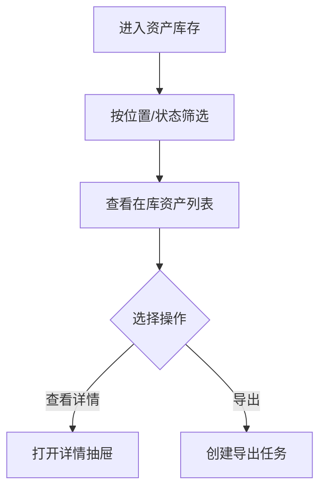

# 资产库存 PRD

## 版本记录

| 版本 | 日期 | 说明 | 影响范围 |
| --- | --- | --- | --- |
| v0.1 | 2026-08-03 | 初稿 | 全文 |
| v0.2 | 2026-08-11 | 补齐原型工程关联（ISS-009 回写）：页面已在原型实现并登记 manifest，关联章节回填页面文件与路由 | 原型/工程关联 |
| v0.3 | 2026-08-12 | 调整资产状态范围，库存状态筛选和范围说明同步调整 | 功能范围、字段与展示、数据与校验、验收标准 |
| v0.5 | 2026-08-13 | 删除审计人员角色；补充部门管理员本部门只读库存，普通用户不进入 Web 库存 | 使用角色、权限规则、验收标准 |

## 规划来源

- 产品规划文档：`001_产品规划/03-功能模块-02-仓储管理模块.md`
- 对应模块：仓储管理模块
- 关联页面：资产库存
- 端类型：web
- 关联实体：资产、资产位置
- 关联权限：`07-权限逻辑约定.md` 中仓储管理—资产库存（查看、导出）
- 相关通用规则：`06-通用业务规则.md` 中统一查询上下文（F-13）、资产清单与库存同源

## 背景与目标

单位管理员和部门管理员需要一个从仓储视角查询在库资产的页面。资产库存是资产清单当前值的在库查询投影，只展示在库范围的资产，不独立维护资产当前值；部门管理员仅可见本部门名下资产，普通用户不进入 Web 库存。

## 使用角色与诉求

| 角色 | 使用场景 | 关键诉求 | 页面主要动作 |
| --- | --- | --- | --- |
| 单位管理员 | 按具体位置/状态查看在库资产 | 筛选、查看、导出 | 筛选、查看、导出 |
| 部门管理员 | 查看本部门名下在库资产 | 按具体位置/状态筛选、查看 | 筛选、查看 |
| 普通用户 | 个人资产查看 | 不进入 Web 库存；移动端仅查看本人名下资产 | 不开放 Web |

## 功能范围

### 本期包含

- 在库资产列表展示（含分页、排序）
- 按具体位置和资产状态筛选
- 资产详情查看（抽屉展示）
- 受控导出

### 本期不包含

- 新增、编辑资产（库存是只读查询投影，不提供写入入口）
- 独立资产当前值维护（消费资产清单当前值）

### 边界说明

资产库存是资产清单在库范围的查询投影，不拥有绕过入库和资产派发能力直接修改资产状态的权限。位置主数据由"系统设置 > 位置管理"维护，库存只引用具体位置。

## 页面与入口

| 页面 | 端类型 | 路由/页面路径建议 | 入口 | 页面关系 | 说明 |
| --- | --- | --- | --- | --- | --- |
| 资产库存 | web | /asset-management/asset-stock | 仓储管理 > 资产库存 | 上游为资产清单当前值 | 只读在库查询页 |

## 页面信息架构

| 页面 | 区域 | 信息层级 | 主体内容 | 关键操作区 |
| --- | --- | --- | --- | --- |
| 资产库存 | 顶部 | 主 | 页面标题"资产库存" | 导出按钮 |
| 资产库存 | 筛选区 | 主 | 所在位置、资产状态 | 搜索、重置、展开/收起 |
| 资产库存 | 表格区 | 主 | 资产编号、资产分类、资产名称、所在位置、编码(SN/RFID)、资产状态 | 查看详情 |
| 资产库存 | 分页区 | 辅助 | 总数、每页条数、页码跳转 | — |

## 业务流程

## 功能需求

| 编号 | 功能点 | 规则说明 | 适用页面 | 优先级 |
| --- | --- | --- | --- | --- |
| FR-1 | 列表展示 | 展示在库资产编号、资产分类、资产名称、所在位置、编码(SN/RFID)、资产状态；默认按资产编号排序 | 资产库存 | P0 |
| FR-2 | 多条件筛选 | 支持所在位置树形选择和资产状态筛选；位置支持按完整路径查询 | 资产库存 | P0 |
| FR-3 | 详情抽屉 | 点击行打开右侧抽屉，展示资产完整信息 | 资产库存 | P0 |
| FR-4 | 受控导出 | 按当前筛选条件生成导出任务，受数据权限、水印和有效期控制 | 资产库存 | P0 |

## 字段与展示

| 页面区域 | 字段 | 字段含义 | 类型/示例 | 展示规则 | 数据来源 |
| --- | --- | --- | --- | --- | --- |
| 筛选区 | 位置 | 具体位置筛选 | 树形选择 | 启用位置节点，可按完整路径搜索 | 系统设置 |
| 筛选区 | 资产状态 | 状态筛选 | 单选/固定 | 在库 | 资产当前值 |
| 表格 | 资产编号 | 唯一标识 | 文本 | 默认显示 | 资产当前值 |
| 表格 | 分类名称 | 所属分类 | 文本 | 显示 | 资产当前值 |
| 表格 | 资产名称 | 名称 | 文本 | 显示 | 资产当前值 |
| 表格 | 位置 | 当前具体位置 | 文本 | 显示完整路径 | 资产当前值 |
| 表格 | 资产状态 | 当前状态 | 标签 | 彩色标签 | 资产当前值 |
| 表格 | SN | 序列号 | 文本 | 显示 | 资产当前值 |
| 表格 | RFID | 射频编码 | 文本 | 显示 | 资产当前值 |

## 状态与操作

| 状态 | 可见操作 | 禁用/隐藏规则 | 操作后状态变化 | 结果反馈 |
| --- | --- | --- | --- | --- |
| 在库 | 查看详情、导出 | 无编辑入口 | 无 | — |
| 非在库 | 不展示 | 不进入库存查询结果 | 无 | — |

## 权限规则

| 权限对象 | 规则 | 无权限表现 | 数据可见范围 |
| --- | --- | --- | --- |
| 页面 | 单位管理员和部门管理员可见；部门管理员仅本部门范围；普通用户不进入 Web | 无权限提示或导航隐藏 | 单位管理员：本单位；部门管理员：本部门名下资产 |
| 导出按钮 | 仅单位管理员可见 | 部门管理员隐藏 | 本单位 |
| 数据 | 服务端先应用权限和数据范围 | 空结果提示"无权限" | 查询和导出复用同一数据权限条件 |

## 数据与校验规则

| 字段/数据项 | 默认值 | 必填 | 格式/范围校验 | 计算口径 | 刷新/同步规则 |
| --- | --- | --- | --- | --- | --- |
| 位置筛选 | — | 否 | 启用位置节点 | — | 从系统设置同步 |
| 资产状态筛选 | 在库 | 否 | 仅在库 | — | 默认且固定展示在库范围 |

## 异常与空状态

| 场景 | 触发条件 | 页面表现 | 用户可执行操作 | 恢复/兜底规则 |
| --- | --- | --- | --- | --- |
| 无数据 | 无在库资产 | 空态提示"暂无在库资产" | — | — |
| 无权限 | 查询授权失败 | 明确失败提示 | 返回工作台 | 不以空结果替代失败 |
| 加载失败 | 查询服务异常 | 错误提示，保留当前条件 | 重试 | 不静默返回全量数据 |

## 验收标准

### 页面验收

- 资产库存页面可通过"仓储管理 > 资产库存"菜单进入
- 页面标题为"资产库存"
- 表格展示在库资产编号、资产分类、资产名称、所在位置、编码(SN/RFID)、资产状态；详情展示同一组基础字段
- 筛选区字段与表格可见列对应

### 功能验收

- 列表只展示在库状态资产
- 单位管理员可筛选、查看详情和导出；部门管理员可筛选和查看本部门名下资产但不可导出
- 导出文件包含当前筛选条件的全部命中数据
- 库存数据与资产清单当前值一致

### 状态验收

- 库存页面不提供编辑入口
- 已派发、在用、借用中、维保中、已报废资产不出现在库存列表中

## 原型/工程关联

- PRD 类型：项目 PRD
- PRD 文件：`002_PRD/barracks-admin/资产库存.md`
- 原型项目：`003_prototype/barracks-admin/`
- 页面文件：`src/views/warehouse/AssetStock.vue`（位置/状态筛选 + 库存列表 + 详情抽屉）
- 文档映射：`src/doc/manifest.json` 已登记 `/asset-management/asset-stock`
