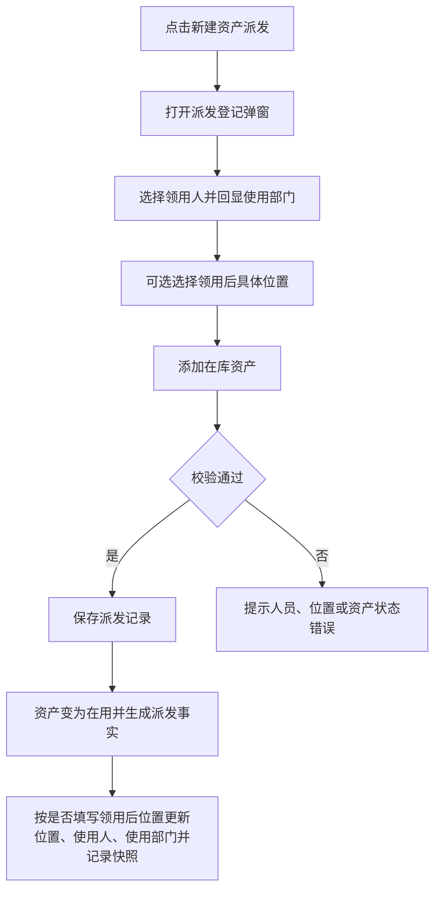

# 资产派发 PRD

## 版本记录

| 版本 | 日期 | 说明 | 影响范围 |
| --- | --- | --- | --- |
| v0.1 | 2026-08-03 | 初稿 | 全文 |
| v0.2 | 2026-08-11 | 同步原型迭代：出库弹窗改为基础信息+资产明细两段式，支持组织树选人 | 页面信息架构、功能需求、数据与校验、验收标准 |
| v0.3 | 2026-08-12 | 按出库事实更新资产当前值 | 边界说明、业务规则 |
| v0.5 | 2026-08-13 | 删除审计人员角色并明确资产派发仅单位管理员可用；部门管理员通过使用变更完成二次分发 | 使用角色、权限规则、验收标准 |
| v0.6 | 2026-08-14 | 新增非必填“领用后位置”下拉字段；未选择时保留资产当前具体位置 | 派发弹窗、位置规则、数据校验、验收标准 |

## 规划来源

- 产品规划文档：`001_产品规划/03-功能模块-02-仓储管理模块.md`
- 对应模块：仓储管理模块
- 关联页面：资产派发
- 端类型：web
- 关联实体：资产派发记录、资产、资产位置、使用对象
- 关联权限：`07-权限逻辑约定.md` 中仓储管理—资产派发（查看、新建、作废、导出）
- 相关通用规则：`06-通用业务规则.md` 中原子业务动作、唯一数据源、历史不可覆盖
- 本轮业务变更来源：用户本轮输入

## 背景与目标

单位管理员通过资产派发页面登记资产派发给领用人的事实。页面统一使用“资产派发”业务语义，也不建立仓库概念。派发只能选择在库资产，必须登记领用人；“领用后位置”为非必填，选择后更新资产当前具体位置，未选择时保留派发前位置。保存即生效，资产状态由在库变为在用，派发事实、当前使用人、使用部门和位置按上述规则同步更新。后续使用变更通过派发记录识别并处理已派发资产。

## 使用角色与诉求

| 角色 | 使用场景 | 关键诉求 | 页面主要动作 |
| --- | --- | --- | --- |
| 单位管理员 | 批量向具体位置派发资产 | 选择在库资产、登记领用人、可选指定领用后位置、保留派发凭证 | 新建、作废、查看、导出 |
| 部门管理员 | 部门资产接收后的二次分发 | 不在资产派发页面操作；通过使用变更处理本部门名下资产 | 不开放资产派发 |
| 普通用户 | 个人资产查看 | 不进入 Web 派发页面 | 不开放 Web |

## 功能范围

### 本期包含

- 派发记录列表展示、关键字和派发类型筛选
- 派发登记：基础信息、领用人、使用部门、领用后位置和资产明细
- 组织树抽屉选择领用人并自动回显使用部门
- 只允许选择在库资产
- 业务办理详情、作废和受控导出

### 本期不包含

- 派发记录直接编辑
- 仓库、仓库类型、总仓/分仓字段和独立仓库主数据
- 审批流程

### 边界说明

位置由“系统设置 > 位置管理”唯一维护。派发不是简单删除库存记录，而是记录资产派发前后状态；领用后位置有值时记录从原当前位置到新具体位置的变化，无值时保留原当前位置。派发同时更新资产当前状态、使用人和使用部门。已派发资产后续仍可通过使用变更调整使用人、部门或位置。

## 页面与入口

| 页面 | 端类型 | 路由/页面路径建议 | 入口 | 页面关系 | 说明 |
| --- | --- | --- | --- | --- | --- |
| 资产派发 | web | /asset-management/asset-outbound | 仓储管理 > 资产派发 | 上游为资产入库/资产清单，下游为使用变更 | 派发登记弹窗页；本轮保留原型路由 |

## 页面信息架构

| 页面 | 区域 | 信息层级 | 主体内容 | 关键操作区 |
| --- | --- | --- | --- | --- |
| 资产派发 | 顶部 | 主 | 页面标题“资产派发” | 新建资产派发、导出 |
| 资产派发 | 筛选区 | 主 | 关键字、派发类型、状态 | 查询、重置 |
| 资产派发 | 表格区 | 主 | 派发单号、日期、资产编号、资产名称、派发类型、领用人、领用后位置、状态 | 查看详情、作废 |
| 资产派发 | 派发弹窗 | 主 | 基础信息（创建人、领用人、领用日期、使用部门、领用后位置、备注）+ 资产明细 | 组织树选人、位置选择、添加资产、保存 |
| 资产派发 | 详情抽屉 | 辅助 | 派发主单、派发前位置、领用后位置、领用人和资产明细 | — |

## 业务流程

## 功能需求

| 编号 | 功能点 | 规则说明 | 适用页面 | 优先级 |
| --- | --- | --- | --- | --- |
| FR-1 | 列表展示 | 展示派发单号、日期、资产编号、资产名称、派发类型、领用人、领用后位置和状态；支持关键字、派发类型和状态筛选 | 资产派发 | P0 |
| FR-2 | 派发登记 | 基础信息+资产明细两段式弹窗；仅在库资产可添加；领用人必填，领用后位置非必填；保存即生效 | 资产派发 | P0 |
| FR-3 | 领用人选择 | 通过组织树抽屉选择有效人员；选定后自动回显使用部门且不可编辑 | 资产派发 | P0 |
| FR-4 | 领用后位置选择 | 通过下拉选择位置管理中维护的启用具体位置节点；字段非必填，不展示仓库或位置类型字段 | 资产派发 | P0 |
| FR-5 | 派发状态更新 | 保存后资产从在库变为在用，更新使用人和使用部门；领用后位置有值时更新当前位置，无值时保留派发前位置，并记录相关快照 | 资产派发 | P0 |
| FR-6 | 业务办理详情 | 只读展示派发单基础信息、派发前位置、领用后位置、领用人和资产明细 | 资产派发 | P1 |
| FR-7 | 派发作废 | 已生效记录可二次确认后作废；保留原始轨迹，资产恢复派发前状态和位置快照 | 资产派发 | P0 |
| FR-8 | 受控导出 | 按当前筛选条件导出派发记录 | 资产派发 | P1 |

## 字段与展示

| 页面区域 | 字段 | 字段含义 | 类型/示例 | 展示规则 | 数据来源 |
| --- | --- | --- | --- | --- | --- |
| 派发弹窗 | 创建人 | 业务登记人 | 文本只读 | 当前登录人，不可修改 | 登录态 |
| 派发弹窗 | 领用人 | 资产派发后的实际使用人 | 组织树选择 | 必填 | 基础信息 |
| 派发弹窗 | 领用日期 | 派发生效日期 | 日期 | 默认当天，必填 | 用户输入 |
| 派发弹窗 | 使用部门 | 领用人的所属部门 | 文本只读 | 领用人选择后自动回显，必填 | 基础信息 |
| 派发弹窗 | 领用后位置 | 资产领用后的具体位置 | 下拉选择 | 非必填；仅显示位置管理中维护的启用位置；不含仓库字段 | 位置管理 |
| 派发弹窗 | 备注 | 派发说明 | 多行文本 | 非必填 | 用户输入 |
| 资产明细 | 资产编号 | 资产唯一标识 | 文本 | 仅可添加在库资产 | 资产当前值 |
| 资产明细 | 资产名称 | 资产名称 | 文本 | 只读展示 | 资产当前值 |
| 资产明细 | 派发前位置 | 派发前具体位置 | 文本 | 只读快照 | 资产当前值 |
| 资产明细 | 资产状态 | 派发前状态 | 标签 | 必须为在库 | 资产当前值 |
| 列表 | 派发类型 | 派发业务类型 | 枚举 | 调拨/领用等 | 用户输入 |

## 状态与操作

| 派发记录状态 | 可见操作 | 禁用/隐藏规则 | 操作后状态变化 | 结果反馈 |
| --- | --- | --- | --- | --- |
| 已生效 | 查看详情、作废、导出 | 无 | 作废后变为已作废，资产恢复前一状态 | 成功提示 |
| 已作废 | 查看详情、导出 | 作废按钮禁用 | 无 | — |

资产状态规则：保存派发后由在库变为在用，并生成派发事实；已有派发事实的资产不再出现在仅展示在库资产的选择器中，但可进入使用变更处理。

## 交互规则

| 交互类型 | 适用页面/区域 | 规则 |
| --- | --- | --- |
| 选择领用人 | 派发弹窗 | 组织树展示序号、所属部门、姓名；选择后自动回填使用部门；清空领用人时同步清空使用部门 |
| 选择领用后位置 | 派发弹窗 | 下拉展示位置管理中维护的启用位置；字段可清空；已选择时保存前再次校验位置状态，未选择时保留派发前位置 |
| 添加资产 | 资产明细 | 资产选择器仅展示在库资产；同一派发单内不可重复添加；至少添加 1 条 |
| 保存 | 派发弹窗 | 同时校验领用人、使用部门和资产状态；领用后位置有值时校验位置仍启用；整单保存成功后更新全部资产并刷新列表 |
| 作废 | 表格区 | 二次确认后作废；作废必须按原派发记录恢复资产前一状态，不能直接覆盖历史派发事实 |

## 权限规则

| 权限对象 | 规则 | 无权限表现 | 数据可见范围 |
| --- | --- | --- | --- |
| 页面 | 仅单位管理员可见；部门管理员、普通用户不进入资产派发 | 无权限提示或导航隐藏 | 本单位 |
| 新建、作废 | 仅单位管理员 | 无权限隐藏 | — |
| 查看、导出 | 仅单位管理员可用 | 无权限隐藏 | 本单位 |
| 资产选择 | 仅引用当前权限范围内的在库资产 | 无可选资产时空态 | — |

## 数据与校验规则

| 字段/数据项 | 默认值 | 必填 | 格式/范围校验 | 计算口径 | 刷新/同步规则 |
| --- | --- | --- | --- | --- | --- |
| 创建人 | 当前登录人 | 是 | 不可编辑 | — | 登录态 |
| 领用人 | 空 | 是 | 基础信息中的有效人员 | — | 选人后回填使用部门 |
| 领用日期 | 当天 | 是 | 有效日期 | — | — |
| 使用部门 | 领用人所属部门 | 是 | 由人员带出，不可手填 | — | 随领用人同步 |
| 领用后位置 | 空 | 否 | 只能选择位置管理中启用的具体位置节点 | — | 从位置管理同步；有值时保存前复核状态，无值时保留派发前位置 |
| 派发资产 | 空 | 是 | 资产当前状态必须为在库；至少 1 条 | — | 保存前实时复核 |
| 派发类型 | 空 | 是 | 调拨/领用等有效枚举 | — | 列表筛选与登记共用 |
| 派发前位置 | 资产当前值 | 系统生成 | 保存时生成快照 | — | 历史记录不可覆盖 |
| 资产当前状态 | 在库 | 系统生成 | 保存后变为在用 | — | 作废时按规则恢复 |
| 备注 | 空 | 否 | 文本 | — | — |

## 异常与空状态

| 场景 | 触发条件 | 页面表现 | 用户可执行操作 | 恢复/兜底规则 |
| --- | --- | --- | --- | --- |
| 无派发记录 | 无记录 | 空态提示并引导新建 | 新建资产派发 | — |
| 无在库资产 | 当前权限范围内无在库资产 | 明细选择器空态 | 先完成资产入库 | 阻止保存空明细 |
| 资产已被其他业务占用 | 打开表单后资产不再为在库 | 保存时提示资产状态已变化 | 移除该资产或刷新重选 | 整单阻止保存 |
| 未选领用人 | 领用人为空 | 定位字段并提示 | 选择有效人员 | 阻止保存 |
| 未选领用后位置 | 领用后位置为空 | 不提示错误 | 可直接保存 | 保留派发前具体位置 |
| 位置已停用 | 已选择的领用后位置在保存前被停用 | 提示位置不可用 | 重新选择启用位置或清空该字段 | 阻止保存 |
| 保存失败 | 数据冲突或系统异常 | 错误提示并保留表单 | 重试 | 不产生部分派发 |

## 验收标准

### 页面验收

- 用户可通过“仓储管理 > 资产派发”进入页面，页面标题和按钮统一使用“资产派发”。
- 派发弹窗包含领用人、领用日期、使用部门、领用后位置、备注和资产明细，不包含仓库字段。
- 列表和详情展示领用后位置、领用人和派发前位置快照。

### 功能验收

- 领用人必须通过组织树选择，选择后使用部门自动回显且不可编辑。
- 领用后位置为非必填；填写时只能选择位置管理中维护的启用具体位置，清空时沿用派发前位置。
- 只能添加在库资产，至少添加 1 条；资产状态在保存时再次校验。
- 保存即生效，资产由在库变为在用，使用人和使用部门更新；填写领用后位置时更新当前位置，未填写时保留原位置，并生成派发位置快照、派发业务记录和审计日志。
- 已有派发事实的资产不再出现在在库资产选择器中，但可通过使用变更继续处理。
- 作废前二次确认；作废后资产按派发前状态和位置恢复，原派发记录仍可追溯。

### 状态验收

- 已生效派发记录可作废，已作废记录不可再次作废。
- 部门管理员和普通用户不可进入资产派发；派发后资产由部门管理员通过使用变更完成部门内二次分发。

## 原型/工程关联

- PRD 类型：项目 PRD
- PRD 文件：`002_PRD/barracks-admin/资产派发.md`
- 原型项目：`003_prototype/barracks-admin/`
- 页面文件：`src/views/warehouse/AssetOutbound.vue`（当前原型仍为旧页面文件名）
- 文档映射：`src/doc/manifest.json` 已登记 `/asset-management/asset-outbound`，当前仍使用原路由和文件映射
- 说明：本轮仅修改 PRD，原型页面标题、路由和 manifest 映射暂不调整。
