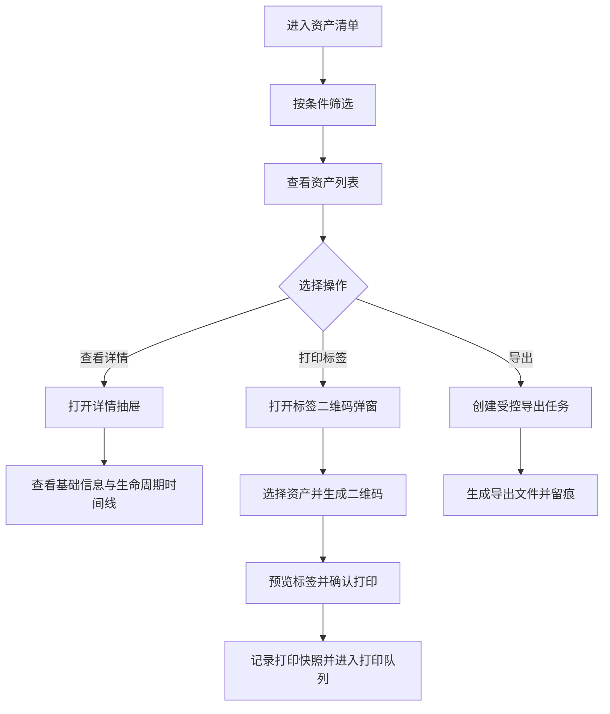

# 资产清单 PRD

## 版本记录

| 版本 | 日期 | 说明 | 影响范围 |
| --- | --- | --- | --- |
| v0.1 | 2026-08-03 | 初稿 | 全文 |
| v0.2 | 2026-08-11 | 同步原型迭代（ISS-009 回写）：资产清单为只读视图，行操作仅保留详情，行级编辑本期不提供（编码维护由编码管理页承接）；详情抽屉增加生命周期时间线；表格 SN/RFID 合并为"编码(SN/RFID)"双行列；顶部提供历史迁移导入、打印标签、导出模拟入口 | 功能范围、页面信息架构、功能需求、字段与展示、权限规则、验收标准、原型/工程关联 |
| v0.3 | 2026-08-12 | 调整资产状态范围，资产清单状态筛选和状态展示同步调整 | 功能范围、字段与展示、状态与操作 |
| v0.5 | 2026-08-13 | 删除审计人员角色；补充部门管理员本部门只读资产清单和普通用户移动端个人资产入口 | 使用角色、权限规则、验收标准 |
| v0.6 | 2026-08-14 | 页面名称由“资产台账”统一调整为“资产清单”；同步原型标题、侧边菜单与文档映射，并移除原型中已废止的“闲置”状态展示 | 页面名称、字段与展示、原型/工程关联 |
| v0.7 | 2026-08-17 | 根据用户本轮要求与原型迭代，移除“历史迁移导入”入口及相关流程；将打印标签更新为资产选择、二维码生成状态、标签预览和确认打印交互 | 功能范围、页面信息架构、业务流程、功能需求、字段与展示、状态与操作、交互规则、权限规则、数据与校验规则、异常与空状态、验收标准 |
| v0.8 | 2026-08-17 | 按按钮不超过 4 个字的规范，将二维码生成按钮统一命名为“生成码”，保留二维码生成与打印交互语义 | 页面信息架构、状态与操作、验收标准 |
| v0.9 | 2026-08-18 | 同步资产属性模型：详情抽屉展示资产属性与当前三级分类专属属性快照，导出包含已保存属性值；字段定义仍由资产分类页面维护 | 背景目标、功能需求、字段与展示、数据与校验、验收标准 |

## 规划来源

- 产品规划文档：`001_产品规划/03-功能模块-02-仓储管理模块.md`
- 对应模块：仓储管理模块
- 关联页面：资产清单
- 端类型：web
- 关联实体：资产、资产分类、资产属性、专属属性、标准型号、资产位置、使用对象、仓储流转记录
- 关联权限：`07-权限逻辑约定.md` 中仓储管理—资产清单的查看、打印、导出权限；本页面不提供编辑与历史迁移导入入口
- 相关通用规则：`06-通用业务规则.md` 中统一查询上下文（F-13）和导出口径一致

## 背景与目标

单位管理员需要一个统一的资产清单页面，查看本单位全部资产的当前状态、位置、使用对象、编码等核心信息；部门管理员需要在授权部门范围内查看本部门名下资产。普通用户不进入 Web 资产清单，仅在移动端查看本人名下资产。资产清单是仓储管理模块的核心只读页面，复用资产当前值，不提供新增入口（资产由入库形成）。

## 使用角色与诉求

| 角色 | 使用场景 | 关键诉求 | 页面主要动作 |
| --- | --- | --- | --- |
| 单位管理员 | 查看资产全貌、定位特定资产、打印当前资产标签 | 快速筛选、查看详情、生成二维码标签、导出 | 筛选、查看、打印、导出 |
| 部门管理员 | 查看本部门名下资产 | 按条件筛选、查看详情，不编辑、打印或导出 | 筛选、查看 |
| 普通用户 | 查看本人名下资产 | 不进入 Web 资产清单；移动端仅查看本人资产与必要字段 | 不开放 Web |

## 功能范围

### 本期包含

- 资产清单列表展示（含分页）
- 多条件筛选（关键字、资产分类、所在位置、资产状态、编码状态）
- 资产详情抽屉（基础信息 + 生命周期时间线）
- 标签打印（从资产清单发起，包含二维码生成与标签预览）
- 受控导出

### 本期不包含

- 新增资产（由入库登记形成，资产清单不提供新增）
- 行级资产编辑（本期资产清单为只读视图，编码补充维护由编码管理页承接）
- 审批流程（不建立审批，保存即生效并留痕）

### 边界说明

资产清单复用资产当前值，库存仅是资产清单在库范围的查询投影。位置主数据由"系统设置 > 位置管理"维护，资产清单只引用具体位置。分类、资产属性和三级分类专属属性由"系统设置 > 资产分类"维护；标准型号只作为资产的可选来源信息，不替代资产当前值。详情和导出读取资产入库时保存的属性快照，属性配置变化不回写历史资产。历史数据迁移不由资产清单页面承接。

## 页面与入口

| 页面 | 端类型 | 路由/页面路径建议 | 入口 | 页面关系 | 说明 |
| --- | --- | --- | --- | --- | --- |
| 资产清单 | web | /asset-management/asset-ledger | 仓储管理 > 资产清单 | 上游为入库/出库，下游为详情抽屉、二维码标签弹窗、导出 | 核心只读列表页 |

## 页面信息架构

| 页面 | 区域 | 信息层级 | 主体内容 | 关键操作区 |
| --- | --- | --- | --- | --- |
| 资产清单 | 顶部 | 主 | 页面标题"资产清单" | 打印标签、导出按钮 |
| 资产清单 | 筛选区 | 主 | 关键字（资产编号/名称）、资产分类、所在位置（树形选择）、资产状态（多选）、编码状态（多选） | 搜索、重置 |
| 资产清单 | 表格区 | 主 | 资产编号、资产分类、资产名称、标准型号、所在位置、使用对象、资产状态、编码(SN/RFID)双行、编码状态 | 详情 |
| 资产清单 | 详情抽屉 | 辅助 | 资产基础信息、资产属性快照、当前三级分类专属属性快照 + 生命周期时间线（入库/出库/借用/位置变更/维保/报废事件） | — |
| 资产清单 | 标签二维码弹窗 | 辅助 | 打印资产选择、二维码生成状态、标签字段预览、二维码内容摘要 | 生成码、确认打印、取消 |
| 资产清单 | 分页区 | 辅助 | 总数、每页条数、页码跳转 | — |

## 业务流程

## 功能需求

| 编号 | 功能点 | 规则说明 | 适用页面 | 优先级 |
| --- | --- | --- | --- | --- |
| FR-1 | 列表展示 | 展示资产编号、资产分类、资产名称、标准型号、所在位置、使用对象、资产状态、编码(SN/RFID)双行列、编码状态 | 资产清单 | P0 |
| FR-2 | 多条件筛选 | 支持关键字、资产分类下拉、所在位置树形选择、资产状态多选、编码状态多选；位置选择不依赖仓库，支持按节点或完整路径查询 | 资产清单 | P0 |
| FR-3 | 详情抽屉 | 点击行"详情"打开右侧抽屉，展示资产基础信息、资产属性快照、当前三级分类专属属性快照与生命周期时间线（事件类型标签、描述、操作人） | 资产清单 | P0 |
| FR-4 | 标签打印 | 单位管理员从资产清单打开标签二维码弹窗，选择当前筛选结果中的资产；系统展示二维码生成中状态，完成后展示二维码和标签字段预览，确认后记录打印快照并进入打印队列 | 资产清单 | P1 |
| FR-5 | 受控导出 | 按当前筛选条件创建受控导出任务，受数据权限、水印和有效期控制 | 资产清单 | P0 |

## 字段与展示

| 页面区域 | 字段 | 字段含义 | 类型/示例 | 展示规则 | 数据来源 |
| --- | --- | --- | --- | --- | --- |
| 筛选区 | 资产分类 | 分类筛选 | 下拉选择 | 启用分类列表 | 系统设置 |
| 筛选区 | 所在位置 | 具体位置筛选 | 树形选择 | 启用位置节点，可按完整路径搜索 | 系统设置 |
| 筛选区 | 资产状态 | 状态筛选 | 多选 | 在库/在用/借用中/维保中/已报废 | 资产当前值 |
| 筛选区 | 编码状态 | 编码筛选 | 多选 | 待完善/部分完善/已完善 | 资产当前值 |
| 表格 | 资产编号 | 唯一标识 | 文本 | 默认显示 | 资产当前值 |
| 表格 | 资产分类 | 所属分类 | 文本 | 显示 | 资产当前值 |
| 表格 | 资产名称 | 名称 | 文本 | 显示 | 资产当前值 |
| 表格 | 标准型号 | 入库时引用的标准型号 | 文本 | 无引用显示"—" | 资产当前值 |
| 详情抽屉 | 资产属性 | 单位级资产属性及实际值 | 按属性定义 | 按资产入库时保存的属性快照展示；无值显示"—" | 资产属性配置/资产快照 |
| 详情抽屉 | 专属属性 | 当前三级分类专属属性及实际值 | 按属性定义 | 按资产入库时保存的分类属性快照展示；无值显示"—" | 专属属性配置/资产快照 |
| 表格 | 所在位置 | 当前具体位置 | 文本 | 显示完整路径 | 资产当前值 |
| 表格 | 使用对象 | 当前使用对象 | 文本 | 显示 | 资产当前值 |
| 表格 | 资产状态 | 当前状态 | 标签 | 彩色标签 | 资产当前值 |
| 表格 | 编码(SN/RFID) | 序列号与射频编码 | 双行文本 | 同一列内分两行展示 SN 与 RFID，空值显示"—" | 资产当前值 |
| 表格 | 编码状态 | 编码完善度 | 标签 | 显示 | 资产当前值 |
| 标签二维码弹窗 | 打印资产 | 本次打印对应的资产 | 下拉选择 | 默认选中当前筛选结果首条资产，可切换其他命中资产 | 当前筛选结果 |
| 标签二维码弹窗 | 二维码生成状态 | 二维码生成进度 | 枚举标签 | 待生成、生成中、已生成；生成中展示扫描动画和加载状态 | 标签生成过程 |
| 标签二维码弹窗 | 二维码内容 | 标签二维码承载内容 | 只读文本 | 由资产唯一标识和资产编号生成，不允许手工修改 | 资产当前值 |
| 标签二维码弹窗 | 标签预览 | 打印标签展示内容 | 预览卡片 | 展示资产编号、状态、资产名称、资产分类、所在位置和编码信息 | 资产当前值 |

## 状态与操作

| 状态 | 可见操作 | 禁用/隐藏规则 | 操作后状态变化 | 结果反馈 |
| --- | --- | --- | --- | --- |
| 资产清单页面 | 查看详情、打印标签、导出 | 部门管理员隐藏打印和导出；普通用户不可见页面 | 页面数据不变 | 打开详情抽屉或对应业务弹窗 |
| 二维码待生成 | 选择资产、生成二维码 | 未选择资产时不可确认打印 | 进入“生成中” | 展示生成中的加载状态 |
| 二维码生成中 | 查看生成动画 | 禁用确认打印 | 生成完成后进入“已生成” | 展示扫描动画和“正在生成二维码” |
| 二维码已生成 | 确认打印、取消 | 资产切换后重新生成；确认打印前必须已生成 | 确认后关闭弹窗并记录打印快照 | 提示已进入打印队列 |
| 在库 | 查看详情、导出 | 无 | 无 | — |
| 在用 | 查看详情、导出 | 无 | 无 | — |
| 借用中 | 查看详情、导出 | 无 | 无 | — |
| 维保中 | 查看详情、导出 | 无 | 无 | — |
| 已报废 | 查看详情、导出 | 无 | 无 | — |

## 交互规则

| 交互类型 | 适用页面/区域 | 规则 |
| --- | --- | --- |
| 搜索/筛选 | 筛选区 | 筛选字段对应可见列；位置使用树形选择；停用项不可选 |
| 排序/分页 | 表格区 | 分页默认20条/页 |
| 弹窗/抽屉 | 详情抽屉 | 右侧抽屉展示，含生命周期时间线；无记录时空态提示 |
| 弹窗/抽屉 | 标签二维码弹窗 | 点击“打印标签”打开；默认选中当前筛选结果首条资产；切换资产后重新进入生成中状态；生成完成前不可确认打印 |
| 确认/保存/取消 | 标签二维码弹窗 | 生成完成后点击“确认打印”记录打印快照并关闭弹窗；点击“取消”关闭弹窗且不产生打印记录 |
| 页面级操作 | 顶部操作区 | 仅提供打印标签、导出；本页面不提供历史迁移导入 |

## 权限规则

| 权限对象 | 规则 | 无权限表现 | 数据可见范围 |
| --- | --- | --- | --- |
| 页面 | 单位管理员和部门管理员可见；部门管理员仅本部门范围；普通用户不进入 Web | 无权限提示或导航隐藏 | 单位管理员：本单位全部；部门管理员：本部门名下资产 |
| 打印按钮 | 仅单位管理员可见 | 部门管理员隐藏 | — |
| 导出按钮 | 仅单位管理员可见 | 部门管理员隐藏 | 本单位 |
| 数据 | 服务端先应用权限和数据范围 | 空结果提示"无权限" | 查询和导出复用同一数据权限条件 |

## 数据与校验规则

| 字段/数据项 | 默认值 | 必填 | 格式/范围校验 | 计算口径 | 刷新/同步规则 |
| --- | --- | --- | --- | --- | --- |
| 资产编号 | — | 是 | 单位内唯一 | — | 由入库生成，不可手动修改 |
| SN | — | 否 | 单位内唯一 | — | 由编码管理页维护，资产清单只展示 |
| RFID | — | 否 | 有效范围内唯一 | — | 由编码管理页维护，资产清单只展示 |
| 编码状态 | 待完善 | 是 | 待完善/部分完善/已完善 | SN和RFID均空为待完善；均有为已完善 | 由编码变动自动更新 |
| 打印资产 | 当前筛选结果首条资产 | 是 | 必须为当前用户可见范围内的资产 | 用户切换资产后重新生成二维码 | 打印弹窗打开或资产选择变化时刷新 |
| 二维码内容 | — | 是 | 由资产唯一标识和资产编号生成，不允许编辑 | 同一资产编号对应稳定二维码内容 | 生成完成后供标签预览与打印快照使用 |

## 异常与空状态

| 场景 | 触发条件 | 页面表现 | 用户可执行操作 | 恢复/兜底规则 |
| --- | --- | --- | --- | --- |
| 无数据 | 本单位无资产 | 空态提示"暂无资产数据" | 引导到入库登记 | — |
| 无权限 | 查询授权失败 | 明确失败提示 | 返回工作台 | 不以空结果替代失败 |
| 加载失败 | 查询服务异常 | 错误提示，保留当前条件 | 重试 | 不静默返回全量数据 |
| 无生命周期记录 | 资产无流转事件 | 时间线区空态提示 | — | — |
| 无可打印资产 | 当前筛选条件无命中数据 | 点击“打印标签”不打开弹窗，提示暂无可打印资产 | 调整筛选条件或重置筛选 | 保留当前筛选条件 |
| 二维码未生成 | 尚未完成二维码生成 | “确认打印”不可用，保留“生成码”操作 | 等待生成完成 | 不记录打印快照 |

## 验收标准

### 页面验收

- 资产清单页面可通过"仓储管理 > 资产清单"菜单进入
- 页面标题为"资产清单"
- 表格至少展示资产编号、资产分类、资产名称、标准型号、所在位置、使用对象、资产状态、编码(SN/RFID)双行列、编码状态
- 行内"详情"打开右侧抽屉，展示基础信息、资产属性与专属属性快照，并展示生命周期时间线

### 功能验收

- 单位管理员可筛选、查看详情、打印标签和导出；页面不展示“历史迁移导入”按钮，也不存在该页面流程
- 部门管理员可筛选、查看本部门详情，但打印和导出按钮不可见；普通用户不进入 Web 资产清单
- 标签弹窗中的二维码生成按钮为“生成码”，按钮名称不超过 4 个字；生成过程中展示交互状态，完成后才允许“确认打印”。
- 导出文件包含当前筛选条件的全部命中数据，不低于当前页，字段至少包括资产编号、资产分类、资产名称、标准型号、所在位置、使用对象、资产状态、SN、RFID、编码状态，并包含已保存的资产属性和专属属性值
- 单位管理员点击“打印标签”后，弹窗默认选中当前筛选结果首条资产，并可切换其他命中资产
- 选择资产后二维码先显示生成中状态和扫描动画，生成完成后展示二维码、二维码内容摘要和标签字段预览
- 二维码未生成完成前“确认打印”不可用；确认打印后关闭弹窗并提示已进入打印队列
- 位置筛选使用统一位置树，不依赖仓库，支持按完整路径定位节点

### 状态验收

- 资产清单为只读视图，行操作仅提供详情
- 编码状态根据SN和RFID的完善程度自动计算
- 二维码标签流程至少覆盖待生成、生成中、已生成三种状态；资产切换后重新生成
- 取消打印不产生打印快照，确认打印仅对已生成二维码的资产生效
- 生命周期时间线按时间正序展示入库、出库、借用、位置变更、维保、报废事件

## 原型/工程关联

- PRD 类型：项目 PRD
- PRD 文件：`002_PRD/barracks-admin/资产清单.md`
- 原型项目：`003_prototype/barracks-admin/`
- 页面文件：`src/views/warehouse/AssetList.vue`
- 文档映射：`src/doc/manifest.json` 已登记 `/asset-management/asset-ledger`，关联文档为 `资产清单.md`
