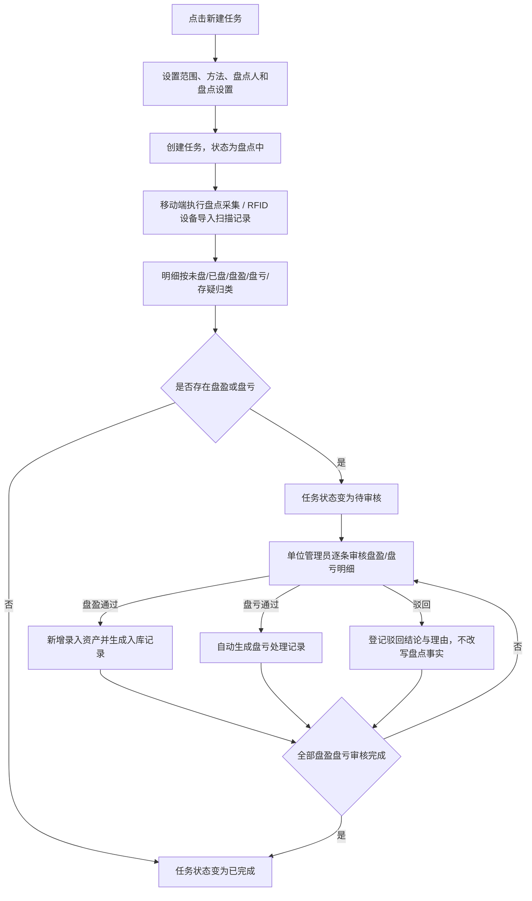

# 资产盘点 PRD

## 版本记录

| 版本 | 日期 | 说明 | 影响范围 |
| --- | --- | --- | --- |
| v0.1 | 2026-08-03 | 初稿（RFID 盘点，批次制） | 全文 |
| v0.2 | 2026-08-11 | 按 DEC-013、DEC-014、DEC-015 重写为任务制：盘点任务取代盘点批次，取消复核与归档；页面更名为资产盘点（路由 /asset-management/asset-inventory）；盘点执行移交移动端盘点采集 PRD | 全文；原文件 RFID盘点.md 废止 |
| v0.3 | 2026-08-12 | 按 DEC-020 新增盘盈盘亏审核处置闭环：任务状态增加待审核；盘盈审核通过后新增录入资产并生成入库记录（优先引用标准型号，也可手工录入且不创建标准型号），盘亏审核通过后自动生成盘亏处理记录；审核驳回仅留痕；处置记录可作废退回重审 | 背景目标、功能范围、信息架构、业务流程、功能需求、状态、权限、数据校验、异常、验收标准 |
| v0.4 | 2026-08-13 | 盘亏审核通过生成记录的口径同步为资产处置：处置类型为盘亏处理，关联资产处置页面 /asset-management/asset-disposal | 盘亏处置流程、记录追溯与验收 |
| v0.6 | 2026-08-13 | 删除审计人员角色并明确组织盘点仅由单位管理员负责；普通用户点验由移动端个人资产 PRD 承接 | 使用角色、权限规则、验收标准 |
| v0.7 | 2026-08-17 | 统一“资产盘点”菜单下的新建按钮和弹窗标题为“新建任务”，按钮名称不超过 4 个字 | 页面信息架构、业务流程、异常与验收标准 |
| v0.8 | 2026-08-18 | 质量整改：统一盘亏审核通过后的记录名称为资产处置记录，处置类型为盘亏处理；明确已完成任务不提供删除等写入操作 | 状态与操作、流程反馈、验收标准 |

## 规划来源

- 产品规划文档：`001_产品规划/03-功能模块-04-资产盘点模块.md`
- 对应模块：资产盘点模块
- 关联页面：资产盘点
- 端类型：web
- 关联实体：盘点任务、盘点明细、扫描记录、RFID 设备、资产、基础人员
- 关联权限：`07-权限逻辑约定.md` 中资产盘点—盘点任务（查看、新建、导入、审核处置、导出）
- 相关通用规则：`06-通用业务规则.md` 中盘盈盘亏审核处置闭环、采集不改资产清单、扫描事实保留、盘点锁定、统一查询上下文
- 决策依据：DEC-010、DEC-013、DEC-014、DEC-015、DEC-020；版本准入 IN-004

## 背景与目标

单位管理员在资产盘点页面创建盘点任务、查看任务执行进度和明细归类结果，并对盘盈/盘亏明细进行审核处置。盘点采用任务制：Web 端负责任务创建、审核处置与结果查看，移动端（barracks-mobile）负责任务执行采集。任务下按盘点明细归类为未盘、已盘、盘盈、盘亏、存疑五类。采集时盘盈盘亏仅作记录，不自动改写资产清单和库存；盘盈盘亏须经单位管理员审核确认后方可处置：盘盈入账、盘亏出账（DEC-020）。已盘/存疑事实不可修改，需要调整时创建新任务。

## 使用角色与诉求

| 角色 | 使用场景 | 关键诉求 | 页面主要动作 |
| --- | --- | --- | --- |
| 单位管理员 | 创建盘点任务、跟踪进度、审核处置盘盈盘亏、查看归类结果 | 按范围和方法创建任务、指派盘点人、逐条审核盘盈/盘亏并入账出账、查看五类明细结果、导出 | 新建任务、审核处置、查看结果、导出 |
| 部门管理员 | 部门资产日常管理 | 不进入组织盘点任务、不创建或审核盘点任务 | 不开放组织盘点 |
| 普通用户 | 个人资产点验 | 不进入组织盘点任务；移动端查看本人资产并自主点验 | 移动端查看、提交点验 |

## 功能范围

### 本期包含

- 盘点任务列表展示（任务名称、盘点方法、盘点人、计划时间、状态、进度）
- 创建盘点任务（盘点范围、盘点方法、盘点人、盘点设置）
- 任务结果查看（未盘/已盘/盘盈/盘亏/存疑五类明细页签）
- 盘盈盘亏审核处置（逐条审核确认或驳回；盘盈处置弹窗、盘亏处置确认）
- RFID 采集结果导入（设备上传扫描记录）
- 受控导出

### 本期不包含

- 盘点执行采集（归移动端盘点采集 PRD，工程 barracks-mobile）
- 已完成任务已盘/存疑事实的直接修改（需创建新任务）
- 采集时盘盈盘亏自动改写资产清单和库存（必须先经审核处置）
- 独立复核与归档阶段（任务制已取消）
- 部门管理员、普通用户均不进入组织盘点审核处置；普通用户个人点验不改变资产清单（仅单位管理员负责组织盘点）

### 边界说明

- 采集时盘盈盘亏仅作记录，不自动改写资产清单和库存（DEC-010）；审核处置后方可入账出账（DEC-020）。
- 盘点任务执行期间（含待审核阶段），任务范围内的资产不得执行出入库、借用、使用变更、维保或报废（盘点锁定）。
- 已完成任务的已盘/存疑事实不得直接修改；需要调整时创建新任务。
- 同一标签重复扫描保留原始痕迹。
- 移动端采集行为（执行盘点、盘盈录入、批量标记等）由 `002_PRD/barracks-mobile/移动端盘点采集.md` 定义。
- 盘盈入库记录在资产入库列表与资产清单中正常展示和追溯；盘亏处理记录在资产处置列表正常展示和追溯，具体口径分别见 `资产入库.md` 和 `资产处置.md`。

## 页面与入口

| 页面 | 端类型 | 路由/页面路径建议 | 入口 | 页面关系 | 说明 |
| --- | --- | --- | --- | --- | --- |
| 资产盘点 | web | /asset-management/asset-inventory | 资产盘点 > 资产盘点 | 上游为资产清单，下游为移动端盘点采集 | 任务列表 + 创建 + 结果查看 |

## 页面信息架构

| 页面 | 区域 | 信息层级 | 主体内容 | 关键操作区 |
| --- | --- | --- | --- | --- |
| 资产盘点 | 顶部 | 主 | 页面标题"资产盘点" | 新建任务按钮、导出按钮 |
| 资产盘点 | 筛选区 | 主 | 任务名称、盘点方法、状态 | 搜索、重置 |
| 资产盘点 | 表格区 | 主 | 任务名称、盘点方法、盘点人、计划时间、状态、进度 | 查看结果、导入扫描（RFID） |
| 资产盘点 | 结果抽屉/页签区 | 主 | 未盘、已盘、盘盈、盘亏、存疑五类明细页签，各页签展示资产编号、资产名称、资产分类、所在位置、使用对象、备注、照片数；盘盈/盘亏页签额外展示处置状态与审核/处置入口 | 查看明细、审核处置 |
| 资产盘点 | 盘盈处置弹窗 | 主 | 盘盈明细信息（现场登记内容、照片）+ 标准型号选择（可选）或手工填写资产分类、资产名称及其他字段 + 入库具体位置 + 实际单价（可留空） | 审核通过（生成入库记录）、审核驳回 |
| 资产盘点 | 盘亏处置确认 | 主 | 盘亏明细信息（资产编号、名称、最后已知状态、照片）+ 处置结论预览（处置类型=盘亏处理，处置说明自动备注盘点盘亏） | 审核通过（生成资产处置记录）、审核驳回 |
| 资产盘点 | 分页区 | 辅助 | 总数、每页条数、页码跳转 | — |

## 业务流程

## 功能需求

| 编号 | 功能点 | 规则说明 | 适用页面 | 优先级 |
| --- | --- | --- | --- | --- |
| FR-1 | 任务列表展示 | 展示任务名称、盘点方法、盘点人、计划时间、状态、进度；按统一查询上下文筛选和分页 | 资产盘点 | P0 |
| FR-2 | 创建盘点任务 | 设置盘点范围（资产分类/资产状态/部门/使用对象多选）、盘点方法（手动盘点/扫码盘点/RFID）、盘点人、计划时间和盘点设置；不选范围时默认为发起人数据权限内全部资产 | 资产盘点 | P0 |
| FR-3 | 结果查看 | 按未盘/已盘/盘盈/盘亏/存疑五类页签查看明细，含备注和照片数；盘盈/盘亏页签额外展示处置状态 | 资产盘点 | P0 |
| FR-4 | 盘盈审核处置 | 盘盈明细审核通过时打开盘盈处置弹窗：可选择已启用标准型号，也可不选并手工填写资产分类、资产名称及其他字段；填写入库具体位置，实际单价允许留空；数量固定 1；保存后新增录入资产并生成入库记录，入库来源标记盘盈；手工录入不创建或补充标准型号；审核驳回时登记驳回理由 | 资产盘点 | P0 |
| FR-5 | 盘亏审核处置 | 盘亏明细审核通过时展示处置结论预览（处置类型=盘亏处理，处置说明自动备注盘点盘亏），确认后自动生成资产处置记录，免二次确认，保留处置前快照；审核驳回时登记驳回理由 | 资产盘点 | P0 |
| FR-6 | RFID 采集导入 | 导入 RFID 设备上传的扫描记录，保留设备、扫描时间和上传任务等原始痕迹 | 资产盘点 | P1 |
| FR-7 | 受控导出 | 按筛选条件导出任务列表或明细结果 | 资产盘点 | P1 |

## 状态与操作

| 状态 | 可见操作 | 禁用/隐藏规则 | 操作后状态变化 | 结果反馈 |
| --- | --- | --- | --- | --- |
| 盘点中 | 查看、查看结果、导入扫描（RFID）、导出 | 无写入禁用 | 移动端采集持续推进明细归类 | — |
| 待审核 | 查看、查看结果、审核处置盘盈/盘亏、导出 | 任务范围资产维持盘点锁定 | 逐条审核处置盘盈/盘亏明细；全部审核完成后变为已完成 | 盘盈通过提示已生成入库记录；盘亏通过提示已生成资产处置记录；驳回提示已留痕 |
| 已完成 | 查看、查看结果、导出 | 所有写入操作禁用 | 无 | 已盘/存疑需调整时创建新任务 |

盘盈/盘亏明细处置状态：待审核 → 审核通过 / 审核驳回；审核通过生成的入库/资产处置记录被作废后，明细退回待审核可重新审核。

## 权限规则

| 权限对象 | 规则 | 无权限表现 | 数据可见范围 |
| --- | --- | --- | --- |
| 页面 | 仅单位管理员可见；部门管理员和普通用户不可见 | 无权限提示或导航隐藏 | 本单位 |
| 新建任务 | 仅单位管理员 | 无权限隐藏 | — |
| 审核处置 | 仅单位管理员（DEC-020） | 无权限隐藏 | 保存前二次校验权限与数据范围 |
| 导入扫描 | 仅单位管理员 | 无权限隐藏 | — |
| 导出 | 仅单位管理员 | 无权限隐藏 | 本单位 |

## 数据与校验规则

| 字段/数据项 | 默认值 | 必填 | 格式/范围校验 | 计算口径 | 刷新/同步规则 |
| --- | --- | --- | --- | --- | --- |
| 任务号 | — | 是 | 唯一 | — | 系统自动生成 |
| 任务名称 | — | 是 | 非空 | — | — |
| 盘点范围 | 发起人数据权限内全部资产 | 否 | 资产分类/资产状态/部门/使用对象多选 | — | 从资产清单和基础信息同步 |
| 盘点方法 | — | 是 | 手动盘点、扫码盘点、RFID | — | 枚举只引用不新增 |
| 盘点人 | — | 是 | 本单位人员 | — | 从基础信息同步 |
| 计划时间 | — | 是 | 起止日期，起≤止 | — | — |
| 盘点明细归类 | — | 是 | 未盘/已盘/盘盈/盘亏/存疑 | 任务范围资产清单与采集事实比对 | 由移动端采集实时更新 |
| 处置状态 | 待审核 | 是（仅盘盈/盘亏） | 待审核/审核通过/审核驳回 | — | 审核处置实时更新；生成记录作废后退回待审核 |
| 盘盈标准型号 | 空 | 否（盘盈通过时） | 已启用标准型号；允许为空 | — | 选择时回显字段；不反向修改标准型号 |
| 盘盈资产分类 | 空 | 是（盘盈通过时） | 有效资产分类 | — | 标准型号回显或手工录入 |
| 盘盈资产名称 | 空 | 是（盘盈通过时） | 非空文本 | — | 标准型号回显或手工录入 |
| 盘盈实际单价 | 留空 | 否 | 正数或留空 | — | 留空时入库金额为空 |
| 盘盈所在位置 | — | 是（盘盈通过时） | 启用的具体位置节点 | — | 位置管理 |
| 扫描记录 | — | 是 | 保留设备、扫描时间和上传任务 | — | 保留原始痕迹 |

## 字段与展示

| 页面区域 | 字段 | 字段含义 | 类型/示例 | 展示规则 | 数据来源 |
| --- | --- | --- | --- | --- | --- |
| 结果页签 | 位置 | 盘点时资产所在具体位置 | 文本 | 展示完整路径 | 资产当前值/采集事实 |
| 结果页签 | 使用对象 | 盘点时使用对象 | 文本 | 无值显示“—” | 资产当前值 |
| 盘盈处置 | 标准型号 | 可选模板 | 选择器 | 可选，启用项可选 | 标准型号 |
| 盘盈处置 | 资产分类/名称 | 盘盈资产基础信息 | 分类选择+文本 | 必填 | 标准型号回显或用户输入 |
| 盘盈处置 | 所在位置 | 盘盈资产具体位置 | 树形选择 | 必填，启用节点可选 | 位置管理 |

## 异常与空状态

| 场景 | 触发条件 | 页面表现 | 用户可执行操作 | 恢复/兜底规则 |
| --- | --- | --- | --- | --- |
| 无任务 | 无盘点任务记录 | 空态提示 | 引导到新建任务 | — |
| 无差异 | 明细全部为已盘 | 盘盈/盘亏/存疑页签计数为 0，任务采集完成后直接已完成 | 查看结果 | — |
| 待审核积压 | 存在未审核盘盈盘亏 | 任务保持待审核，工作台待办提醒 | 逐条审核处置 | 盘点锁定持续生效倒逼处置 |
| 已完成任务修改 | 尝试修改已完成任务 | 阻止操作 | 创建新任务 | — |
| 盘点锁定 | 任务范围内资产发起出入库、借用、使用变更、维保或报废 | 阻止业务操作 | 等任务完成 | 盘点锁定 |
| 处置保存失败 | 盘盈入库或盘亏处理写入失败 | 呈现失败状态并保留当前条件 | 重试 | 整单回滚，明细保持待审核 |
| 导入失败 | RFID 采集文件校验失败 | 呈现失败状态并保留当前条件 | 修正后重新导入 | 不产生部分写入 |

## 验收标准

### 页面验收

- 资产盘点页面可通过"资产盘点 > 资产盘点"菜单进入，路由为 /asset-management/asset-inventory
- 表格展示任务名称、盘点方法、盘点人、计划时间、状态、进度

### 功能验收

- 可创建盘点任务：支持资产分类/资产状态/部门/使用对象多选范围、三种盘点方法、盘点人和计划时间
- 不选范围时默认为发起人数据权限内全部资产
- 结果按未盘/已盘/盘盈/盘亏/存疑五类页签展示
- 可导入 RFID 设备上传的扫描记录且保留原始痕迹
- 采集时盘盈盘亏不自动改写资产清单和库存
- 盘盈审核通过后新增录入资产并生成入库记录：标准型号可选；不选时手工填写资产分类和资产名称；必须指定具体位置；数量固定 1，实际单价可留空，入库来源标记盘盈；手工录入不创建或补充标准型号
- 盘亏审核通过后自动生成资产处置记录：处置类型固定盘亏处理，处置说明自动备注盘点盘亏，免二次确认，保留处置前快照
- 审核驳回仅登记结论与理由，不改写盘点事实
- 盘盈入库/盘亏处理记录作废后，资产恢复审核前状态，明细退回待审核可重新审核
- 已完成任务所有写入操作禁用；已盘/存疑事实不可修改
- 任务执行期间（含待审核阶段）范围内资产被盘点锁定，不得执行出入库、借用、使用变更、维保或报废
- 部门管理员和普通用户不可查看组织盘点任务；普通用户通过移动端个人资产页面提交点验，不生成盘点任务明细
- “资产盘点”页面的新建按钮和弹窗标题均为“新建任务”，按钮名称不超过 4 个字。

### 状态验收

- 任务状态仅盘点中、待审核、已完成三种，与 `04-全局业务实体设计.md` 盘点任务状态枚举一致
- 盘点中→待审核（存在盘盈盘亏）或已完成（无盘盈盘亏）；待审核→已完成（全部审核处置完成）
- 盘盈/盘亏明细处置状态仅待审核、审核通过、审核驳回三种
- 已完成后不可回退；已盘/存疑事实不可修改

## 原型/工程关联

- PRD 类型：项目 PRD
- PRD 文件：`002_PRD/barracks-admin/资产盘点.md`
- 原型项目：`003_prototype/barracks-admin/`
- 页面文件：`src/views/inventory/AssetInventory.vue`
- 文档映射：`src/doc/manifest.json` 中 `/asset-management/asset-inventory` → `资产盘点.md`
- 关联 PRD：移动端盘点采集（`002_PRD/barracks-mobile/移动端盘点采集.md`）
