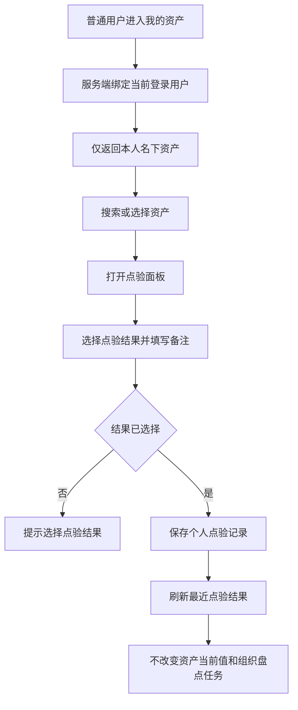

# 个人资产与自主点验 PRD

## 版本记录

| 版本 | 日期 | 说明 | 影响范围 |
| --- | --- | --- | --- |
| v0.1 | 2026-08-13 | 新增普通用户移动端个人资产查看和自主点验入口 | 全文 |

## 规划来源

- 产品规划：`001_产品规划/02-用户角色与核心场景.md`、`001_产品规划/04-全局业务实体设计.md`、`001_产品规划/07-权限逻辑约定.md`
- 版本范围：`001_产品规划/08-版本规划.md` 中 `IN-012`
- 决策依据：`001_产品规划/00-文档索引.md` 中 `DEC-021`
- 端类型：mobile-h5
- 路由：`/pages/personal/assets`
- 关联实体：资产、资产位置、基础人员、个人点验记录

## 背景与目标

普通用户不进入 Web 管理端，只需要查看当前登录人名下资产的基本信息、所在位置和使用状态，并在现场自主提交点验结果。点验是个人确认事实，不创建组织盘点任务、不修改资产当前值、不改变资产使用人或位置。

## 使用角色与诉求

| 角色 | 使用场景 | 关键诉求 | 页面主要动作 |
| --- | --- | --- | --- |
| 普通用户 | 查看本人资产、现场核对实物 | 快速找到本人资产，反馈正常、位置不符、未找到或信息异常 | 查看、搜索、发起点验、提交点验 |
| 单位管理员 | 查看个人点验留痕 | 通过后台业务记录追溯个人点验结果，不使用普通用户入口 | 查询记录 |
| 部门管理员 | 部门日常管理 | 不进入个人用户入口，继续通过 Web 处理授权部门业务 | 不开放 |

## 功能范围

### 本期包含

- 当前用户身份摘要：姓名、角色、所属部门
- 本人名下资产数量统计
- 资产关键词搜索
- 资产卡片展示：资产编号、名称、分类、位置、使用状态、SN/RFID、最近点验时间
- 从资产卡片发起点验
- 选择点验结果：正常、位置不符、未找到、信息异常
- 填写点验备注并提交个人点验记录
- 提交后更新本页面点验时间和结果展示

### 本期不包含

- 查看他人或部门资产
- 组织盘点任务、扫码/RFID 组织采集和盘盈盘亏处置
- 修改资产名称、分类、位置、状态、使用人或编码
- 导出个人资产或点验记录
- 审批流程

## 页面与入口

| 页面 | 端类型 | 路由/页面路径 | 入口 | 页面关系 | 说明 |
| --- | --- | --- | --- | --- | --- |
| 个人资产与自主点验 | mobile-h5 | `/pages/personal/assets` | 普通用户移动端登录后首页入口 | 独立业务页 | 页面内包含个人资产列表和点验面板 |

## 页面信息架构

| 区域 | 内容 | 关键交互 |
| --- | --- | --- |
| 顶部导航 | 我的资产 | 不显示组织盘点导航 |
| 用户身份卡 | 姓名、所属部门、普通用户标签 | 只读 |
| 统计摘要 | 资产总数、待点验数、最近点验结果 | 只读 |
| 搜索区 | 资产名称、资产编号、位置关键词 | 输入后实时过滤本人资产 |
| 资产列表 | 资产基本信息、当前位置、状态、编码和最近点验 | 点击“点验”打开点验面板 |
| 点验面板 | 资产摘要、结果选项、备注、提交按钮 | 选择结果后提交；点击遮罩或取消关闭 |

## 业务流程

## 功能需求

| 编号 | 功能点 | 规则说明 | 优先级 |
| --- | --- | --- | --- |
| FR-1 | 本人资产列表 | 服务端强制使用当前登录人员 ID 过滤；页面不提供人员、部门、单位或位置范围筛选 | P0 |
| FR-2 | 资产搜索 | 支持资产名称、资产编号、位置和分类关键词；无结果显示明确空态 | P0 |
| FR-3 | 资产卡片 | 展示资产编号、名称、分类、当前位置、使用状态、SN/RFID 和最近点验信息 | P0 |
| FR-4 | 发起点验 | 从资产卡片打开点验面板，点验资产不可替换为他人资产 | P0 |
| FR-5 | 提交点验 | 结果为必选，备注非必填，备注最多 200 字；提交成功后保留个人点验记录 | P0 |
| FR-6 | 只读保护 | 点验提交不得写入资产位置、使用人、部门、状态、SN/RFID 或组织盘点明细 | P0 |

## 字段与展示

| 区域 | 字段 | 必填 | 展示/校验 |
| --- | --- | --- | --- |
| 身份卡 | 当前用户姓名 | 是 | 来自登录态，只读 |
| 身份卡 | 所属部门 | 是 | 来自基础信息数据中心，只读 |
| 资产卡片 | 资产编号 | 是 | 只读 |
| 资产卡片 | 资产名称 | 是 | 只读 |
| 资产卡片 | 资产分类 | 是 | 只读 |
| 资产卡片 | 所在位置 | 是 | 展示完整位置路径，只读 |
| 资产卡片 | 使用状态 | 是 | 在用、借用中、维保中等当前状态，只读 |
| 资产卡片 | SN/RFID | 否 | 为空时展示“未录入”，只读 |
| 点验面板 | 点验结果 | 是 | 正常、位置不符、未找到、信息异常，四选一 |
| 点验面板 | 备注 | 否 | 文本，最多 200 字 |
| 点验记录 | 点验时间 | 系统生成 | 保存成功时生成 |

## 状态与异常

| 场景 | 页面表现 | 处理规则 |
| --- | --- | --- |
| 本人无资产 | 展示空状态和“暂无本人名下资产” | 不显示点验入口 |
| 搜索无结果 | 展示“未找到匹配资产” | 清空关键词或返回全部 |
| 未选择结果 | 阻止提交并提示 | 保留已填写备注 |
| 资产已不在本人名下 | 提交前重新校验登录人和资产使用人 | 阻止提交并刷新列表 |
| 重复快速提交 | 按资产和提交请求去重 | 只保存一条个人点验记录 |
| 保存失败 | 明确提示保存失败 | 保留面板内容，允许重试 |

## 权限规则

| 权限对象 | 规则 | 无权限表现 | 数据可见范围 |
| --- | --- | --- | --- |
| 页面 | 仅普通用户可进入；单位管理员、部门管理员不使用该个人入口 | 不展示入口或提示无权限 | 当前登录普通用户本人名下资产 |
| 资产查询 | 强制绑定当前用户 ID，不允许客户端传入人员范围 | 越权条件被忽略并记录安全日志 | 仅本人 |
| 发起点验 | 仅对本人名下资产开放 | 不展示点验按钮 | 当前卡片资产 |
| 提交点验 | 结果必选，保存前重新校验资产归属 | 阻止保存并提示 | 只写个人点验记录 |

## 验收标准

- 普通用户进入页面后只能看到本人名下资产，页面不存在查看他人资产的入口或筛选条件。
- 资产卡片至少展示资产编号、名称、分类、位置、使用状态和最近点验信息。
- 四种点验结果可选且互斥；未选择结果时不能提交。
- 备注可为空，超过 200 字时阻止提交并提示。
- 提交成功后本卡片展示最新点验结果和时间，并保留记录。
- 点验提交前后资产当前值、使用人、部门、位置、编码和组织盘点任务均不改变。
- 普通用户、部门管理员无法通过该页面查看组织台账、库存、业务记录或导出数据。

## 原型与工程关联

- 原型工程：`003_prototype/barracks-mobile/`
- 页面文件：`src/pages/personal/assets.vue`
- manifest 映射：`/pages/personal/assets`
