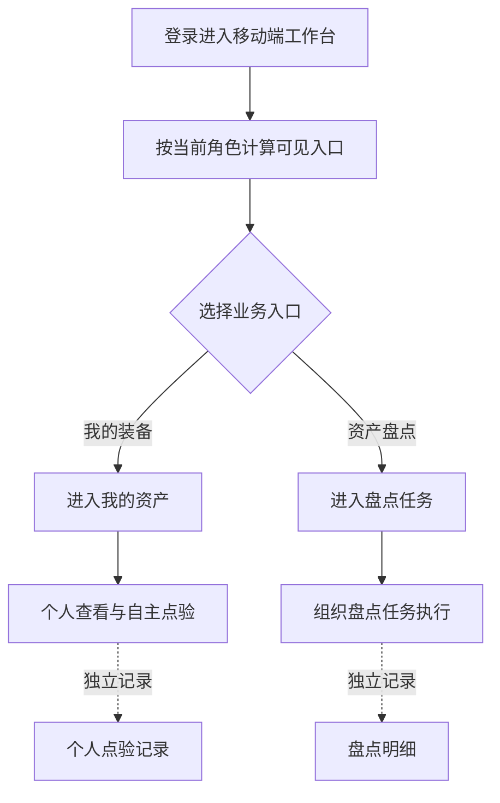

# 工作台 PRD

## 版本记录

| 版本 | 日期 | 说明 | 影响范围 |
| --- | --- | --- | --- |
| v0.1 | 2026-08-14 | 新增移动端工作台，拆分个人装备查看与组织盘点执行入口 | 工作台页面、入口跳转、权限提示 |
| v0.2 | 2026-08-14 | 按参考图重构资产管理功能卡片，入口重命名并采用轻量毛玻璃图标 | 工作台视觉、入口名称、功能卡片扩展结构 |

## 规划来源

- 产品规划文档：[`001_产品规划/02-用户角色与核心场景.md`](../../../001_产品规划/02-用户角色与核心场景.md)
- 对应模块：移动端个人资产与自主点验、资产盘点模块（移动端盘点采集）
- 关联页面：工作台、我的资产、盘点任务
- 端类型：mobile
- 关联实体：资产、个人点验记录、盘点任务、盘点明细
- 关联权限：普通用户仅可进入个人资产入口；单位管理员可进入组织盘点采集入口
- 相关通用规则：个人点验与组织盘点任务分开记录；盘点采集不直接改变资产清单和库存

## 背景与目标

移动端同时承载普通用户的个人装备查看与单位管理员的组织盘点执行。工作台负责提供清晰、互不混淆的业务入口：我的装备进入本人资产页面，资产盘点进入组织盘点任务列表。工作台只做入口聚合和摘要展示，不新增个人点验或组织盘点业务状态。

原型为便于跨角色流程评审同时展示两类入口；实际应用应依据当前登录角色与权限，仅展示有权进入的功能。

## 使用角色与诉求

| 角色 | 使用场景 | 关键诉求 | 页面主要动作 |
| --- | --- | --- | --- |
| 普通用户 | 查看和确认本人名下装备 | 快速进入我的装备页面，了解本人资产范围 | 点击“我的装备” |
| 单位管理员 | 现场执行组织盘点 | 快速进入被授权的盘点任务列表 | 点击“资产盘点” |

## 功能范围

### 本期包含

- 工作台顶部导航、工作台标题和业务说明。
- “资产管理”卡片及“我的装备”独立入口。
- “资产管理”卡片及“资产盘点”独立入口。
- 我的装备数量、盘点任务数量和待盘资产数量摘要展示。
- 入口角色范围提示，以及个人点验与组织盘点互不影响的边界提示。
- 底部 Tab 视觉导航；除工作台外的未开放 Tab 仅做轻提示。

### 本期不包含

- 在工作台内直接查看资产明细、提交个人点验或执行盘点。
- 盘点任务创建、盘点结果审核、盘盈盘亏处置和导出。
- 消息中心、个人中心及其他底部 Tab 的业务实现。

### 边界说明

- “我的装备”下游为个人资产与自主点验页面，不进入组织盘点任务流。
- “资产盘点”下游为移动端盘点采集页面，使用组织盘点任务和盘点明细数据。
- 工作台摘要只读消费下游数据，不写入资产、个人点验记录、盘点任务或盘点明细。

## 页面与入口

| 页面 | 端类型 | 路由/页面路径建议 | 入口 | 页面关系 | 说明 |
| --- | --- | --- | --- | --- | --- |
| 工作台 | mobile | `/pages/demo/workbench/index` | 移动端登录后首页 | 下游为“我的资产”和“盘点任务” | 按角色权限展示独立业务入口 |
| 我的资产 | mobile | `/pages/personal/assets` | 工作台 > 我的装备 | 上游为工作台 | 普通用户查看本人资产并自主点验 |
| 盘点任务 | mobile | `/pages/stocktake/tasks` | 工作台 > 资产盘点 | 上游为工作台 | 单位管理员进入组织盘点任务 |

## 页面信息架构

| 页面 | 区域 | 信息层级 | 主体内容 | 关键操作区 |
| --- | --- | --- | --- | --- |
| 工作台 | 顶部导航 | 主 | 资产管理标题、更多入口 | 查看工作台提示 |
| 工作台 | 工作台说明 | 主 | 工作台标题、移动端入口说明 | — |
| 工作台 | 资产管理卡片 | 主 | 卡片标题“资产管理”；“我的装备”和“资产盘点”四列网格入口，使用轻量毛玻璃图标 | 点击对应入口 |
| 工作台 | 入口辅助说明 | 次 | 我的装备数量、资产盘点任务和待盘数量、权限边界 | — |
| 工作台 | 边界提示 | 辅助 | 个人点验与组织盘点分开记录的说明 | — |
| 工作台 | 底部 Tab | 辅助 | 首页、工作台、消息、我的 | 工作台高亮；未开放 Tab 轻提示 |

## 业务流程

## 功能需求

| 编号 | 功能点 | 规则说明 | 适用页面 | 优先级 |
| --- | --- | --- | --- | --- |
| FR-1 | 资产管理功能卡片 | 工作台以“资产管理”为卡片标题，使用可扩展的四列网格承载功能入口 | 工作台 | P0 |
| FR-2 | 我的装备入口 | 点击“我的装备”进入 `/pages/personal/assets`，不携带组织盘点任务参数 | 工作台 | P0 |
| FR-3 | 资产盘点入口 | 点击“资产盘点”进入 `/pages/stocktake/tasks`，不携带个人点验上下文 | 工作台 | P0 |
| FR-4 | 摘要展示 | 我的装备摘要取当前登录用户可见资产；盘点摘要取当前权限范围内任务及待盘明细 | 工作台 | P1 |
| FR-5 | 角色范围提示 | 入口卡片展示“普通用户 · 仅本人”或“单位管理员 · 组织任务”等范围说明 | 工作台 | P0 |
| FR-6 | 业务边界提示 | 工作台明确提示个人点验与组织盘点分别记录，不改变对方业务状态 | 工作台 | P0 |
| FR-7 | 未开放 Tab 反馈 | 首页、消息、我的未纳入本期时，点击只提示入口暂未开放，不改变当前工作台状态 | 工作台 | P1 |

## 字段与展示

| 页面区域 | 字段 | 字段含义 | 类型/示例 | 展示规则 | 数据来源 |
| --- | --- | --- | --- | --- | --- |
| 我的装备入口 | 入口名称 | 进入个人资产页面的功能名称 | 文本：“我的装备” | 固定展示；角色无权限时隐藏 | 页面权限配置 |
| 我的装备入口 | 装备数量 | 当前用户名下资产数量 | 数值 | 展示在入口辅助说明中 | 资产当前值 |
| 我的装备入口 | 角色范围 | 入口的权限边界 | 文本：“仅本人” | 固定展示边界提示 | 权限规则 |
| 资产盘点入口 | 入口名称 | 进入组织盘点任务页的功能名称 | 文本：“资产盘点” | 固定展示；角色无权限时隐藏 | 页面权限配置 |
| 资产盘点入口 | 待处理任务数 | 当前可执行的未完成任务数量 | 数值 | 仅统计当前权限范围内非已完成任务 | 盘点任务 |
| 资产盘点入口 | 待盘资产数 | 待执行盘点明细数量 | 数值 | 仅统计可见任务内“未盘”明细 | 盘点明细 |
| 资产盘点入口 | 角色范围 | 入口的权限边界 | 文本：“组织任务” | 固定展示边界提示 | 权限规则 |

## 状态与操作

| 状态 | 可见操作 | 禁用/隐藏规则 | 操作后状态变化 | 结果反馈 |
| --- | --- | --- | --- | --- |
| 有权限且有数据 | 点击我的装备或资产盘点 | 入口正常可见 | 跳转到对应下游页面 | 页面正常打开 |
| 有权限但无个人资产 | 查看入口 | 入口保留，数量显示为 0 | 进入我的资产空态 | 下游页面展示无资产空态 |
| 有权限但无盘点任务 | 查看入口 | 入口保留，任务数和待盘数显示为 0 | 进入盘点任务空态 | 下游页面展示无任务空态 |
| 无权限 | 无入口操作 | 对应入口隐藏，不以空数据替代无权限 | 工作台保留其他有权入口 | 不泄露无权限数据 |
| 其他 Tab 未开放 | 点击 Tab | 不切换页面 | 当前 Tab 仍为工作台 | 轻提示“入口暂未开放” |

## 交互规则

| 交互类型 | 适用页面/区域 | 规则 |
| --- | --- | --- |
| 跳转 | 工作台功能卡片 | 点击整张入口卡片中的功能入口进入对应页面；我的装备与资产盘点使用不同路由，互不复用上下文 |
| 摘要刷新 | 工作台摘要 | 页面进入时按当前可见数据重新计算，不允许使用另一角色或另一业务域的数据 |
| 权限 | 入口分组 | 由当前登录角色决定入口是否展示；客户端不得通过传入用户 ID 扩大个人资产范围 |
| Tab | 底部导航 | 工作台保持高亮；未开放 Tab 不切换页面，仅反馈提示 |
| 返回 | 下游页面 | 由下游页面自己的导航栏处理，返回后回到工作台 |

## 权限规则

| 权限对象 | 规则 | 无权限表现 | 数据可见范围 |
| --- | --- | --- | --- |
| 我的装备入口 | 仅普通用户进入个人资产入口 | 非普通用户隐藏入口 | 当前登录人员名下资产 |
| 资产盘点入口 | 仅单位管理员进入组织盘点采集入口 | 非单位管理员隐藏入口 | 当前盘点任务授权范围内任务和明细 |
| 工作台摘要 | 只聚合当前角色可见数据 | 失败或无权限不以其他角色数据替代 | 与对应入口数据范围一致 |
| 入口跳转 | 只能跳转到当前角色有权页面 | 无权限跳转被拒绝并提示 | 不携带越权范围参数 |

## 数据与校验规则

| 字段/数据项 | 默认值 | 必填 | 格式/范围校验 | 计算口径 | 刷新/同步规则 |
| --- | --- | --- | --- | --- | --- |
| 我的装备数量 | 0 | 否 | 非负整数 | 当前登录用户名下资产数量 | 进入工作台时刷新 |
| 盘点任务数量 | 0 | 否 | 非负整数 | 当前权限范围内盘点任务数量 | 进入工作台时刷新 |
| 待处理任务数量 | 0 | 否 | 非负整数 | 任务状态不为“已完成”的任务数量 | 进入工作台时刷新 |
| 待盘资产数量 | 0 | 否 | 非负整数 | 可见任务下归类为“未盘”的明细数量 | 进入工作台时刷新 |

## 异常与空状态

| 场景 | 触发条件 | 页面表现 | 用户可执行操作 | 恢复/兜底规则 |
| --- | --- | --- | --- | --- |
| 无个人资产 | 当前用户名下没有资产 | 我的装备数量显示 0，入口仍可见 | 进入我的资产 | 下游页面展示个人资产空态 |
| 无盘点任务 | 当前用户没有可见盘点任务 | 盘点任务和待盘资产数量显示 0，入口仍可见 | 进入盘点任务 | 下游页面展示任务空态 |
| 无权限 | 当前角色不具备对应入口权限 | 对应入口隐藏 | 使用其他有权入口 | 不显示敏感数量和任务信息 |
| 摘要加载失败 | 工作台摘要数据加载失败 | 保留入口结构，摘要展示失败提示 | 重试或进入下游页面 | 不使用缓存的其他角色数据 |
| 下游页面不可用 | 目标页面路由或权限校验失败 | 提示无法进入目标功能 | 返回工作台 | 工作台自身状态不改变 |

## 验收标准

### 页面验收

- 工作台页面展示“资产管理”卡片，卡片内以四列网格承载“我的装备”和“资产盘点”两个独立入口。
- “我的装备”入口展示本人装备数量辅助说明和“仅本人”边界提示。
- “资产盘点”入口展示任务与待盘资产辅助说明和“组织任务”边界提示。
- 两个入口图标使用轻量毛玻璃视觉：圆形图标、半透明层次、轻边框和模糊效果。
- 页面展示工作台说明、我的装备数量、盘点任务数量和边界提示；底部工作台 Tab 处于高亮状态。

### 功能验收

- 点击“我的装备”进入 `/pages/personal/assets`，不会进入盘点任务页面或创建组织盘点上下文。
- 点击“资产盘点”进入 `/pages/stocktake/tasks`，不会进入个人资产页面或读取个人点验上下文。
- 工作台摘要只展示当前角色和对应业务域的数据，不改变资产、个人点验记录、盘点任务或盘点明细。
- 当前角色无权访问某入口时，该入口隐藏，且工作台不以其他角色数据替代展示。

### 状态验收

- 无个人资产或无盘点任务时，入口仍可按权限展示，数量显示为 0，并由下游页面负责空态。
- 其他底部 Tab 未开放时，点击后不离开工作台，仅出现轻提示。
- 从任一下游页面返回后，工作台仍保持入口分组和独立边界说明。

## 原型/工程关联

- PRD 类型：项目 PRD
- PRD 文件：`002_PRD/barracks-mobile/移动端工作台/工作台.md`
- 原型项目：`003_prototype/barracks-mobile/`
- 页面文件：`003_prototype/barracks-mobile/src/pages/demo/workbench/index.vue`
- 文档映射：`src/doc/manifest.json` 中 `/pages/demo/workbench/index` → `移动端工作台/工作台.md`
