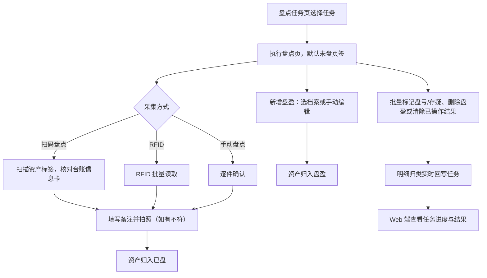

# 移动端盘点采集 PRD

## 版本记录

| 版本 | 日期 | 说明 | 影响范围 |
| --- | --- | --- | --- |
| v0.1 | 2026-08-11 | 初稿：落实 DEC-013、DEC-015，移动端盘点采集入口纳入 V1.0.0（IN-011），覆盖盘点任务、执行盘点、新增盘盈、信息核对四个页面 | 全文 |
| v0.2 | 2026-08-13 | 盘盈采集术语由历史资产模板调整为标准型号；支持选择标准型号或手工填写资产分类、资产名称，最终由 Web 端审核处置决定是否入账 | 新增盘盈、字段与校验、验收标准 |
| v0.3 | 2026-08-18 | 质量整改：将“删除盘点单”统一为“清除已操作结果”；该动作仅适用于未完成任务，保留任务单并将当前采集结果恢复为未盘/移除临时盘盈记录 | 功能范围、交互、状态、异常与验收 |

## 规划来源

- 产品规划文档：`001_产品规划/03-功能模块-04-资产盘点模块.md`、`001_产品规划/02-用户角色与核心场景.md`（移动端盘点采集入口）
- 对应模块：资产盘点模块
- 关联页面：盘点任务、执行盘点、新增盘盈、信息核对
- 端类型：mobile（uni-app H5）
- 关联实体：盘点任务、盘点明细、扫描记录、资产、附件
- 关联权限：`07-权限逻辑约定.md` 中资产盘点—盘点采集（移动端）（查看、创建、标记、清除已操作结果；仅单位管理员）
- 相关通用规则：`06-通用业务规则.md` 中盘点不改台账、扫描事实保留、盘点锁定、并行业务互斥
- 决策依据：DEC-013、DEC-014、DEC-015；版本准入 IN-011

## 背景与目标

单位管理员在移动端（barracks-mobile）执行 Web 端创建的盘点任务：现场核对实物与台账、扫码/RFID/手动采集、录入盘盈、标记盘亏与存疑，并以备注和拍照留证。采集结果实时回写任务下的盘点明细归类（未盘/已盘/盘盈/盘亏/存疑），盘盈盘亏仅作记录，不改变库存和台账。

## 使用角色与诉求

| 角色 | 使用场景 | 关键诉求 | 页面主要动作 |
| --- | --- | --- | --- |
| 单位管理员 | 现场执行盘点任务 | 快速定位待盘资产、逐件或批量采集、盘盈录入、盘亏存疑留证 | 选择任务、执行盘点、新增盘盈、标记盘亏/存疑、拍照上传 |

移动端不新增业务角色；组织盘点采集仅服务单位管理员，普通用户使用独立的个人资产页面自主点验，不进入组织盘点任务。

## 功能范围

### 本期包含

- 盘点任务列表（按盘点人数据权限展示其参与的任务）
- 执行盘点：资产列表五页签（未盘/已盘/盘盈/盘亏/存疑）、逐件与批量采集、备注与拍照留证
- 新增盘盈：从启用标准型号选择或手动编辑录入现场发现的账外资产
- 信息核对：实物与台账信息现场比对，不符情况以备注记录
- 盘点结果管理：清除已操作结果（受控；任务单保留）

### 本期不包含

- 离线暂存与断点上传（LATER-007，当前为在线模式）
- 盘点任务的创建、结果汇总查看与导出（归 Web 端资产盘点 PRD）
- 盘盈盘亏自动入账或出账

### 边界说明

- 盘盈盘亏仅作记录，不自动改写资产清单和库存（DEC-010）。
- 采集行为实时归入任务明细；任务已完成后不得继续采集。
- 图片仅支持拍照上传；盘点设置以任务创建时的设置为准。

## 页面与入口

| 页面 | 端类型 | 路由/页面路径建议 | 入口 | 页面关系 | 说明 |
| --- | --- | --- | --- | --- | --- |
| 盘点任务 | mobile | /pages/stocktake/tasks | 移动端首页入口 | 下游为执行盘点 | 任务列表页 |
| 执行盘点 | mobile | /pages/stocktake/execute | 盘点任务 > 任务卡片 | 上游为盘点任务，跳转新增盘盈 | 全屏采集页 |
| 新增盘盈 | mobile | /pages/stocktake/surplus | 执行盘点 > 新增盘盈 | 返回执行盘点 | 盘盈录入页 |
| 信息核对 | mobile | /pages/stocktake/check | 执行盘点 > 资产卡片核对 | 返回执行盘点 | 实物与台账核对页 |

## 页面信息架构

| 页面 | 区域 | 信息层级 | 主体内容 | 关键操作区 |
| --- | --- | --- | --- | --- |
| 盘点任务 | 顶部 | 主 | 自定义导航栏"盘点任务" | — |
| 盘点任务 | 列表区 | 主 | 任务卡片：任务名称、盘点方法、资产数量、计划时间、进度条、状态 | 点击进入执行盘点 |
| 执行盘点 | 顶部 | 主 | 任务名称、资产数量、计划时间、进度条；未盘/已盘/盘盈/盘亏/存疑五页签 | 页签切换 |
| 执行盘点 | 列表区 | 主 | 资产卡片：资产编号、资产名称、资产分类、所在位置、资产状态、使用人 | 单件采集、批量选择 |
| 执行盘点 | 采集区（全屏） | 主 | 上半部分：资产清单基本信息卡（批量执行时多张纵向滚动）；下半部分：备注输入区（提示"若盘点实物与资产清单信息不符，请在备注中填写说明"）+ 拍照上传区 | 保存采集结果 |
| 执行盘点 | 底部 | 主 | 主按钮"扫码盘点""新增盘盈" | "更多"折叠：批量执行盘点、批量标记盘亏、批量标记存疑、批量删除盘盈、清除已操作结果 |
| 新增盘盈 | 表单区 | 主 | 从启用标准型号选择或手动编辑：资产编号、资产名称、资产分类、所在位置、备注、照片 | 保存盘盈记录 |
| 信息核对 | 核对区 | 主 | 台账信息卡与实物逐项核对，不符项以备注记录 | 确认核对结果、返回 |

## 业务流程

## 功能需求

| 编号 | 功能点 | 规则说明 | 适用页面 | 优先级 |
| --- | --- | --- | --- | --- |
| FR-1 | 任务列表 | 展示盘点人可见的任务卡片，含进度条；点击进入执行盘点 | 盘点任务 | P0 |
| FR-2 | 五页签资产列表 | 未盘/已盘/盘盈/盘亏/存疑页签切换，各页签展示资产卡片 | 执行盘点 | P0 |
| FR-3 | 逐件采集 | 全屏采集页：台账基本信息卡 + 备注 + 拍照；保存后归入已盘 | 执行盘点 | P0 |
| FR-4 | 扫码盘点 | 扫描资产二维码/条码定位资产并执行采集 | 执行盘点 | P0 |
| FR-5 | 批量操作 | 批量执行盘点、批量标记盘亏、批量标记存疑、批量删除盘盈 | 执行盘点 | P0 |
| FR-6 | 新增盘盈 | 从启用标准型号选择或手动编辑录入账外资产，仅记录不入账；不选择标准型号时资产名称、资产分类必填 | 新增盘盈 | P0 |
| FR-7 | 信息核对 | 实物与台账信息现场比对，不符情况在备注中填写说明 | 信息核对、执行盘点 | P0 |
| FR-8 | 盘亏备注弹层 | 盘亏专用备注弹层，仅保留备注输入框，不含拍照 | 执行盘点 | P1 |
| FR-9 | 清除已操作结果 | 仅任务处于盘点中时可用；二次确认后移除当前任务的临时盘盈记录，并将已盘、盘亏、存疑明细恢复为未盘；任务单保留，不允许对已完成任务执行 | 执行盘点 | P1 |

## 状态与操作

| 状态 | 可见操作 | 禁用/隐藏规则 | 操作后状态变化 | 结果反馈 |
| --- | --- | --- | --- | --- |
| 未盘 | 扫码盘点、手动确认、批量执行盘点 | 删除盘盈隐藏 | 采集保存→已盘 | 轻提示保存成功 |
| 已盘 | 查看、备注与照片补充 | 重复采集提示覆盖确认 | 保持已盘 | — |
| 盘盈 | 查看、批量删除盘盈 | — | 删除后移出盘盈 | 二次确认 |
| 盘亏 | 查看、备注（盘亏专用弹层） | — | 保持盘亏 | — |
| 存疑 | 查看 | — | 保持存疑 | — |
| 盘点中 | 清除已操作结果 | 仅单位管理员可用；已完成任务隐藏该入口；二次确认后保留任务单并清除当前采集结果 | 结果恢复为未盘，临时盘盈记录移除 | 已清除本次操作结果 |
| 任务已完成 | 全部采集操作禁用 | 批量与采集入口隐藏 | 无 | 提示任务已完成 |

## 权限规则

| 权限对象 | 规则 | 无权限表现 | 数据可见范围 |
| --- | --- | --- | --- |
| 移动端入口 | 仅单位管理员（DEC-015） | 部门管理员和普通用户不提供组织盘点入口 | 本单位组织盘点任务范围内资产 |
| 任务可见 | 盘点人可见其被指派的任务及发起人数据权限内任务 | 无任务空态 | 受盘点任务范围约束 |
| 采集与批量操作 | 仅单位管理员，复用盘点任务授权与数据范围 | — | 任务范围内资产 |

## 数据与校验规则

| 字段/数据项 | 默认值 | 必填 | 格式/范围校验 | 计算口径 | 刷新/同步规则 |
| --- | --- | --- | --- | --- | --- |
| 资产卡片字段 | — | 是 | 资产编号、资产名称、资产分类、所在位置、资产状态、使用人 | 来自资产当前值 | 与台账实时同步 |
| 备注 | 空 | 否 | 文本 | — | 随采集结果回写任务明细 |
| 照片 | 无 | 否 | 仅拍照上传 | — | 按任务盘点设置约束 |
| 盘盈标准型号 | 空 | 否 | 选择启用标准型号或留空手工录入；资产名称、分类必填 | — | 仅记录，不入账；不反向创建标准型号 |
| 采集归类 | 未盘 | 是 | 未盘/已盘/盘盈/盘亏/存疑 | 采集行为驱动 | 实时回写任务明细 |

## 字段与展示

| 页面区域 | 字段 | 字段含义 | 类型/示例 | 展示规则 | 数据来源 |
| --- | --- | --- | --- | --- | --- |
| 资产卡片 | 所在位置 | 资产当前具体位置 | 文本 | 展示完整路径 | 资产当前值 |
| 新增盘盈 | 标准型号 | 可选模板 | 选择器 | 仅显示启用标准型号，可跳过 | 标准型号 |
| 新增盘盈 | 资产分类 | 盘盈资产分类 | 分类选择 | 必填 | 标准型号回显或用户输入 |
| 新增盘盈 | 资产名称 | 盘盈资产名称 | 文本 | 必填 | 标准型号回显或用户输入 |
| 新增盘盈 | 所在位置 | 盘盈现场位置 | 树形选择 | 必填 | 位置管理 |

## 异常与空状态

| 场景 | 触发条件 | 页面表现 | 用户可执行操作 | 恢复/兜底规则 |
| --- | --- | --- | --- | --- |
| 无任务 | 盘点人无可见任务 | 空态提示 | 联系单位管理员创建任务 | — |
| 扫码失败 | 标签无法识别 | 提示扫描失败，保留当前页签 | 改用手动盘点 | — |
| 网络异常 | 保存采集时请求失败 | 提示保存失败 | 重试 | 不产生重复明细，按任务+资产编号幂等 |
| 任务已完成 | 任务被 Web 端关闭后继续操作 | 采集入口禁用 | 返回任务列表 | — |
| 盘点锁定 | 采集期间资产发起其他业务 | Web 端阻止其他业务 | 继续采集 | 盘点锁定 |

## 验收标准

### 页面验收

- 四个页面可通过盘点任务流顺序进入，页面路径与 `pages.json` 一致
- 执行盘点为全屏页：上半部分台账基本信息卡、下半部分备注与拍照区
- 顶部展示任务名称、资产数量、计划时间和进度条；资产列表分未盘/已盘/盘盈/盘亏/存疑五个页签

### 功能验收

- 可逐件执行扫码盘点、RFID 盘点和手动盘点，采集保存后资产归入已盘
- 批量执行盘点、批量标记盘亏、批量标记存疑、批量删除盘盈可用
- 新增盘盈支持从启用标准型号选择和手动编辑，保存后归入盘盈且不改变库存；不选择标准型号时资产名称、资产分类必填
- 盘亏备注弹层仅含备注输入框，不含拍照
- 实物与台账不符时可在备注填写说明并拍照留证
- 盘盈盘亏不自动改写资产清单和库存
- 已完成任务的全部采集与批量操作禁用

### 状态验收

- 明细归类与 `04-全局业务实体设计.md` 盘点明细归类枚举一致（未盘、已盘、盘盈、盘亏、存疑）
- 采集结果实时回写任务，Web 端任务进度与移动端明细计数一致

## 原型/工程关联

- PRD 类型：项目 PRD
- PRD 文件：`002_PRD/barracks-mobile/移动端盘点采集.md`
- 原型项目：`003_prototype/barracks-mobile/`
- 页面文件：`src/pages/stocktake/tasks.vue`、`execute.vue`、`surplus.vue`、`check.vue`
- 文档映射：`src/doc/manifest.json` 中四个盘点页面路由 → `移动端盘点采集.md`
- 关联 PRD：资产盘点（`002_PRD/barracks-admin/资产盘点.md`）
